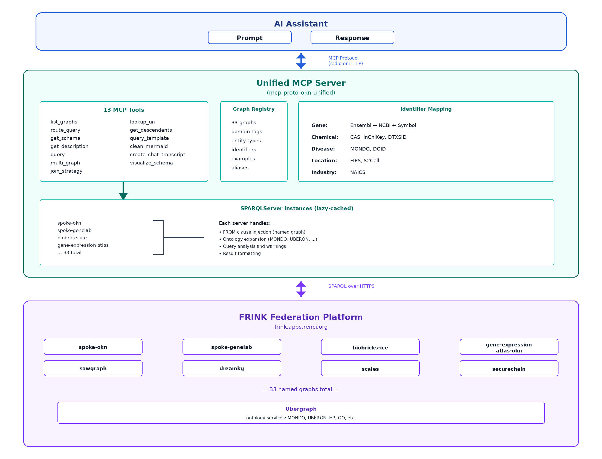

# MCP Proto-OKN Server

[](https://opensource.org/licenses/BSD-3-Clause)
[](https://www.python.org/downloads/)
[](https://modelcontextprotocol.io/)
[](https://pypi.org/project/mcp-proto-okn/)

A single [Model Context Protocol](https://modelcontextprotocol.io/) (MCP) server that exposes **33 [Proto-OKN](https://www.proto-okn.net/) knowledge graphs** through one unified interface. The server enables AI assistants (Claude, ChatGPT, GitHub Copilot, etc.) to discover graphs, inspect their schemas, query them with SPARQL, bridge identifiers across graphs, and combine results from multiple sources — all through natural-language conversation. The graphs are hosted on the [Open Knowledge Network (OKN)](https://okn.us/) federation platform and cataloged in the [OKN Knowledge Graph Registry](https://registry.okn.us/registry/).

> **Beta:** the proto-okn MCP server is in beta. We welcome feedback and bug reports via [issues](https://github.com/sbl-sdsc/mcp-proto-okn/issues).

### [Video introduction](https://www.youtube.com/watch?v=50L-tKCoXJE) · [Technical review presentation](https://nebigdatahub.org/wp-content/uploads/2026/01/MCP-Proto-OKN-Technical-Review.pdf)
*Note: MCP URL and installation instructions have changed. [Updated instructions](#for-users)*

---

## Features

- **🌐 Unified access** — one MCP server, 33 knowledge graphs, one endpoint
- **🔎 Graph discovery** — list, filter, and search graphs by domain, entity type, or natural language
- **📐 Schema inspection** — understand each graph's classes, predicates, and properties before writing queries
- **🧭 Per-graph SPARQL** — query any individual graph with automatic FROM-clause injection
- **🔗 Cross-graph bridging** — built-in identifier maps (Ensembl ↔ NCBI Gene ↔ Symbol; CAS, DTXSID, InChIKey; MONDO, FIPS, NAICS, …)
- **🧬 Multi-graph queries** — run different SPARQL across multiple graphs in a single call and merge results
- **🌳 Ontology-driven search expansion** — queries are automatically expanded using ontology hierarchies (MONDO, UBERON, HP, GO, CL, ChEBI, …) via [Ubergraph](https://registry.okn.us/registry/kgs/ubergraph/), so a query for "arthritic joint disease" matches all of its subtypes without manual enumeration
- **🖼️ Schema visualization & transcripts** — generate Mermaid class diagrams and chat transcripts directly from the conversation

## Architecture


---

# For Users

This section is for people who want to **use** the unified server through an MCP-compatible client (Claude Desktop, ChatGPT, Claude Code, VS Code Insiders with GitHub Copilot, etc.). No installation, no local setup — the server is already hosted, you just point your client at it.

**Hosted endpoint URL:** `https://apps.okn.us/okn-mcp/mcp`

## Connecting Your Client

### Claude Desktop

1. Launch Claude Desktop → **Settings → Connectors → Add custom connector**
2. Name: `proto-okn`, URL: `https://apps.okn.us/okn-mcp/mcp`
3. Click **Configure** and set tool permissions to **Always allow**
4. In a new chat, click `+` and toggle `proto-okn` on. Toggle Web search off.

Full walkthrough with screenshots: **[Claude Desktop setup](docs/claude-setup.md)**.

> A Claude Pro or Max subscription is required for MCP connectors in Claude Desktop.

### ChatGPT

ChatGPT supports MCP services only in the web app (https://chatgpt.com) with **Developer mode** enabled. Then **Settings → Apps → Create app**, MCP Server URL `https://apps.okn.us/okn-mcp/mcp`.

Full walkthrough with screenshots: **[ChatGPT setup](docs/chatgpt-setup.md)**.

### Claude Code

Add to `.mcp.json` in your project root (or `~/.claude/settings.json` for all projects):

```json
{
  "mcpServers": {
    "proto-okn": {
      "type": "url",
      "url": "https://apps.okn.us/okn-mcp/mcp"
    }
  }
}
```

Verify with `/mcp` — you should see `proto-okn` connected.

### VS Code Insiders + GitHub Copilot

VS Code Insiders supports MCP in Agent mode with the GitHub Copilot extension. Use the same URL: `https://apps.okn.us/okn-mcp/mcp`.

---

## Example Prompts

Once the server is connected, try these conversational prompts in your client. The assistant will pick the right graphs, write the SPARQL, and combine results for you.

- Default: query across all Proto-OKN KGs
  > Generate a table of all Proto-OKN Knowledge Graphs with two columns: "KG Name" and "Description."
  →  [Result](docs/examples/proto-okn-overview.md)

- Target a specific KG with `@kg-name`
  > @spoke-genelab: Give a high-level overview of this knowledge graph, including its main entities, relationships, and purpose.

- Save a session
  > Create a chat transcript.

  The transcript downloads as `.md` or `.pdf` and includes the model name and version.

## Use Cases

### Knowledge Graph Overviews & Class Diagrams

Each link points to a chat transcript for generating an overview and a class diagram for a Proto-OKN KG.

| 🧬 Biology & Health | 🌱 Environment | ⚖️ Justice | 🛠️ Technology & Manufacturing | NASA/NIH/ARCH(*)
|--------------------|---------------|-----------|-------------------------------|-------------|
| [biobricks-aopwiki](docs/examples/biobricks-aopwiki_overview.md) | [sawgraph](docs/examples/sawgraph_overview.md) | [ruralkg](docs/examples/ruralkg_overview.md) | [securechainkg](docs/examples/securechainkg_overview.md) | [nasa-gesdisc-kg](docs/examples/nasa-gesdisc-kg_overview.md) |
| [biobricks-ice](docs/examples/biobricks-ice_overview.md) | [fiokg](docs/examples/fiokg_overview.md) | [scales](docs/examples/scales_overview.md) | [sudokn](docs/examples/sudokn_overview.md) | [nde](docs/examples/nde_overview.md)
| [biobricks-mesh](docs/examples/biobricks-mesh_overview.md) | [geoconnex](docs/examples/geoconnex_overview.md) | [nikg](docs/examples/nikg_overview.md) | | [gene-expression-atlas-okn](docs/examples/gene-expression-atlas-okn_overview.md) |
| [biobricks-pubchem-annotations](docs/examples/biobricks-pubchem-annotations_overview.md) | [spatialkg](docs/examples/spatialkg_overview.md) | [dreamkg](docs/examples/dreamkg_overview.md) |  | [biomarkerkg](docs/examples/biomarkerkg-overview.md)
| [biobricks-tox21](docs/examples/biobricks-tox21_overview.md) | [hydrologykg](docs/examples/hydrologykg_overview.md) |  |  | [evoweb](docs/examples/evoweb-overview.md)
| [biobricks-toxcast](docs/examples/biobricks-toxcast_overview.md) | [ufokn](docs/examples/ufokn_overview.md) |  |  | [oard-kg](docs/examples/oard-kg-overview.md)
| [spoke-genelab](docs/examples/spoke-genelab_overview.md) | [wildlifekn](docs/examples/wildlifekn_overview.md) |  |  | [ncipidkg](docs/examples/ncipidkg-overview.md)
| [spoke-okn](docs/examples/spoke-okn_overview.md) | [climatemodelskg](docs/examples/climatemodelskg_overview.md) |  |  | [pankgraph](docs/examples/pankgraph-overview.md)
|  | [sockg](docs/examples/sockg_overview.md) |  | | [prokn](docs/examples/prokn_overview.md)

**(*) ARCH: Advancing Research Capacity in Health, NSF Proto-OKN supplemental awards.**

### Space Flight Use Cases

* [Spaceflight Missions (spoke-genelab)](docs/examples/spoke-genelab_breakdown.md)
* [Spaceflight Gene Expression Analysis (spoke-genelab, spoke-okn)](docs/examples/spoke_spaceflight_analysis.md)
* [Spaceflight Gene Expression with Literature Analysis (spoke-genelab, spoke-okn, MCP:PubMed)](docs/examples/spoke-genelab-OSD-244_verbatim.md)
* [Spaceflight Gene Expression — Disease Associations (spoke-genelab, spoke-okn, prokn, MCP:Open Targets, MCP:PubMed)](docs/examples/space-flight-disease-relationships.md)
* [Spaceflight Microbiome and Pathogen Analysis (spoke-genelab, spoke-okn, MCP:PubMed)](docs/examples/spoke-genelab_microbiome_and_pathogen_analysis.md)

### Biomedical Use Cases
* [Disease Prevalence in the US (spoke-okn)](docs/examples/us_county_disease_prevalence.md)
* [Disease Prevalence — Socio-Economic Factors Correlation (spoke-okn)](docs/examples/disease_socio_economic_correlation.md)
* [NIAID Data Exploration — COVID-19 Vaccine Research (nde)](docs/examples/nde_COVID-19-Vaccine-Research.md)
* [Diabetic Nephropathy Meta-Analysis (gene-expression-atlas-okn)](docs/examples/diabetic-nephropathy-meta-analysis.md) — featured on WOBD as a [worked example](https://apps.okn.us/wobd/mcp/diabetic-nephropathy)
* [Diabetic Nephropathy Differential Expression Analysis (gene-expression-atlas-okn, ARCHS4)](docs/examples/dn_differential_expression_archs4_analysis.md)
* [APOE Gene Info (prokn)](docs/examples/prokn-apoe-gene.md)
* [Prostate Cancer Biomarkers (biomarkerkg)](docs/examples/biomarkerkg-prostate-cancer.md)
* [Marfan Syndrome Phenotypes (oard-kg)](docs/examples/oard-kg-marfan-syndrom-phenotypes.md)
* [Pancreatic Acinar Cell Adhesion Genes (pankgraph)](docs/examples/pankgraph-pancreatic-acinar-cell-adhesion-genes.md)

### Environmental Use Cases
* [Contamination at Superfund Sites (spoke-okn)](docs/examples/superfund-contaminants.md)
* [PFOA in Drinking Water (spoke-okn)](docs/examples/spoke_okn_pfoa_drinking_water.md)
* [Data about PFOA (spoke-okn, biobricks-toxcast)](docs/examples/pfoa_data_spoke_okn_biobricks_toxcast.md)
* [PFAS Environmental Health Analysis (sawgraph, spoke-okn, biobricks-ice)](docs/examples/pfas_environmental_health_kg_analysis.md) — featured on WOBD as a [worked example](https://apps.okn.us/wobd/mcp/pfas-compounds)
* [Biological Targets for PFOA (biobricks-toxcast, biobricks-ice, biobricks-aopwiki, spoke-okn)](docs/examples/biobricks_toxcast_PFOA_targets.md)
* [PFOA Safety Profile (biobricks-ice, biobricks-aopwiki, sawgraph, spoke-okn)](docs/examples/pfoa-safety-profile.md)
* [Bisphenol A Safety Profile (biobricks-ice, biobricks-aopwiki, spoke-okn)](docs/examples/bpa-safety-profile.md)

### Criminal and Environmental Justice
* [Criminal Justice Patterns (scales)](docs/examples/scales_criminal_justice_analysis.md)
* [Drug Possession Charges (scales)](docs/examples/scales_drug_possession.md)
* [Environmental Justice (sawgraph, scales, spatialkg, spoke-okn)](docs/examples/environmental-justice-kg-analysis.md)
* [Rural Health Access (ruralkg, dreamkg, spoke-okn)](docs/examples/rural-health-access-mapping.md)

### Misc. Use Cases
* [Michigan Flooding Event (ufokn)](docs/examples/ufokn_michigan_flood.md)
* [Flooding and Socio-Economic Factors (ufokn, spatialkg, spoke-okn)](docs/examples/flooding-socioeconomic-correlation.md)
* [Philadelphia Area Incidents (nikg)](docs/examples/nikg_philadelphia_incidents.md)
* [Mining Suppliers in North Dakota (sudokn)](docs/examples/sudokn_mining_suppliers.md)

### Ontology-Driven Search Expansion
Queries are automatically expanded using ontology hierarchies (MONDO, HP, GO, UBERON, ChEBI, …) via [Ubergraph](https://registry.okn.us/registry/kgs/ubergraph/) to include all descendant concepts. A search for "cardiovascular disease" automatically matches every subtype the data is tagged at — without you having to enumerate them.

* **[Cardiovascular Disease Datasets — full walkthrough (nde)](docs/examples/cardiovascular-disease-ontology-expansion.md)** — shows how one URI in the query expands to 1,592 descendant concepts and matches 284 disease subtypes
* [Arthritic Joint Disease Datasets (nde)](docs/examples/nde-arthritic_joint_disease_ontology_expansion.md)
* [Space Flight Studies Investigating Muscles (spoke-genelab)](docs/examples/spoke-genelab_muscle_studies_ontology_expansion.md)

### Proto-OKN Integration Opportunities

* [Cross-KG Geolocation Data Exploration](docs/examples/cross-kg-geolocation-analysis.md)
* [Cross-KG Chemical Compound Data Exploration](docs/examples/cross-kg-compound-analysis.md)
* [Cross-KG Bio Data Exploration (Opus 4.7)](docs/examples/cross-graph-opportunities-bio-opus4.7.md)
* [Cross-KG Bio Data Exploration (Sonnet 4.6)](docs/examples/cross-graph-opportunities-bio-sonnet4.7.md)

### Cross-Platform LLM Benchmarks

The same prompt run across Claude Desktop and VS Code Insiders with several LLMs.

| Query | Claude Sonnet 4.5 (Desktop) | Claude Sonnet 4.5 (VS Code) | Gemini 3 Pro | Groq Code Fast 1 | GPT-5.2 |
|-------|-----------------------------|-----------------------------|--------------|------------------|---------|
| **Spaceflight Missions** | [link](docs/examples/spacex-missions-sonnet-4.5-claude.md) | [link](docs/examples/spacex-missions-sonnet-4.5-vs-studio.md) | [link](docs/examples/spacex-missions-Gemini-3-Pro.md) | [link](docs/examples/spacex-missions-Gorc-Code-Fast-1.md) | [link](docs/examples/spacex-missions-GPT-5.2.md) |
| **Gene Expression Analysis** | [link](docs/examples/OSD-161-sonnet-4.5-claude.md) | [link](docs/examples/OSD-161-sonnet-4.5-vs-studio.md) | [link](docs/examples/OSD-161_Gemini-3-ProPreview-vs-studio.md) | [link](docs/examples/OSD-161-Groc-Code-Fact-1-vs-studio.md) | [link](docs/examples/OSD-161-GPT-5.2-vs-studio.md) |

[Benchmarks (in progress)](docs/benchmarks.md) — mcp-proto-okn vs. SPARQL ground-truth evaluation.

---

## For Developers

The [develop document](docs/develop.md) describes how to **run the server locally**, **contribute code**, or **host a copy**. 

---

## Troubleshooting

**MCP server not appearing in Claude Desktop**
- Completely quit and restart Claude Desktop (closing the window is not enough)
- For local installs, verify `uvx` is on PATH (`which uvx`); if not, use the absolute path in `command`

**Connection errors**
- Check that the OKN endpoints are reachable: `curl https://apps.okn.us/spoke-okn/sparql`
- Some endpoints may have rate limits or temporary downtime

**Slow or hung queries**
- Complex SPARQL can take time; break it into smaller parts
- Ontology expansion across very broad concepts (e.g. "disease") may take several minutes

---

## License

This project is licensed under the BSD 3-Clause License. See [LICENSE](LICENSE).

## Citation

```bibtex
@software{rose2025mcp-proto-okn,
  title={MCP Server Proto-OKN},
  author={Rose, P.W. and Good, B.M. and Nelson, C.A. and Saravia-Butler, A.M. and Shi, Y. and Su, A.I. and Baranzini, S.E.},
  year={2025},
  url={https://github.com/sbl-sdsc/mcp-proto-okn}
}

@software{rose2025spoke-genelab,
  title={NASA SPOKE-GeneLab Knowledge Graph},
  author={Rose, P.W. and Nelson, C.A. and Gebre, S.G. and Saravia-Butler, A.M. and Soman, K. and Grigorev, K.A. and Sanders, L.M. and Costes, S.V. and Baranzini, S.E.},
  year={2025},
  url={https://github.com/BaranziniLab/spoke_genelab}
}
```

## Presentations

### Related Publications

- Nelson, C.A., Rose, P.W., Soman, K., Sanders, L.M., Gebre, S.G., Costes, S.V., Baranzini, S.E. (2025). "Nasa Genelab-Knowledge Graph Fabric Enables Deep Biomedical Analysis of Multi-Omics Datasets." *NASA Technical Reports*, 20250000723. [Link](https://ntrs.nasa.gov/citations/20250000723)
- Sanders, L., Costes, S., Soman, K., Rose, P., Nelson, C., Sawyer, A., Gebre, S., Baranzini, S. (2024). "Biomedical Knowledge Graph Capability for Space Biology Knowledge Gain." *45th COSPAR Scientific Assembly*, July 13-21, 2024. [Link](https://ui.adsabs.harvard.edu/abs/2024cosp...45.2183S/abstract)

## Acknowledgments

### Funding

- **National Science Foundation** Award [#2333819](https://www.nsf.gov/awardsearch/showAward?AWD_ID=2333819): "Proto-OKN Theme 1: Connecting Biomedical information on Earth and in Space via the SPOKE knowledge graph"
- **National Science Foundation** Award [#2535091](https://www.nsf.gov/awardsearch/show-award?AWD_ID=2535091): "Proto-OKN Theme 2: OKN-Fabric"

### Related Projects

- [WOBD — Web of Biological Data](https://apps.okn.us/wobd) — The umbrella project this MCP server is part of, providing a public face for both the templated query UI and AI-assistant access. The case studies hosted on WOBD ([diabetic nephropathy](https://apps.okn.us/wobd/mcp/diabetic-nephropathy), [PFAS](https://apps.okn.us/wobd/mcp/pfas-compounds), [terpene biosynthesis](https://apps.okn.us/wobd/mcp/terpene-biosynthesis)) were produced using Claude together with this server. Source: [SuLab/OKN-WOBD](https://github.com/SuLab/OKN-WOBD).
- [Proto-OKN Project](https://www.proto-okn.net/) — Prototype Open Knowledge Network initiative
- [Open Knowledge Network (OKN)](https://okn.us/) — Knowledge-graph hosting infrastructure (formerly FRINK)
- [OKN Knowledge Graph Registry](https://registry.okn.us/registry/) — Catalog of available knowledge graphs
- [Model Context Protocol](https://modelcontextprotocol.io/) — AI-assistant integration standard
- [Original MCP Server SPARQL](https://github.com/ekzhu/mcp-server-sparql/) — Base implementation reference

---

*For questions, issues, or contributions, please visit our [GitHub repository](https://github.com/sbl-sdsc/mcp-proto-okn).*
