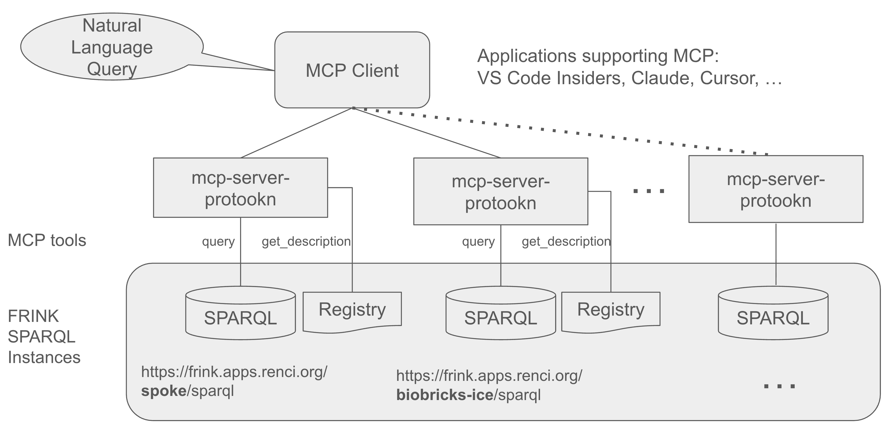

# MCP Server Proto-OKN

A Model Context Protocol (MCP) server that provides tools for querying SPARQL endpoints, with specialized support for the NSF-funded [Proto-OKN Project](https://www.proto-okn.net/) (Prototype Open Knowledge Network) knowledge graphs hosted on the [FRINK](https://frink.renci.org/) platform.

## Features

- **FRINK Integration**: Automatic detection and documentation linking for FRINK-hosted knowledge graphs
- **Proto-OKN Support**: Optimized for querying knowledge graphs in the Proto-OKN ecosystem including:
  - SPOKE (Scalable Precision Medicine Open Knowledge Engine)
  - BioBricks ICE (Chemical safety and cheminformatics)
  - DREAM-KG (Addressing homelessness with explainable AI)
  - SAWGraph (Safe Agricultural Products and Water monitoring)
  - And many other Proto-OKN knowledge graphs
- **Flexible Configuration**: Support for both FRINK and custom SPARQL endpoints
- **Automatic Documentation**: Registry links for supported knowledge graphs

## Overview



## Installation

### Prerequisites

1. **Install VS Code Insiders** (required for MCP support)
   
   Download and install VS Code Insiders from [https://code.visualstudio.com/insiders/](https://code.visualstudio.com/insiders/)
   
   VS Code Insiders is needed because it includes the latest MCP (Model Context Protocol) features.

2. **Install GitHub Copilot extension** (required for MCP integration)
   
   - Open VS Code Insiders
   - Sign in with your GitHub account that has Copilot access
   - **Note**: You need an active GitHub Copilot subscription to use MCP features
   
   MCP servers integrate with VS Code through the Copilot Chat interface.

3. **Install uv** (Python package manager)
   
   ```bash
   # macOS/Linux
   curl -LsSf https://astral.sh/uv/install.sh | sh
   
   # Windows
   powershell -c "irm https://astral.sh/uv/install.ps1 | iex"
   
   # Or via pip
   pip install uv
   ```

### Setup Instructions

1. **Clone and setup the project**

   ```bash
   git clone https://github.com/sbl-sdsc/mcp-proto-okn.git
   cd mcp-proto-okn
   uv sync
   ```

2. **Configure the MCP servers**

   This project includes a pre-configured `.vscode/mcp.json` file with multiple Proto-OKN knowledge graph endpoints. You can add third party endpoints with a custom description as shown for Wikidata in the example.

   Edit `.vscode/mcp.json` to update the server configurations. Here is a snippet of the mcp.json file:

   ```json
   {
     "servers": {
       "mcp-spoke-sparql": {
         "command": "uv",
         "args": ["run", "python", "-m", "mcp_server_protookn.server", "--endpoint", "https://frink.apps.renci.org/spoke/sparql"]
       },
      "mcp-wikidata-sparql": {
         "command": "uv",
         "args": ["run", "python", "-m", "mcp_server_protookn.server", "--endpoint", "https://query.wikidata.org/sparql", "--description", "Access to Wikidata's knowledge graph"]
      }
     }
   }
   ```

   The existing file contains configurations for a subset of Proto-OKN knowledge graphs. You can enable/disable specific servers by adding or removing them from the configuration.

3. **Start using the MCP server**

   - Open VS Code Insiders
   - File -> Open Folder: mcp-proto-okn
   - Open a new chat window
   - Select `Agent` mode
   - Select the `Claude Sonnet 4` model (all other models including GPT-5 perform poorly)
   - The MCP servers should automatically connect and provide access to the knowledge graphs

### Quick Start: Query a Knowledge Graph

Once everything is set up, you can start querying knowledge graphs through the VS Code chat interface:

**Example prompts to try:**

1. **Get a description of a knowledge graph:**
   ```
   Provide a concise overview of the SPOKE knowledge graph, including its main purpose, data sources, and key features.
   ```
2. **Query that combines multiple entity types:**
   ```
   Antibiotic contamination can contribute to antimicrobial resistance. Find locations with antibiotic contamination.
   ```

3. **Query across multiple KGs:**
   ```
   What type of data is available for perfluorooctanoic acid in SPOKE, BioBricks, and SAWGraph?
   ```


The chat interface will use the MCP server to execute SPARQL queries against the configured endpoints and return structured results.

## Usage

### Command Line Parameters

The MCP server accepts the following command line arguments:

**Required:**
- `--endpoint`: SPARQL endpoint URL (e.g., `https://frink.apps.renci.org/spoke/sparql`)

**Optional:**
- `--description`: Custom description for the SPARQL endpoint (automatically generated for FRINK endpoints)

## Tools

### `query`

Execute a SPARQL query against the configured endpoint.

**Parameters:**

- `query_string`: A valid SPARQL query string

**Returns:**

- The query results in JSON format

### `get_description`

Get a description and other metadata about the endpoint, including the PI, funding information, and more.


**Parameters:**

None

**Returns:**

- A description of the SPARQL endpoint extracted from the ProtOKN registry or a custom description provided in mcp.json configuration file.


## Links

- [Proto-OKN Project](https://www.proto-okn.net/)
- [FRINK Platform](https://frink.renci.org/)
- [Knowledge Graph Registry](https://frink.renci.org/registry/)
- [MCP Protocol](https://modelcontextprotocol.io/)
- [Original MCP Server SPARQL](https://github.com/ekzhu/mcp-server-sparql/)


## Citation
PW Rose, CA Nelson, Y Shi, SE Baranzini, MCP Server Proto-OKN. Available online: https://github.com/sbl-sdsc/mcp-proto-okn (2025)

PW Rose, CA Nelson, SG Gebre, K Soman, KA Grigorev, LM Sanders, SV Costes, SE Baranzini, NASA SPOKE-GeneLab Knowledge Graph. Available online: https://github.com/BaranziniLab/spoke_genelab (2025)

CA Nelson, PW Rose, K Soman, LM Sanders, SG Gebre, SV Costes, SE Baranzini, Nasa Genelab-Knowledge Graph Fabric Enables Deep Biomedical Analysis of Multi-Omics Datasets, https://ntrs.nasa.gov/citations/20250000723 (2025)

L Sanders, S Costes, K Soman, P Rose, C Nelson, A Sawyer, S Gebre, S Baranzini, Biomedical Knowledge Graph Capability for Space Biology Knowledge Gain, 45th COSPAR Scientific Assembly. Held 13-21 July, 2024, https://ui.adsabs.harvard.edu/abs/2024cosp...45.2183S/abstract


## Funding
NSF Award number [2333819](https://www.nsf.gov/awardsearch/showAward?AWD_ID=2333819), Proto-OKN Theme 1: Connecting Biomedical information on Earth and in Space via the SPOKE knowledge graph.
