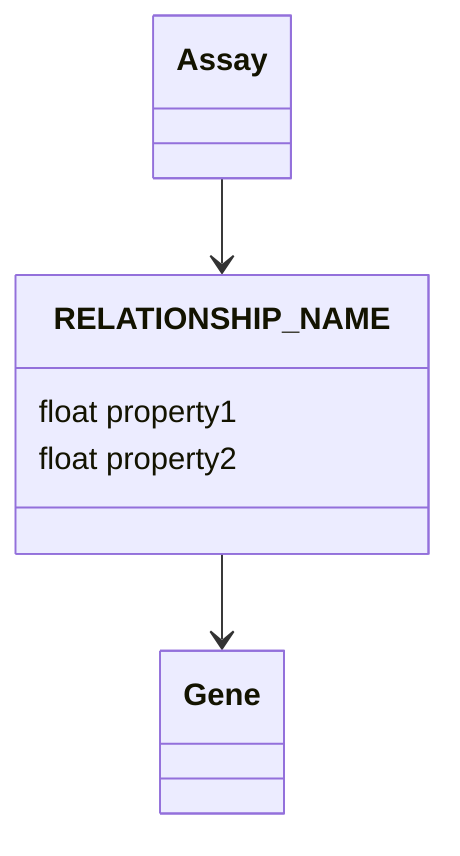

# API Reference

The unified `mcp-proto-okn-unified` server exposes 13 MCP tools. Tools take the canonical graph name (e.g. `spoke-okn`) as their first argument where applicable; aliases defined in the registry are resolved automatically.

## Discovery

### `list_graphs(domain?, entity_type?)`

Browse all 33 graphs with metadata. Call this first to understand what data is available.

**Parameters**
- `domain` (string, optional): filter by domain tag (`biology`, `health`, `toxicology`, `environment`, `geospatial`, …)
- `entity_type` (string, optional): filter by entity class name (`Gene`, `Disease`, `ChemicalEntity`, …)

**Returns** `{ graph_count, graphs: [...] }` with each graph's `name`, `display_name`, `domain_tags`, `entity_types`, and `identifier_namespaces`.

### `route_query(question)`

Match a natural-language question to the most relevant graphs using a registry keyword search.

**Parameters**
- `question` (string, required): the user's natural-language question

**Returns** a ranked list of candidate graphs with match scores.

### `get_description(graph_name)`

Full description, example queries, and identifier namespaces for a single graph. Use before writing queries to deep-dive into a specific graph.

## Schema and Query

### `get_schema(graph_name, compact?)`

Retrieves the schema (classes, predicates, edge properties, node properties) for a graph.

> **Important:** Always call this tool **before** writing SPARQL for a graph.

**Parameters**
- `graph_name` (string, required)
- `compact` (boolean, optional, default `true`): if `true`, returns compact URI:label mappings; if `false`, includes full metadata with descriptions

**Returns** a JSON object with:
- **`classes`** — node types (e.g. `Gene`, `Study`, `Assay`)
- **`predicates`** — edges between nodes (e.g. `ASSOCIATES_DaG`, `MEASURED_IN`); includes a `has_edge_properties` flag per predicate
- **`edge_properties`** — properties stored on relationships themselves (accessed via RDF reification — e.g. `log2fc`, `p_value`)
- **`node_properties`** — literal properties on node classes

### `query(graph_name, query_string, ...)`

Execute SPARQL with automatic FROM-clause injection, ontology expansion, and query analysis.

> **Important:** call `get_schema()` first.

**Parameters**
- `graph_name` (string, required)
- `query_string` (string, required): a valid SPARQL query
- `analyze` (boolean, default `true`): emit warnings for missing `LIMIT`/`ORDER BY`, edge-property misuse, etc.
- `auto_expand_descendants` (boolean, default `true`): rewrite the query to also match descendants of any MONDO/UBERON/HP/GO/CL/ChEBI URI it contains, fetched from Ubergraph
- `max_descendants` (integer, default `2000`): cap on expansion per URI
- `max_depth` (integer, default `5`): max `rdfs:subClassOf` hops
- `bind_expansion_to` (list, optional): variable names to bind expanded URIs to (constrains the expansion to chosen positions in the query)

**Returns**
```json
{
  "graph_name": "...",
  "columns": [...],
  "data": [[...], ...],
  "count": N,
  "query_analysis": { "warning": "...", "suggested_order": "..." },
  "ontology_expansion": { "expanded": true, "original_uris": [...], "expanded_uris": {...}, "total_concepts": K }
}
```

**Query analysis** automatically warns for:
- **`LIMIT` without `ORDER BY`** — results are arbitrary, suggests an appropriate `ORDER BY` based on variable names
- **Edge-property access without reification** — predicates with edge properties referenced as plain triples; provides a corrected RDF reification template
- **Variable analysis** — prioritizes numeric variable names (`concentration`, `count`, `p_value`, `log2fc`, …) for `ORDER BY` suggestions

**Edge-properties access pattern.** For relationships with associated data, use the RDF reification pattern:

```sparql
?stmt rdf:subject ?source ;
      rdf:predicate schema:RELATIONSHIP_NAME ;
      rdf:object ?target ;
      schema:property_name ?value .
```

### `multi_graph_query(queries)`

Run different SPARQL across multiple graphs in a single call. Results are merged with an added `source_graph` column.

**Parameters**
- `queries` (dict, required): `{ "<graph_name>": "<sparql>", ... }`

**Returns** merged result rows tagged with `source_graph`.

### `get_query_template(graph_name, relationship_name)`

Return a SPARQL template demonstrating the RDF reification pattern for a specific relationship that has edge properties (e.g. differential expression with `log2fc`, `p_value`).

## Cross-Graph Bridging

### `get_join_strategy(graph_a, graph_b)`

Identify shared identifiers and recommend a join strategy between two graphs. May suggest a third "bridge" graph (e.g. `gene-expression-atlas-okn` between Ensembl-only and NCBI-Gene-only graphs).

### `lookup_uri(label, max_results?)`

Find an ontology URI by its human-readable label via Ubergraph. Graph-independent.

**Returns** `{ query_label, match_count, matches: [{ uri, label, match_type }] }`.

### `get_descendants(uri, max_results?, max_depth?, include_distance?)`

Expand a URI to find all descendant classes in the ontology hierarchy. Graph-independent.

**Returns** `{ uri, label, max_depth, descendant_count, descendants: [{ uri, label, distance? }] }`.

> For *querying datasets* with ontology expansion, use `query(..., auto_expand_descendants=True)` instead — `get_descendants` is for exploring the ontology itself.

## Visualization and Documentation

### `visualize_schema(graph_name)`

Returns a step-by-step prompt that walks the assistant through generating a Mermaid class diagram for the graph's schema. Workflow:

1. Call `get_schema()`
2. Identify nodes, edges, and edge properties
3. Generate a draft Mermaid diagram
4. **Must call `clean_mermaid_diagram`** on the draft
5. Present the cleaned diagram

Edge properties are represented as intermediary classes:



### `clean_mermaid_diagram(mermaid_content)`

Clean a Mermaid class diagram by removing notes (which would render as unreadable yellow boxes), empty braces, content after `\n` in class names, and stray vertical bars.

Called automatically inside the `visualize_schema` workflow; usable standalone for ad-hoc Mermaid cleanup.

### `create_chat_transcript(graph_name?)`

Returns a formatted prompt instructing the assistant to package the current conversation as a markdown chat transcript (saved to `~/Downloads/`), including queries, results, visualizations, and model-version footer.

---

## Command-Line Interface

The unified server is launched via `mcp-proto-okn-unified` (installed by `uv sync` or available via `uvx`).

```bash
uv run mcp-proto-okn-unified --help
```

Common invocations:

```bash
# Default: stdio transport for local MCP clients
uv run mcp-proto-okn-unified

# HTTP transport for hosting
uv run mcp-proto-okn-unified --transport streamable-http --host 0.0.0.0 --port 8000
```

Configurable via CLI flags or environment variables (`MCP_PROTO_OKN_TRANSPORT`, `MCP_PROTO_OKN_HOST`, `MCP_PROTO_OKN_PORT`, `MCP_PROTO_OKN_API_KEY`); see the [README's "Transport Modes" section](../README.md#transport-modes).
