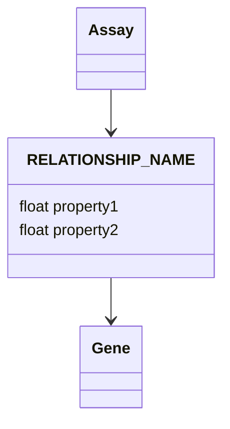

# API Reference

The unified `mcp-proto-okn-unified` server exposes 13 MCP tools. Tools take the canonical graph name (e.g. `spoke-okn`) as their first argument where applicable; aliases defined in the registry are resolved automatically.

## Discovery

### `list_graphs(domain?, entity_type?)`

Browse all 33 graphs with metadata. Call this first to understand what data is available.

**Parameters**
- `domain` (string, optional): filter by domain tag (`biology`, `health`, `toxicology`, `environment`, `geospatial`, …)
- `entity_type` (string, optional): filter by entity class name (`Gene`, `Disease`, `ChemicalEntity`, …)

**Returns** `{ graph_count, graphs: [...] }` with each graph's `name`, `display_name`, `domain_tags`, `entity_types`, and `identifier_namespaces`.

### `route_query(question)`

Rank the graphs by keyword overlap between the question and the registry metadata.

This is a **lexical prefilter, not a learned or semantic router.** The question is lowercased and split on whitespace, and each term is substring-matched against each graph's description summary, domain tags, entity classes, predicates, example queries, identifier namespaces, and name; per-field weights are summed into `relevance_score`. There is no embedding model, stemming, or synonym expansion, so vocabulary mismatch (asking about "cancer" when the registry says "neoplasm") scores zero.

Accordingly the tool returns **all** graphs ranked rather than a filtered top-k — the score orders which graphs to inspect first, and the calling model performs the actual selection using this output together with `get_description` / `get_schema`. A `relevance_score` of 0 means no literal term overlap, not "irrelevant".

**Parameters**
- `question` (string, required): the user's natural-language question

**Returns** a ranked list of **all** candidate graphs with keyword match scores.

### `get_description(graph_name)`

Full description, example queries, and identifier namespaces for a single graph. Use before writing queries to deep-dive into a specific graph.

## Schema and Query

### `get_schema(graph_name, compact?)`

Retrieves the schema (classes, predicates, edge properties, node properties) for a graph.

> **Important:** Always call this tool **before** writing SPARQL for a graph.

**Parameters**
- `graph_name` (string, required)
- `compact` (boolean, optional, default `true`): if `true`, returns compact URI:label mappings; if `false`, includes full metadata with descriptions

**Returns** a JSON object with:
- **`classes`** — node types (e.g. `Gene`, `Study`, `Assay`)
- **`predicates`** — edges between nodes (e.g. `ASSOCIATES_DaG`, `MEASURED_IN`); includes a `has_edge_properties` flag per predicate
- **`edge_properties`** — properties stored on relationships themselves (accessed via RDF reification — e.g. `log2fc`, `p_value`)
- **`node_properties`** — literal properties on node classes

### `query(graph_name, query_string, ...)`

Execute SPARQL with automatic dataset scoping, ontology expansion, and query analysis.

> **Important:** call `get_schema()` first.

**Parameters**
- `graph_name` (string, required)
- `query_string` (string, required): a valid SPARQL query
- `analyze` (boolean, default `true`): emit warnings for missing `LIMIT`/`ORDER BY`, edge-property misuse, etc.
- `auto_expand_descendants` (boolean, default `true`): rewrite the query to also match descendants of any MONDO/UBERON/HP/GO/CL/ChEBI URI it contains, fetched from the federation's `ubergraph` graph. Expansion always covers the **full subtree** — there is no depth setting (see [`get_descendants`](#get_descendantsuri-max_results-include_distance))
- `max_descendants` (integer, default `2000`): cap on expansion per URI
- `bind_expansion_to` (list, optional): variable names to bind expanded URIs to (constrains the expansion to chosen positions in the query)

**Returns**
```json
{
  "graph_name": "...",
  "columns": [...],
  "data": [[...], ...],
  "count": N,
  "query_analysis": { "warning": "...", "suggested_order": "..." },
  "ontology_expansion": { "expanded": true, "original_uris": [...], "expanded_uris": {...}, "total_concepts": K }
}
```

**Query analysis** automatically warns for:
- **`LIMIT` without `ORDER BY`** — results are arbitrary, suggests an appropriate `ORDER BY` based on variable names
- **Edge-property access without reification** — predicates with edge properties referenced as plain triples; provides a corrected RDF reification template
- **Variable analysis** — prioritizes numeric variable names (`concentration`, `count`, `p_value`, `log2fc`, …) for `ORDER BY` suggestions

**Edge-properties access pattern.** For relationships with associated data, use the RDF reification pattern:

```sparql
?stmt rdf:subject ?source ;
      rdf:predicate schema:RELATIONSHIP_NAME ;
      rdf:object ?target ;
      schema:property_name ?value .
```

**Dataset scoping (`FROM` / `FROM NAMED`).** The server inserts `FROM <https://purl.org/okn/frink/kg/{graph_name}>` before `WHERE`, so bare triple patterns resolve inside the chosen graph. When the query *also* names other graphs explicitly with `GRAPH <iri>`, a matching `FROM NAMED <iri>` is emitted for each of them.

That second line is not decoration. In SPARQL, `FROM` builds the default graph and `FROM NAMED` decides which named graphs the dataset contains — a query carrying only `FROM` has **no** named graphs, so every `GRAPH <other>` block matches the empty graph and returns zero rows with no error and no warning. With both clauses emitted, a cross-graph query written the ordinary way behaves the same through this server as it does against the endpoint directly:

```sparql
SELECT ?dataset ?d WHERE {
  ?dataset schema:healthCondition ?d .
  GRAPH <https://purl.org/okn/frink/kg/ubergraph> {
    ?d rdfs:subClassOf* <http://purl.obolibrary.org/obo/MONDO_0004995> .
  }
}
```

Two cases are left alone: a query that already carries its own `FROM`/`FROM NAMED` is scoping itself and is not second-guessed, and a query using a variable graph (`GRAPH ?g`) cannot have its named graphs enumerated statically, so nothing is injected.

**Federation boundary (`SERVICE`).** A `SERVICE` clause may only address the OKN federation (`apps.okn.us`). A query targeting any other host is refused before execution and returns `{ "error": "...", "refused_service_endpoints": [...] }`; a variable endpoint (`SERVICE ?e`) is refused too, since it cannot be checked statically. A result fetched from outside cannot be reproduced from the graphs this server serves, and is not attributable to them — an external Ubergraph endpoint, for instance, returned 1,628 descendants for a MONDO term where the federation's own copy holds 1,592.

In-federation `SERVICE <https://apps.okn.us/<graph>/sparql>` still works as documented, and everything the ontology tools use is reachable in-federation as a named graph: `GRAPH <https://purl.org/okn/frink/kg/ubergraph>` does what an external Ubergraph `SERVICE` would.

### `multi_graph_query(queries)`

Run different SPARQL across multiple graphs in a single call. Results are merged with an added `source_graph` column.

**Parameters**
- `queries` (dict, required): `{ "<graph_name>": "<sparql>", ... }`

**Returns** merged result rows tagged with `source_graph`.

### `get_query_template(graph_name, relationship_name)`

Return a SPARQL template demonstrating the RDF reification pattern for a specific relationship that has edge properties (e.g. differential expression with `log2fc`, `p_value`).

## Cross-Graph Bridging

### `get_join_strategy(graph_a, graph_b)`

Identify shared identifiers and recommend a join strategy between two graphs. May suggest a third "bridge" graph (e.g. `gene-expression-atlas-okn` between Ensembl-only and NCBI-Gene-only graphs).

### `lookup_uri(label, max_results?)`

Find an ontology URI by its human-readable label in the federation's `ubergraph` graph — exact `rdfs:label` and `oboInOwl:hasExactSynonym` matches. Graph-independent.

Casings are enumerated on the *query* side (the term as given, lowercased, uppercased, title case, and first-letter-capitalised) rather than lowercasing the stored label, which no index can serve and which scanned every label in ubergraph. Matching therefore covers every realistic spelling rather than literally every one: a deliberately mixed-case string like `mUsClE oRgAn` will miss, while `Muscle Organ`, `muscle organ`, and `MUSCLE ORGAN` all hit.

**Returns** `{ query_label, match_count, matches: [{ uri, label, match_type }] }`.

### `get_descendants(uri, max_results?, include_distance?)`

Expand a URI to find all descendant classes in the ontology hierarchy, via `rdfs:subClassOf*` against the federation's `ubergraph` graph. Graph-independent.

**Parameters**
- `uri` (string, required): the full URI to expand (e.g. `http://purl.obolibrary.org/obo/MONDO_0005178`)
- `max_results` (integer, default `2000`): cap on returned descendants
- `include_distance` (boolean, default `true`): include a `distance` field per descendant

**Returns** `{ uri, label, descendant_count, total_count, truncated, descendants: [{ uri, label, distance? }] }`. `total_count` is the size of the full subtree regardless of `max_results`, and `truncated` is `true` when `max_results` cut the list — so a partial answer cannot be mistaken for a complete one.

> **There is no `max_depth`.** The federation's `ubergraph` copy ships a *materialized* closure: every descendant is asserted as a direct `rdfs:subClassOf` of every ancestor, so one hop already returns the whole subtree. The previous depth-bounded implementation recomputed the same rows in every branch and stopped answering at all past ~6 hops, so the parameter has been removed from both `get_descendants` and `query`. For the same reason `distance` is always `1`: a materialized closure keeps no hop counts and cannot tell a child from a great-grandchild.

> For *querying datasets* with ontology expansion, use `query(..., auto_expand_descendants=True)` instead — `get_descendants` is for exploring the ontology itself.

## Visualization and Documentation

### `visualize_schema(graph_name)`

Returns a step-by-step prompt that walks the assistant through generating a Mermaid class diagram for the graph's schema. Workflow:

1. Call `get_schema()`
2. Identify nodes, edges, and edge properties
3. Generate a draft Mermaid diagram
4. **Must call `clean_mermaid_diagram`** on the draft
5. Present the cleaned diagram

Edge properties are represented as intermediary classes:


```mermaid
classDiagram
direction TB

class RELATIONSHIP_NAME {
    float property1
    float property2
}
Assay --> RELATIONSHIP_NAME
RELATIONSHIP_NAME --> Gene
```

### `clean_mermaid_diagram(mermaid_content)`

Clean a Mermaid class diagram by removing notes (which would render as unreadable yellow boxes), empty braces, content after `\n` in class names, and stray vertical bars.

Called automatically inside the `visualize_schema` workflow; usable standalone for ad-hoc Mermaid cleanup.

### `create_chat_transcript(graph_name?)`

Returns a formatted prompt instructing the assistant to package the current conversation as a markdown chat transcript (saved to `~/Downloads/`), including queries, results, visualizations, and model-version footer.

---

## Command-Line Interface

The unified server is launched via `mcp-proto-okn-unified` (installed by `uv sync` or available via `uvx`).

```bash
uv run mcp-proto-okn-unified --help
```

Common invocations:

```bash
# Default: stdio transport for local MCP clients
uv run mcp-proto-okn-unified

# HTTP transport for hosting
uv run mcp-proto-okn-unified --transport streamable-http --host 0.0.0.0 --port 8000

# Run with ontology expansion switched off entirely
uv run mcp-proto-okn-unified --no-ontology-expansion
```

Configurable via CLI flags or environment variables (`MCP_PROTO_OKN_TRANSPORT`, `MCP_PROTO_OKN_HOST`, `MCP_PROTO_OKN_PORT`, `MCP_PROTO_OKN_API_KEY`, `MCP_PROTO_OKN_NO_ONTOLOGY_EXPANSION`); see the [developer doc's "Transport Modes" section](develop.md#transport-modes).

### `--no-ontology-expansion`

Off by default. Intended for controlled comparisons that need the capability *absent* rather than merely unused — withholding the tools is not enough on its own, because expansion is also reachable as a parameter on `query()`. The flag closes both routes at once:

- `get_descendants` returns an empty `descendants` list with an `error` explaining that this is a server setting, not an empty hierarchy
- `query(..., auto_expand_descendants=True)` runs the query exactly as written, over the URIs named and no descendants, and adds an `ontology_expansion_disabled` key to the result so a narrower answer is not read as narrower data

Set via the flag or `MCP_PROTO_OKN_NO_ONTOLOGY_EXPANSION=1`.
