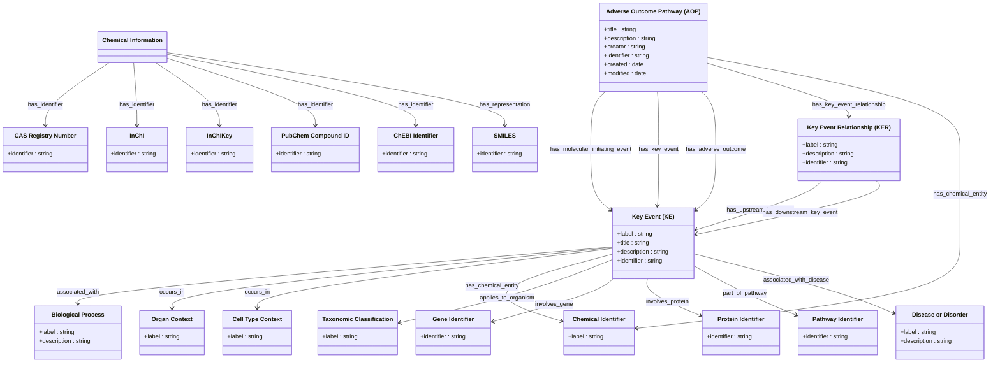

# Chat Transcript: Exploring BioBricks AOP-Wiki Knowledge Graph

## Chat Transcript

👤 **User**  
@biobricks-aopwiki

---

🧠 **Assistant**  
I'll help you explore the biobricks-aopwiki knowledge graph. Let me start by getting some information about this endpoint.

Great! I can see this is the **BioBricks AOP-Wiki** knowledge graph, which contains data about Adverse Outcome Pathways (AOPs) from the AOP-Wiki project.

This knowledge graph is particularly useful for toxicology and environmental health research. It contains:
- **493 AOPs** (Adverse Outcome Pathways)
- **1,469 key events**
- **2,060 key event relationships**
- **184,303 total triples**

The data links molecular initiating events to adverse health outcomes, with extensive cross-references to chemical databases like ChEBI, ChEMBL, PubChem, KEGG, and Wikidata.

Would you like me to:
1. Show you the schema of available classes and relationships?
2. Run a specific query to explore AOPs, key events, or chemical relationships?
3. Visualize the knowledge graph structure?
4. Answer a specific question about toxicology pathways?

Let me know what you'd like to explore!

---

👤 **User**  
Visualize the schema

---

🧠 **Assistant**  
Let me get the schema and create a visualization for you.

Here's the schema visualization for the BioBricks AOP-Wiki knowledge graph! 

The diagram shows the main structure:

**Core Components:**
- **Adverse Outcome Pathway (AOP)** - The central entity linking molecular events to adverse health outcomes
- **Key Events (KE)** - Measurable biological changes in the pathway
- **Key Event Relationships (KER)** - Causal linkages between key events

**Supporting Entities:**
- **Chemical identifiers** (CAS, InChI, SMILES, PubChem, ChEBI)
- **Biological contexts** (organ, cell type, biological processes)
- **Cross-references** (genes, proteins, pathways, diseases, taxonomic classifications)

The relationships show how AOPs connect to their molecular initiating events, intermediate key events, and final adverse outcomes, with all the supporting chemical and biological context information.

---

*Created by [mcp-proto-okn](https://github.com/sbl-sdsc/mcp-proto-okn) 0.4.0 for biobricks-aopwiki on 2025-12-24*

claude-sonnet-4-20250514
