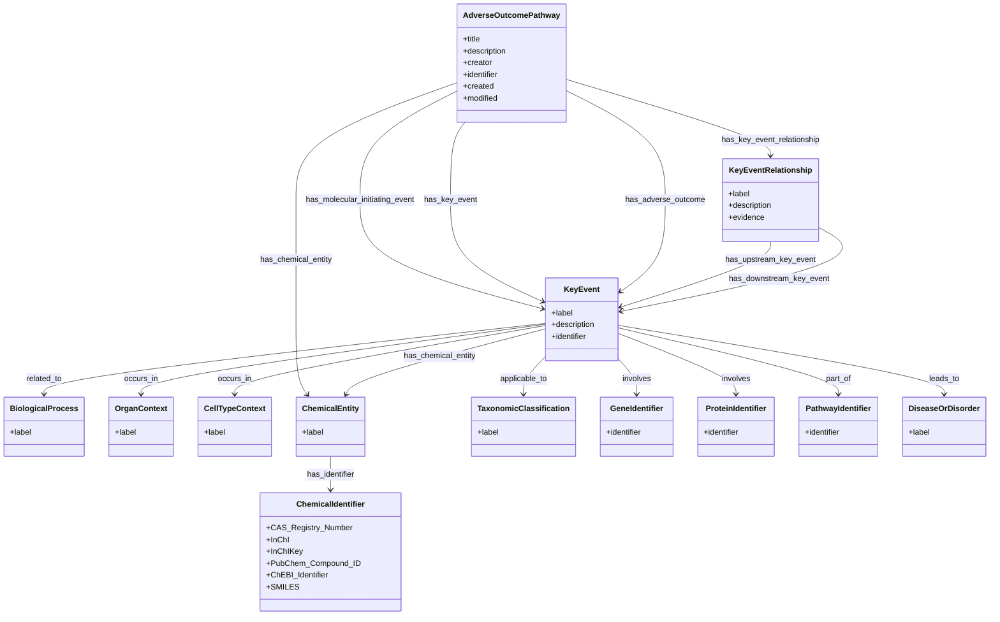

# BioBricks AOP-Wiki Knowledge Graph Exploration

## Chat Transcript

👤 **User**  
@biobrick-aopwiki

---

🧠 **Assistant**  
I'll help you explore the AOP-Wiki knowledge graph! Let me start by getting information about this knowledge graph and understanding its structure.

[Retrieved knowledge graph description and schema]

Perfect! I now have access to the **BioBricks AOP-Wiki knowledge graph**, which contains structured information about Adverse Outcome Pathways (AOPs). 

## What is this knowledge graph?

The **BioBricks AOP-Wiki** is an open knowledge graph containing:
- **493 Adverse Outcome Pathways (AOPs)** - sequences showing how chemical exposures lead to harmful health or environmental effects
- **1,469 Key Events (KEs)** - measurable biological changes that occur along these pathways
- **2,060 Key Event Relationships (KERs)** - causal links between key events
- **184,303 total triples** of interconnected data

It's designed for toxicologists, regulatory scientists, and environmental health researchers to understand how chemicals cause harm through biological mechanisms.

## What can you explore?

You can ask me questions like:
- **"Show me all adverse outcome pathways"** - browse the complete list of AOPs
- **"What chemicals are linked to liver damage?"** - find chemical-disease associations
- **"Find AOPs related to oxidative stress"** - search by biological process
- **"What are the key events in AOP 123?"** - examine specific pathway details
- **"Show me the relationship between gene X and adverse outcomes"** - trace mechanistic connections

The data includes connections to major databases like ChEBI, ChEMBL, PubChem, KEGG, and Wikidata, making it a rich resource for chemical hazard assessment and predictive toxicology.

What would you like to explore?

---

👤 **User**  
Visualize the schema

---

🧠 **Assistant**  
Here's the schema visualization for the BioBricks AOP-Wiki knowledge graph:

This diagram shows the core structure of the AOP-Wiki knowledge graph:

**Central Components:**
- **AdverseOutcomePathway** - The main pathway connecting molecular events to adverse outcomes
- **KeyEvent** - Individual biological changes along the pathway
- **KeyEventRelationship** - Causal connections between key events

**Supporting Context:**
- Biological contexts (Process, Organ, Cell Type)
- Chemical information with multiple identifier types
- Cross-references to genes, proteins, pathways, and diseases
- Taxonomic classifications for species-specific effects

The arrows show how these entities connect - for example, an AOP has a molecular initiating event (first KeyEvent), multiple intermediate KeyEvents, and an adverse outcome (final KeyEvent), with KeyEventRelationships describing the causal chain between them.

---

👤 **User**  
Create transcript

---

*Created by [mcp-proto-okn](https://github.com/sbl-sdsc/mcp-proto-okn) 0.4.0 using claude-sonnet-4-5-20250929 on 2024-12-22*
