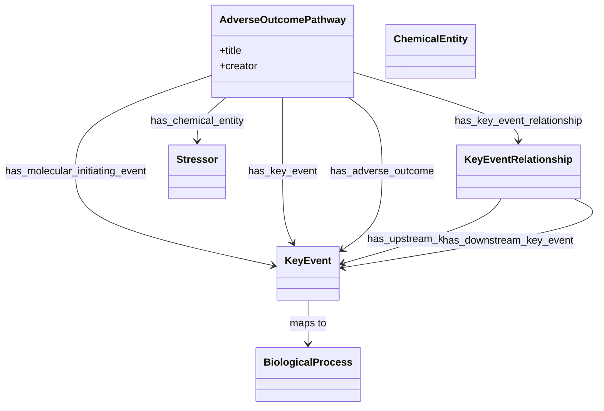

# BioBricks AOP-Wiki Knowledge Graph Exploration

## Chat Transcript

👤 **User**  
@biobricks-aopwiki

---

🧠 **Assistant**  
I'll help you explore the biobricks-aopwiki knowledge graph. Let me fetch its schema and probe the live endpoint for the classes and predicates in use.

**BioBricks AOP-Wiki** represents the **Adverse Outcome Pathway (AOP)** framework from the AOP-Wiki, linking molecular initiating events through a chain of key events to adverse health/environmental outcomes, and connecting them to the chemical stressors that trigger them. It uses the AOP ontology (`aopkb.org/aop_ontology#`) plus EDAM, CHEMINF, GO, and NCIT identifiers for genes, chemicals, processes, and stressors.

Live class counts:
- **493 `AdverseOutcomePathway`** — full causal pathways
- **1,469 `KeyEvent`** and **2,060 `KeyEventRelationship`** — the measurable events and the causal links between them
- **658 `Stressor`** (NCIT) and chemical entities identified via CHEMINF (CAS, ChEBI, ChEMBL, PubChem, ChemSpider, DrugBank, HMDB, KEGG, LipidMaps, Wikidata)
- **501 `biological process`** (GO); gene/protein identifiers via EDAM (NCBI Gene, Ensembl, HGNC, UniProt)

**Main relationships:**
- `has_molecular_initiating_event`, `has_key_event`, `has_adverse_outcome` — link an AOP to its component events
- `has_key_event_relationship` — link an AOP to a causal KE→KE relationship
- `has_upstream_key_event` / `has_downstream_key_event` — the two ends of a key-event relationship
- `has_chemical_entity` — the chemical stressor(s) associated with an AOP or event
- context predicates (`OrganContext`, `CellTypeContext`, `LifeStageContext`) and `has_evidence`

Would you like me to:
1. Visualize the schema structure?
2. Trace the key-event chain of a specific AOP?
3. Find AOPs triggered by a particular chemical stressor?

---

👤 **User**  
Visualize the schema

---

🧠 **Assistant**  
Here's the live schema of BioBricks AOP-Wiki — adverse outcome pathways built from key events and their causal relationships, driven by chemical stressors:

```mermaid
classDiagram
    class AdverseOutcomePathway {
        +title
        +creator
    }
    class KeyEvent
    class KeyEventRelationship
    class Stressor
    class ChemicalEntity
    class BiologicalProcess

    AdverseOutcomePathway --> KeyEvent : has_molecular_initiating_event
    AdverseOutcomePathway --> KeyEvent : has_key_event
    AdverseOutcomePathway --> KeyEvent : has_adverse_outcome
    AdverseOutcomePathway --> KeyEventRelationship : has_key_event_relationship
    KeyEventRelationship --> KeyEvent : has_upstream_key_event
    KeyEventRelationship --> KeyEvent : has_downstream_key_event
    AdverseOutcomePathway --> Stressor : has_chemical_entity
    KeyEvent --> BiologicalProcess : maps to
```

**Key insights from the schema:**

1. **AOP as a causal chain.** Each `AdverseOutcomePathway` designates a molecular initiating event, intermediate key events, and an adverse outcome — all instances of `KeyEvent` reached through distinct predicates — giving a directed path from exposure to harm.

2. **Key-event relationships carry the causality.** `KeyEventRelationship` objects (2,060 of them) connect an upstream and a downstream `KeyEvent`, so the network of event dependencies can be traversed independent of any single AOP.

3. **Chemical stressors.** AOPs link to chemical entities and NCIT `Stressor`s via `has_chemical_entity`, with chemicals identified across CHEMINF schemes (CAS, ChEBI, ChEMBL, PubChem, …) for cross-graph joins to toxicology and chemistry resources.

4. **Biological grounding.** Key events reference GO biological processes and EDAM gene/protein identifiers, anchoring the pathway model to standard molecular ontologies.

---

👤 **User**  
Create transcript

---

*Created by [mcp-proto-okn](https://github.com/sbl-sdsc/mcp-proto-okn) 0.6.0 using claude-opus-4-8 on 2026-07-12*
