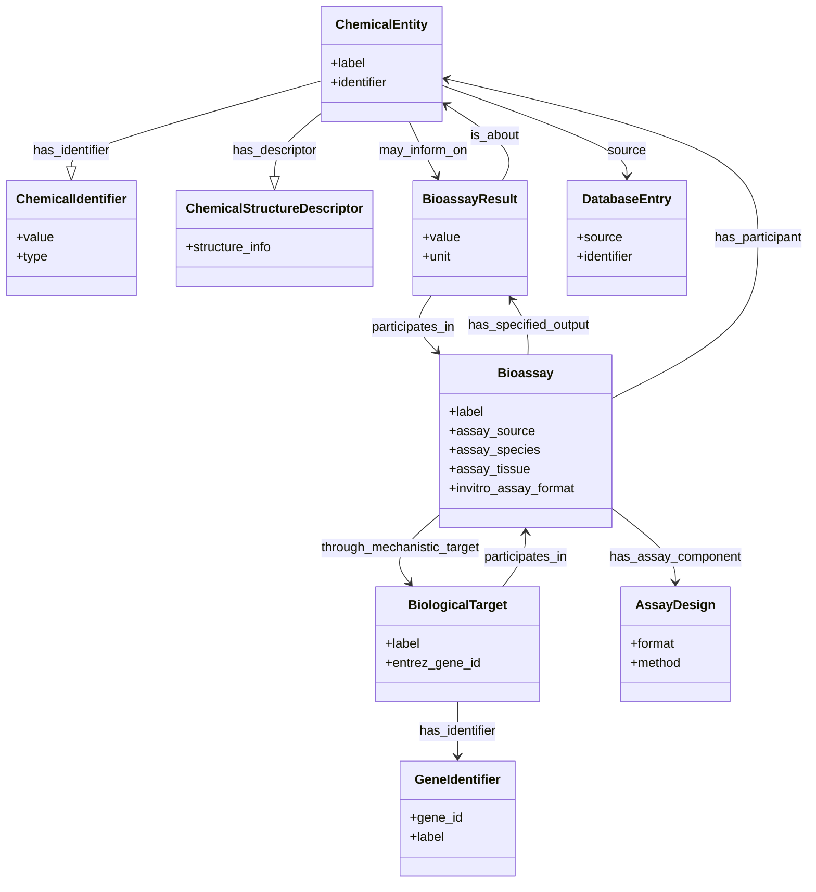

# BioBricks ICE Knowledge Graph Exploration

👤 **User**  
@biobricks-ice

---

🧠 **Assistant**  
I'll help you explore this knowledge graph! Let me start by getting some information about it.

**BioBricks ICE (Integrated Chemical Environment)** is an open knowledge graph containing chemical safety and bioassay data from the EPA's NICEATM ICE database. It contains **27.4 million triples** describing:

- **206,543 chemical entities**
- **Over 3 million bioassay measurements**
- **2,063 standardized assays**

## Key Features

**Core Entity Types:**
- **Chemical Entities** - Molecules and compounds (identified via EPA DSSTox IDs)
- **Bioassays** - Laboratory tests measuring substance effects on living systems
- **Bioassay Results** - Measured outcomes from experiments
- **Biological Targets** - Molecules that substances interact with (linked to genes and UMLS terms)
- **Chemical Identifiers & Descriptors** - Unique codes and structural information

**Key Relationships:**
- Links chemicals to their bioassay test results
- Connects assays to biological targets and genes
- Provides mechanistic information about how chemicals produce effects
- Includes metadata like assay format, tissue type, and species tested

**Vocabularies Used:**
- BioAssay Ontology (BAO)
- Chemical Information Ontology (CHEMINF)
- Semanticscience Integrated Ontology (SIO)
- Relation Ontology (RO)

**Licensing:** Public domain (CC0-1.0) - freely available with no restrictions

## What can I help you explore?

I can help you query this knowledge graph to find information about:
- Specific chemicals and their safety data
- Bioassay results and experimental outcomes
- Biological targets and mechanisms of action
- Gene-chemical interactions
- Toxicity endpoints and health effects

---

👤 **User**  
Visualize the schema

---

🧠 **Assistant**  
Here's the schema visualization for the BioBricks ICE knowledge graph:

## Key Schema Insights

The diagram shows the main structure of the BioBricks ICE knowledge graph:

**Central Hub:** The **Bioassay** class connects most entities together, linking chemicals to their test results and biological targets.

**Chemical Information:** Chemical entities are identified through various identifiers and descriptors, with links to external databases.

**Experimental Data Flow:** 
- Chemicals participate in bioassays
- Bioassays produce results
- Results measure effects on biological targets
- Targets are linked to specific genes

This structure enables queries about chemical safety, toxicity mechanisms, and gene-chemical interactions across the EPA's CompTox database.

---

👤 **User**  
Create transcript

---

*Created by [mcp-proto-okn](https://github.com/sbl-sdsc/mcp-proto-okn) 0.4.0 using claude-sonnet-4-20250514 on 2025-12-22*
