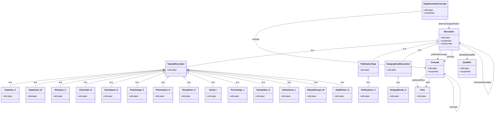

# BioBricks MeSH Knowledge Graph Exploration

👤 **User**  
@biobricks-mesh

---

🧠 **Assistant**  
I'll help you explore this knowledge graph. Let me first get information about what this knowledge graph contains.

*[Retrieved description of BioBricks MeSH knowledge graph]*

Great! I can see this is the **BioBricks MeSH** knowledge graph - an open knowledge graph containing Medical Subject Headings (MeSH), which is the U.S. National Library of Medicine's controlled vocabulary for biomedical terms.

*[Retrieved schema information]*

Perfect! This is the **BioBricks MeSH** knowledge graph, containing the Medical Subject Headings (MeSH) controlled vocabulary used for indexing biomedical literature. Here's what you can explore in this knowledge graph:

## Key Content Areas

The knowledge graph contains **over 18.1 million triples** covering:

### Major Categories (A-Z):
- **Anatomy [A]** - Body structures, organs, tissues, cells
- **Organisms [B]** - Bacteria, viruses, fungi, plants, animals  
- **Diseases [C]** - Pathological conditions, syndromes, symptoms
- **Chemicals and Drugs [D]** - Compounds, pharmaceuticals, biological substances
- **Analytical/Diagnostic Techniques [E]** - Medical procedures, tests, treatments
- **Psychiatry and Psychology [F]** - Mental processes, behavioral sciences
- **Phenomena and Processes [G]** - Biological, chemical, physical processes
- **Disciplines and Occupations [H]** - Fields of study, professions
- **Social Phenomena [I]** - Social sciences, cultural topics
- **Technology and Industry [J]** - Industrial processes, agriculture
- **Humanities [K]** - Arts, history, religion, philosophy
- **Information Science [L]** - Communication, computer science
- **Named Groups [M]** - Population groups, demographics
- **Health Care [N]** - Health services, facilities, systems
- **Geographicals [Z]** - Geographic locations worldwide

### What Questions Can I Help You Answer?

I can help you explore:
- Disease hierarchies and relationships
- Drug/chemical classifications
- Medical procedure categorizations  
- Anatomical structures and their organization
- Organism taxonomies
- Relationships between medical concepts

Would you like to explore a specific area, or should I show you some example queries?

---

👤 **User**  
Visualize the schema

---

🧠 **Assistant**  
I'll visualize the schema for you using a Mermaid diagram.

*[Generated and cleaned Mermaid class diagram]*

Here's the schema visualization for the BioBricks MeSH knowledge graph:

This diagram shows the hierarchical structure of the MeSH knowledge graph:

**Key Structure:**
- **Descriptor** is the main class with three subtypes: TopicalDescriptor, PublicationType, and GeographicalDescriptor
- **TopicalDescriptor** branches into 14 subject categories (A-N) covering everything from Anatomy to Health Care
- **Descriptors** link to **Concepts** (which define meanings) and **Terms** (the actual words/phrases used)
- **Qualifiers** (subheadings) can be associated with descriptors to refine their meaning
- **SupplementaryConcept** provides additional terms for specific substances, protocols, or rare diseases

The relationships show how terms are organized hierarchically (broader/narrower) and how different components connect to form the complete controlled vocabulary system.

---

*Created by [mcp-proto-okn](https://github.com/sbl-sdsc/mcp-proto-okn) 0.4.0 using claude-sonnet-4-20250514 on 2025-12-22*
