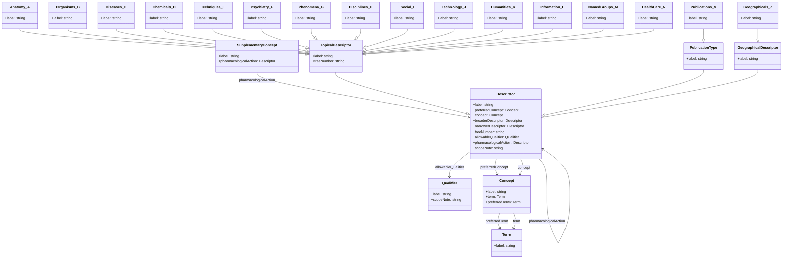

## Chat Transcript
Exploring BioBricks MeSH Knowledge Graph

👤 **User**  
@biobricks-mesh

---

🧠 **Assistant**  
I'll help you explore the biobricks-mesh knowledge graph. Let me start by getting information about this knowledge graph and its schema.

Great! I can now help you explore the **BioBricks MeSH** knowledge graph. This is a comprehensive biomedical vocabulary resource from the U.S. National Library of Medicine containing over 18.1 million triples.

## What's in BioBricks MeSH?

The knowledge graph contains:
- **2.4 million biomedical entities** including:
  - 862,579 terms
  - 464,362 concepts
  - 249,243 chemical substance records
  - 66,110 organisms
  - 29,940 topical descriptors
  - 6,750 diseases

## Main Categories

The MeSH vocabulary is organized into hierarchical categories (A-Z):
- **A** - Anatomy
- **B** - Organisms
- **C** - Diseases
- **D** - Chemicals and Drugs
- **E** - Analytical, Diagnostic and Therapeutic Techniques
- **F** - Psychiatry and Psychology
- **G** - Phenomena and Processes
- **H** - Disciplines and Occupations
- **I-N** - Social sciences, technology, humanities, information science, demographics, and health care
- **V** - Publication Characteristics
- **Z** - Geographicals

## What would you like to explore?

I can help you:
- Search for specific medical terms, diseases, or drugs
- Explore hierarchical relationships (broader/narrower terms)
- Find related concepts and their pharmacological actions
- Query specific diseases and their treatments
- Analyze relationships between terms

What aspect of the MeSH vocabulary would you like to investigate?

---

👤 **User**  
Visualize the schema

---

🧠 **Assistant**  
I'll create a visual representation of the BioBricks MeSH schema. Let me generate and clean the Mermaid diagram.

Here's the BioBricks MeSH schema visualization! The diagram shows:

**Core Structure:**
- **Descriptor** is the main class with relationships to Concepts, Terms, and Qualifiers
- **Concept** represents specific meanings, linked to Terms (the actual words/phrases)
- **Qualifier** adds specificity to descriptors (like "diagnosis" or "therapeutic use")

**Hierarchy:**
- Three main descriptor types: TopicalDescriptor, PublicationType, and GeographicalDescriptor
- 14 topical categories (A-N) for anatomy, organisms, diseases, chemicals, etc.
- Each category inherits from TopicalDescriptor

**Key Relationships:**
- Descriptors link to broader/narrower terms (hierarchical navigation)
- Descriptors have pharmacological actions (for drugs/chemicals)
- Concepts connect to multiple terms (synonyms and variations)

---

*Created by [mcp-proto-okn](https://github.com/sbl-sdsc/mcp-proto-okn) 0.4.0 for biobricks-mesh on 2025-12-24*

claude-sonnet-4-20250514
