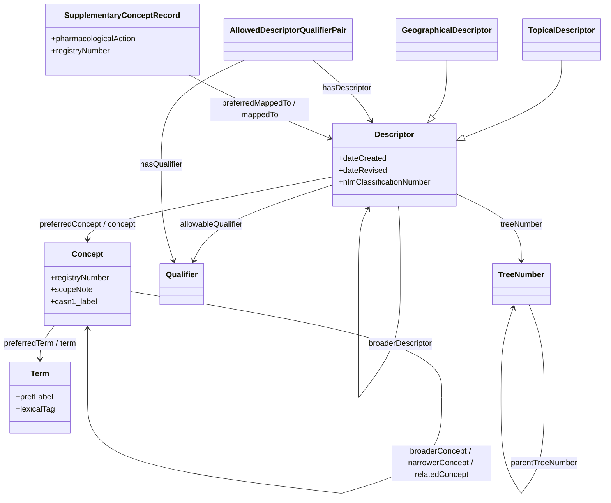

# BioBricks MeSH Knowledge Graph Exploration

## Chat Transcript

👤 **User**  
@biobricks-mesh

---

🧠 **Assistant**  
I'll help you explore the biobricks-mesh knowledge graph. Let me fetch its schema and probe the live endpoint for the classes and predicates in use.

**BioBricks MeSH** is a linked-data representation of the U.S. National Library of Medicine's **Medical Subject Headings (MeSH)** thesaurus, using the official NLM MeSH RDF vocabulary (`id.nlm.nih.gov/mesh/vocab#`). It captures the full descriptor → concept → term hierarchy, the tree-number classification, descriptor/qualifier pairings, and supplementary concept records.

Live class counts:
- **~862,579 `Term`** and **~464,362 `Concept`** — the lexical terms and the concepts they name
- **~673,877 `AllowedDescriptorQualifierPair`** (+ **1,032 `DisallowedDescriptorQualifierPair`**) — valid/invalid descriptor–qualifier combinations
- **~29,940 `TopicalDescriptor`** and **400 `GeographicalDescriptor`** — the main headings
- **~80,089 `TreeNumber`** — positions in the MeSH tree hierarchy
- Supplementary Concept Records: **249,243 `SCR_Chemical`**, **66,110 `SCR_Organism`**, **6,750 `SCR_Disease`**, **1,764 `SCR_Population`**, **1,219 `SCR_Protocol`**
- **84 `Qualifier`** (subheadings), **187 `PublicationType`**, **2 `CheckTag`**

**Main relationships:**
- `preferredConcept` / `concept` — a `Descriptor` has a preferred and additional `Concept`s
- `preferredTerm` / `term` — a `Concept` has a preferred and additional `Term`s
- `broaderConcept` / `narrowerConcept` / `relatedConcept` — concept-to-concept relations
- `broaderDescriptor` — descriptor hierarchy
- `treeNumber` / `parentTreeNumber` — placement and hierarchy within the MeSH tree
- `allowableQualifier`, `hasDescriptor` / `hasQualifier` — qualifier rules and descriptor–qualifier pairs
- `preferredMappedTo` / `mappedTo`, `pharmacologicalAction`, `registryNumber` — supplementary-concept mapping and chemical annotations

Would you like me to:
1. Visualize the schema structure?
2. Look up a descriptor by name and its tree numbers?
3. Traverse the descriptor/concept/term hierarchy for a topic?

---

👤 **User**  
Visualize the schema

---

🧠 **Assistant**  
Here's the live schema of BioBricks MeSH — the NLM MeSH RDF model of descriptors, concepts, terms, tree numbers, qualifiers, and supplementary concept records:

```mermaid
classDiagram
    class TopicalDescriptor
    class GeographicalDescriptor
    class Descriptor {
        +dateCreated
        +dateRevised
        +nlmClassificationNumber
    }
    class Concept {
        +registryNumber
        +scopeNote
        +casn1_label
    }
    class Term {
        +prefLabel
        +lexicalTag
    }
    class Qualifier
    class TreeNumber
    class AllowedDescriptorQualifierPair
    class SupplementaryConceptRecord {
        +pharmacologicalAction
        +registryNumber
    }

    TopicalDescriptor --|> Descriptor
    GeographicalDescriptor --|> Descriptor
    Descriptor --> Concept : preferredConcept / concept
    Concept --> Term : preferredTerm / term
    Concept --> Concept : broaderConcept / narrowerConcept / relatedConcept
    Descriptor --> Descriptor : broaderDescriptor
    Descriptor --> TreeNumber : treeNumber
    TreeNumber --> TreeNumber : parentTreeNumber
    Descriptor --> Qualifier : allowableQualifier
    AllowedDescriptorQualifierPair --> Descriptor : hasDescriptor
    AllowedDescriptorQualifierPair --> Qualifier : hasQualifier
    SupplementaryConceptRecord --> Descriptor : preferredMappedTo / mappedTo
```

**Key insights from the schema:**

1. **Descriptor → Concept → Term backbone.** Each MeSH heading (`TopicalDescriptor` / `GeographicalDescriptor`, a subclass of `Descriptor`) owns one preferred plus several additional `Concept`s, and each concept owns one preferred plus additional `Term`s — the standard three-level MeSH structure.

2. **Tree classification.** Descriptors are placed in the MeSH hierarchy through `treeNumber` → `TreeNumber`, and tree numbers nest via `parentTreeNumber`, so a subtree of topics can be walked directly.

3. **Descriptor–qualifier pairing.** `AllowedDescriptorQualifierPair` (and the small `DisallowedDescriptorQualifierPair` set) enumerate which subheading `Qualifier`s may combine with which descriptors, complementing per-descriptor `allowableQualifier` rules.

4. **Supplementary Concept Records.** SCRs for chemicals, organisms, diseases, populations, and protocols map to their nearest descriptors (`preferredMappedTo` / `mappedTo`) and carry chemical annotations (`registryNumber`, `pharmacologicalAction`). (This is the current `SupplementaryConceptRecord` model; the older `SupplementaryConcept` class and `narrowerDescriptor` predicate are no longer used.)

---

👤 **User**  
Create transcript

---

*Created by [mcp-proto-okn](https://github.com/sbl-sdsc/mcp-proto-okn) 0.6.0 using claude-opus-4-8 on 2026-07-12*
