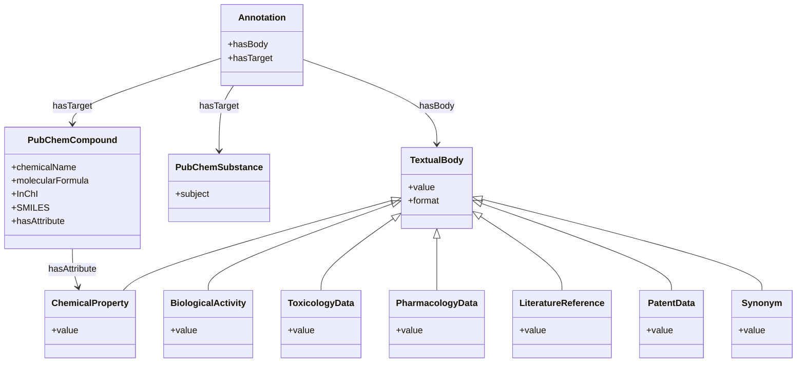

# BioBricks PubChem Annotations Knowledge Graph Exploration

## Chat Transcript

👤 **User**  
@biobricks-pubchem-annotations

---

🧠 **Assistant**  
I'll help you explore the biobricks-pubchem-annotations knowledge graph. Let me start by getting information about this knowledge graph and its schema.

Great! I can help you explore the **BioBricks PubChem Annotations** knowledge graph. This is an open knowledge graph containing over 10.7 million annotations about chemical compounds from PubChem, with information about chemical properties, biological activities, toxicology, pharmacology, literature references, patents, and synonyms.

The knowledge graph contains:
- **87.4 million triples** total
- Annotations following the W3C Web Annotation Data Model
- Links between PubChem compounds and textual annotations covering regulatory data, physical properties, biological activities, and hazard information

**Key classes in the graph:**
- Annotations (connections between compounds and their descriptions)
- PubChem Compounds (unique chemical structures)
- PubChem Substances (chemical records from data contributors)
- Textual Bodies (the actual annotation content)
- Specialized annotations for: Chemical Properties, Biological Activity, Toxicology, Pharmacology, Literature References, Patents, and Synonyms

**Main relationships:**
- `hasTarget` - links annotations to the compounds they describe
- `hasBody` - links annotations to their content
- `value` - contains the actual text/data of an annotation

Would you like me to:
1. Show you some example annotations?
2. Search for specific compounds or chemicals?
3. Explore specific types of annotations (toxicology, biological activity, etc.)?
4. Visualize the schema structure?
5. Run a specific query you have in mind?

---

👤 **User**  
Visualize the schema

---

🧠 **Assistant**  
Here's a visual representation of the BioBricks PubChem Annotations knowledge graph schema:

**Key insights from the schema:**

1. **Central Structure**: The `Annotation` class connects chemical compounds/substances to their descriptive content through two main relationships:
   - `hasTarget` → points to PubChem Compounds or Substances
   - `hasBody` → points to the annotation content (TextualBody)

2. **Annotation Types**: Seven specialized types of annotations extend from TextualBody:
   - Chemical Property (physical/chemical properties)
   - Biological Activity (biological interactions)
   - Toxicology Data (safety and hazards)
   - Pharmacology Data (therapeutic uses)
   - Literature Reference (scientific publications)
   - Patent Data (patent information)
   - Synonym (alternative names)

3. **Chemical Identifiers**: PubChem Compounds have multiple chemical identifiers including chemical names, molecular formulas, InChI, and SMILES notations.

Would you like to explore any specific part of this schema with sample queries?

---

👤 **User**  
Create transcript

---

*Created by [mcp-proto-okn](https://github.com/sbl-sdsc/mcp-proto-okn) 0.4.0 using claude-sonnet-4-5-20250929 on 2025-12-22*
