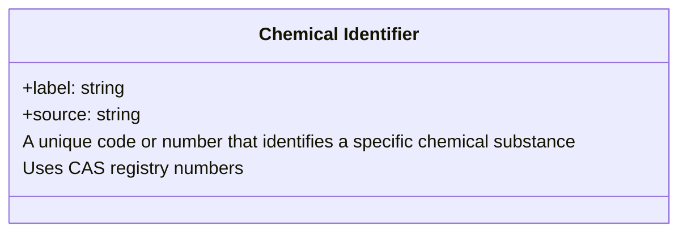

# Chat Transcript
Exploring BioBricks Tox21 Knowledge Graph

---

👤 **User**  
@biobricks-tox21

---

🧠 **Assistant**  
I'll help you explore the biobricks-tox21 knowledge graph. Let me first get information about this knowledge graph to understand what data it contains.

Perfect! I now have information about the **BioBricks Tox21** knowledge graph. This is an open knowledge graph containing Tox21 toxicology screening data with over 120 million chemical assay data points across 70+ distinct assays for approximately 10,000 chemicals.

The knowledge graph contains:
- **8,947 chemical entities** with around 27,000 triples
- Chemical compounds identified using CAS Registry Numbers
- Data from the Tox21 quantitative high-throughput screening (qHTS) 10K library

The schema shows:
- **Classes**: Chemical Identifiers (CHEMINF_000446)
- **Predicates**: Label, Source, and Type relationships

What would you like to explore in this knowledge graph? I can help you:
- Query for specific chemicals and their properties
- Search for chemicals by CAS registry numbers
- Explore the toxicology screening data
- Find information about chemical assays
- Or any other specific questions you have about the Tox21 data

---

👤 **User**  
Visualize the schema

---

🧠 **Assistant**  
Here's the schema visualization for the BioBricks Tox21 knowledge graph:

The schema is relatively simple and focused. The BioBricks Tox21 knowledge graph centers around **Chemical Identifiers** (using the CHEMINF ontology), with each chemical having:
- A human-readable **label** (name)
- A **source** reference (pointing to the Tox21 database)
- Standardized identification using CAS registry numbers

This structure supports the 8,947 chemical entities in the knowledge graph, making them easily queryable and linked to their toxicology screening data. The simplicity of the schema reflects its focused purpose: providing a standardized way to identify and reference chemicals from the Tox21 screening program.

---

*Created by [mcp-proto-okn](https://github.com/sbl-sdsc/mcp-proto-okn) 0.4.0 for biobricks-tox21 on 2025-12-24*

claude-sonnet-4-20250514
