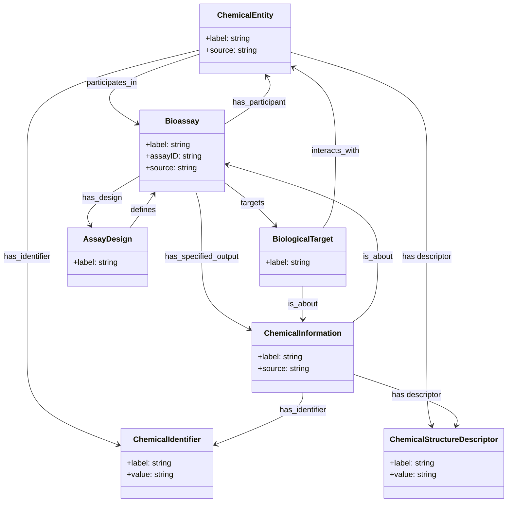

# BioBricks ToxCast Knowledge Graph - Chat Transcript

**Date:** December 11, 2025  
**Topic:** Exploring the BioBricks ToxCast Knowledge Graph

---

## Conversation

### User

> @biobricks-toxcast

### Assistant
I can help you explore the BioBricks ToxCast knowledge graph! This resource contains data from the EPA's ToxCast program, which tests chemicals for potential toxicity.

**Retrieved Endpoint Description:**

BioBricks ToxCast is an open knowledge graph for EPA ToxCast high-throughput screening data.

**Key Statistics:**
- **3.34 million** bioassay screening results
- **9,542** chemical entities
- **2,205** distinct assay endpoints
- Chemicals identified by EPA DSSTox Substance Identifiers (DTXSID) and InChIKeys

**Data Source:**
- Derived from EPA's public domain ToxCast database
- Released under CC0-1.0 license
- SPARQL endpoint: https://frink.apps.renci.org/biobricks-toxcast/sparql

**Contact:**
- Tom Luechtefeld (tom@insilica.co)
- Homepage: https://github.com/biobricks-ai/biobricks-okg

---

### Knowledge Graph Schema

**Main Classes:**

1. **Chemical Entity** - A molecule or compound with defined chemical structure and properties
2. **Chemical Identifier** - A unique code or number that identifies a specific chemical substance
3. **Bioassay** - A laboratory test that measures the biological or biochemical effects of a substance
4. **Chemical Structure Descriptor** - Information that describes the arrangement of atoms in a molecule
5. **Chemical Information** - Data or knowledge about chemical substances and their properties
6. **Biological Target** - A molecule in a living system that a drug or chemical substance interacts with
7. **Assay Design** - The specific method and conditions used to conduct a biological experiment

**Key Relationships (Predicates):**

- **Label** - A human-readable name or title for an entity
- **Source** - The origin or reference for a piece of information
- **Has Identifier** - Links an entity to its unique identification code
- **Participates In** - An entity takes part in or is involved in a biological process
- **Assay ID** - A unique identifier for a toxicology assay in the EPA CompTox database
- **Has Participant** - A process involves or includes a particular entity
- **Has Specified Output** - The result or product produced by a process or assay
- **Has Assay Component** - The specific part or measurement within a larger bioassay
- **Is About** - Indicates that information or data pertains to a particular subject
- **Has Value** - Assigns a specific measurement or quantity to an entity

---

### What can I help you explore?

I can help you:
1. **Find chemicals** by name, identifier, or structure
2. **Search bioassays** by target, endpoint, or design
3. **Explore chemical-activity relationships** across toxicological targets
4. **Query screening results** for specific chemicals or assays
5. **Visualize the knowledge graph structure** with diagrams

What would you like to investigate in the ToxCast data?

---

### User

> Create a class diagram

### Assistant
I've created a comprehensive class diagram for the BioBricks ToxCast knowledge graph!

**Core Classes:**

- **ChemicalEntity** (9,542 entities) - The actual molecules/compounds tested
- **Bioassay** (3.34M results, 2,205 endpoints) - The laboratory tests
- **BiologicalTarget** - The molecules in living systems that chemicals interact with
- **AssayDesign** - The experimental methods and conditions

**Supporting Classes:**

- **ChemicalIdentifier** - IDs like DTXSID and InChIKeys
- **ChemicalStructureDescriptor** - Information about molecular structure
- **ChemicalInformation** - General data about substances

**Key Relationships:**

- Chemicals participate in bioassays
- Bioassays have chemical participants and target biological molecules
- Assays produce chemical information as outputs
- Chemical entities are linked to their identifiers and structure descriptors

The diagram visualizes how EPA ToxCast connects chemicals to their toxicological screening data through standardized assays and biological targets.

**File Created:** toxcast_class_diagram.mermaid

#### Class Diagram

---

## Use Cases

BioBricks ToxCast is useful for:

- **Computational toxicology research** - Analyzing chemical-bioactivity relationships
- **Regulatory science** - Supporting risk assessment decisions
- **Environmental health** - Understanding chemical effects on biological systems
- **Drug discovery** - Identifying potential toxicity early in development
- **Adverse outcome pathway analysis** - Mapping mechanisms of toxicity
- **Compound prioritization** - Screening chemicals for safety concerns

---

## Technical Details

**Ontologies Used:**
- BioAssay Ontology (BAO)
- Chemical Information Ontology (CHEMINF)
- Biolink Model
- Relation Ontology (RO)

**Access Methods:**
- SPARQL queries at https://frink.apps.renci.org/biobricks-toxcast/sparql
- Triple Pattern Fragments at https://frink.apps.renci.org/ldf/biobricks-toxcast

**Funding:**
- NSF Award: 2333728

---

## End of Transcript
