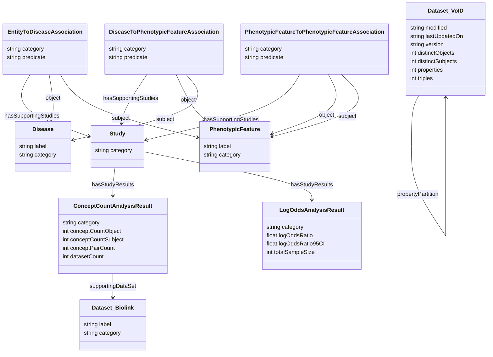

# BiomarkerKG — Knowledge Graph Overview & Schema Visualization

👤 **User**
Give an overview of the @biomarkerkg

---

🧠 **Assistant**

Here's an overview of the **BiomarkerKB Knowledge Graph (biomarkerkg)**:

**What it is**: BiomarkerKG is a biomedical RDF knowledge graph developed at George Washington University that links biomarkers to diseases, drugs, biological entities, and supporting scientific literature. It's built on the [Biolink](https://biolink.github.io/biolink-model/) model and accessible at [biomarkerkb.org](https://biomarkerkb.org/home/).

**Purpose**: It enables integrated queries for biomarker discovery and translational research — connecting genes, proteins, metabolites, therapies, and phenotypes through a structured evidence network.

**Identifier standards**: Biolink, HPO (Human Phenotype Ontology), MONDO (disease ontology), and VoID (dataset descriptors).

**Key entity types** — the graph has 10 core classes organized around three themes:

- *Biological entities*: `Disease`, `PhenotypicFeature`
- *Associations*: `EntityToDiseaseAssociation`, `DiseaseToPhenotypicFeatureAssociation`, `PhenotypicFeatureToPhenotypicFeatureAssociation`
- *Evidence & statistics*: `Study`, `ConceptCountAnalysisResult`, `LogOddsAnalysisResult`, `Dataset`

**What makes it distinctive**: It doesn't just store associations — it captures *statistical evidence*. Log odds ratios with 95% confidence intervals, concept co-occurrence counts, sample sizes, and dataset provenance are all first-class entities, making it well-suited for evidence-based analysis and ML workflows.

**Example queries you can run against it:**

- What biomarkers are associated with a specific disease?
- Which disease-phenotype associations have supporting study evidence?
- What log odds ratio and 95% CI support a biomarker-disease association?

**Access points:**
- SPARQL endpoint: `https://apps.okn.us/biomarkerkg/sparql`
- Triple Pattern Fragments: `https://apps.okn.us/ldf/biomarkerkg`

---

👤 **User**
Visualize the schema with the visualize_schema tool

---

🧠 **Assistant**

Here's the cleaned schema diagram for BiomarkerKG:

The schema shows three tiers: biological entities (`Disease`, `PhenotypicFeature`) at the top, three association classes in the middle connecting them via `subject`/`object` predicates, and the evidence layer at the bottom — `Study` → `ConceptCountAnalysisResult` / `LogOddsAnalysisResult` → `Dataset_Biolink`.

---

*Created by [mcp-proto-okn](https://github.com/sbl-sdsc/mcp-proto-okn) 0.6.0 on 2026-05-01*

*Model: claude-sonnet-4-6*
