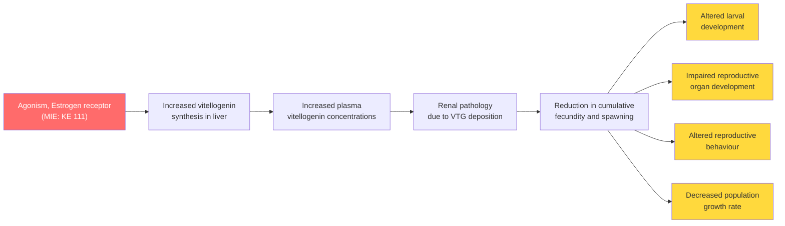
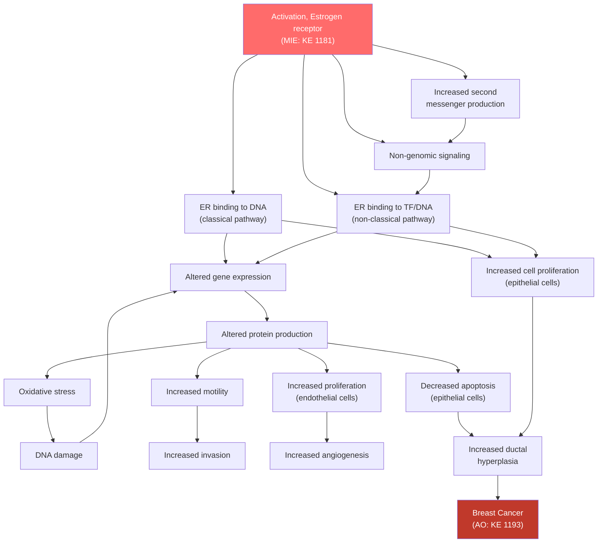
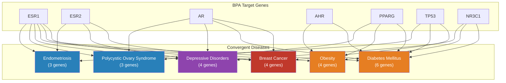

## Chat Transcript
# Bisphenol A (BPA) — Full Safety Profile Investigation Across Proto-OKN Knowledge Graphs

👤 **User**

I'd like to understand the full safety profile of Bisphenol A (BPA).
Start by discovering which knowledge graphs in the system have relevant data about this chemical — I don't know what's available, so please explore. Then investigate:
1. What biological activity has been observed? Find any screening or bioassay data. What targets does it hit? In what tissues and species?
2. What are the mechanistic pathways to harm? Are there established adverse outcome pathways for this chemical? What is the chain of events from the initial molecular interaction to the adverse health effect?
3. What is the broader health context? What genes does this chemical affect, and what diseases are those genes linked to? Are there therapeutic options for those diseases? Where has this chemical been detected in the environment, and how prevalent are the associated diseases in those regions?
4. What's the bottom line? Synthesize everything into a clear picture of this chemical's risk, who's most affected, and what might be done about it.

---

🧠 **Assistant**

## Phase 1: Knowledge Graph Discovery

I began by listing all 27 available knowledge graphs and routing the BPA question to identify the most relevant data sources.

### Graphs Identified as Relevant

| Graph | Domain | Why Relevant |
|---|---|---|
| **BioBricks ICE** | Toxicology, Chemistry, Biology | 27.4M triples, 206K chemicals, 3M+ bioassay measurements from EPA NICEATM. Directly contains BPA toxicity screening data. |
| **BioBricks AOP-Wiki** | Toxicology, Biology, Health | 493 Adverse Outcome Pathways linking molecular initiating events to adverse health outcomes. Contains mechanistic pathways triggered by BPA's estrogen receptor activity. |
| **SPOKE-OKN** | Biology, Health, Chemistry, Environment, Geospatial | Integrative graph connecting chemicals → genes → diseases → locations. Contains BPA gene targets, disease associations, and environmental detection data. |
| **BioBricks ToxCast** | Toxicology, Chemistry | 3.34M bioassay screening results from EPA ToxCast HTS data. |
| **BioBricks MeSH** | Biology, Health, Vocabulary | Medical Subject Headings controlled vocabulary for cross-referencing. |
| **BioBricks PubChem Annotations** | Chemistry, Toxicology, Pharmacology | 10.7M annotations including regulatory and hazard data. |

### BPA Chemical Identifiers Found

- **CAS:** 80-05-7
- **DTXSID:** DTXSID7020182
- **InChIKey:** IISBACLAFKSPIT-UHFFFAOYSA-N
- **ICE URI:** `http://example.com/ice/cHTS2022_invitrodb34_20220302.parquet/dtxsid/DTXSID7020182/Chemical_Entity`
- **SPOKE URI:** `http://rdf.ncbi.nlm.nih.gov/pubchem/inchikey/IISBACLAFKSPIT-UHFFFAOYSA-N`

---

## Phase 2: Biological Activity — Bioassay Screening Data

### Query: BioBricks ICE — Active Hits for BPA

```sparql
PREFIX rdfs: <http://www.w3.org/2000/01/rdf-schema#>
PREFIX ro: <http://purl.obolibrary.org/obo/RO_0000056>
PREFIX ice: <https://ice.ntp.niehs.nih.gov/property/>
PREFIX sio: <http://semanticscience.org/resource/SIO_000300>
PREFIX obi: <http://purl.obolibrary.org/obo/OBI_0000299>

SELECT DISTINCT ?assayName ?tissue ?species ?target ?geneId
WHERE {
  <http://example.com/ice/cHTS2022_invitrodb34_20220302.parquet/dtxsid/DTXSID7020182/Chemical_Entity> ro: ?measureGroup .
  ?measureGroup obi: ?endpoint .
  FILTER(CONTAINS(STR(?endpoint), 'DTXSID7020182') && CONTAINS(STR(?endpoint), '/Call/'))
  ?endpoint sio: 'Active' .
  BIND(REPLACE(REPLACE(STR(?measureGroup), '^.*/assay/', ''), '/dataset_name/.*$', '') AS ?assayName)
  OPTIONAL {
    ?bioassay <http://www.bioassayontology.org/bao#BAO_0000209> ?measureGroup .
    OPTIONAL { ?bioassay ice:assay_tissue ?tissue }
    OPTIONAL { ?bioassay ice:assay_species ?species }
    OPTIONAL { ?bioassay ice:throughMechanisticTarget ?target }
    OPTIONAL { ?bioassay ice:assay_entrez_gene_id ?geneId }
  }
}
ORDER BY ?target
LIMIT 100
```

### Results: 100+ Active Hits Across 15+ Mechanistic Target Categories

BPA triggered active responses across an exceptionally broad range of biological targets:

| Mechanistic Target Category | Representative Assays | Tissue | Species | Key Gene Targets |
|---|---|---|---|---|
| **Estrogen Receptor (ER) Modulation** | ACEA_ER_80hr, ATG_ERa_TRANS_up, ATG_ERE_CIS_up, OT_ER_ERaERa, TOX21_ERa_BLA_Agonist/Antagonist, NVS_NR_hER, NVS_NR_mERa, NVS_NR_bER | breast, liver, kidney, cervix, uterus | human, mouse, bovine | ESR1 (gene 2099), ESR2 (gene 2100) |
| **Androgen Receptor (AR) Modulation** | ACEA_AR_antagonist_80hr, TOX21_AR_BLA_Antagonist, TOX21_AR_LUC_MDAKB2_Antagonist, NVS_NR_hAR, NVS_NR_rAR, NVS_NR_cAR, OT_AR_ARSRC1, UPITT_HCI_U2OS_AR_TIF2 | prostate, kidney, breast, bone | human, rat, chimpanzee | AR (gene 367) |
| **Aryl Hydrocarbon Receptor (AhR)** | ATG_Ahr_CIS_up | liver | human | AHR (gene 196) |
| **Constitutive Androstane Receptor (CAR)** | TOX21_CAR_Agonist, NVS_NR_hCAR_Antagonist | liver | human | NR1I3 (gene 9970) |
| **Glucocorticoid Receptor (GR)** | NVS_NR_hGR, TOX21_GR_BLA_Antagonist | cervix | human | NR3C1 (gene 2908) |
| **PPAR-gamma** | ATG_PPRE_CIS_up, TOX21_PPARg_BLA_antagonist | liver, kidney | human | PPARG (gene 5468) |
| **p53 Pathway** | TOX21_p53_BLA_p2, TOX21_p53_BLA_p4 | intestinal | human | TP53 (gene 7157) |
| **Steroid Hormone Biosynthesis** | CEETOX_H295R_ANDR_dn, CEETOX_H295R_TESTO_dn | adrenal gland | human | AR (gene 367) |
| **Mitochondrial Dysfunction** | TOX21_MMP_rhodamine, TOX21_MMP_ratio_down, APR_HepG2_MitoMembPot, APR_HepG2_MitoMass | liver | human | — |
| **Oxidative Stress / DNA Damage** | APR_HepG2_P-H2AX_24h_up, APR_HepG2_P-H2AX_72h_up | liver | human | H2AFX (gene 3014) |
| **Vascular / Inflammatory** | BSK_SAg_CD40_down, BSK_SAg_CD69_down, BSK_LPS_VCAM1_down, BSK_LPS_PGE2_down | vascular, lung | human | CD40, CD69, VCAM1, PTGS2 |
| **Serotonin Receptors** | NVS_GPCR_h5HT6, NVS_GPCR_g5HT4 | brain | human, guinea pig | HTR6, HTR4 |
| **Adenosine / Opiate Receptors** | NVS_GPCR_hAdoRA1, NVS_GPCR_hOpiate_mu | brain | human, rat | ADORA1, OPRM1 |
| **Cell Cycle / Proliferation** | APR_HepG2_MitoticArrest, NVS_ENZ_hPI3Ka, ATG_AP_1_CIS_up | liver, vascular, skin | human | PIK3CA, FOS/JUN |
| **Cholesterol Transport** | NVS_MP_rPBR | kidney | rat | TSPO (gene 24230) |

**Key Finding:** BPA is an exceptionally broad-spectrum endocrine disruptor. Its strongest activity is as an **estrogen receptor agonist** and **androgen receptor antagonist**, but it also hits AhR, CAR, GR, PPARγ, p53, serotonin/opiate receptors, and more.

---

## Phase 3: Mechanistic Pathways — Adverse Outcome Pathways

### Query: BioBricks AOP-Wiki — Estrogen-Related AOPs

```sparql
PREFIX aop: <http://aopkb.org/aop_ontology#>
PREFIX dc: <http://purl.org/dc/elements/1.1/>
PREFIX rdfs: <http://www.w3.org/2000/01/rdf-schema#>

SELECT ?aopTitle ?upstreamTitle ?downstreamTitle
WHERE {
  VALUES ?aopUri { <https://identifiers.org/aop/200> <https://identifiers.org/aop/167> 
                   <https://identifiers.org/aop/401> <https://identifiers.org/aop/314> }
  ?aopUri dc:title ?aopTitle .
  ?aopUri aop:has_key_event_relationship ?ker .
  ?ker aop:has_upstream_key_event ?up .
  ?ker aop:has_downstream_key_event ?down .
  ?up dc:title ?upstreamTitle .
  ?down dc:title ?downstreamTitle .
}
ORDER BY ?aopTitle
```

### Results: 5 Adverse Outcome Pathways Relevant to BPA

#### AOP 29: ER Agonism → Reproductive Dysfunction (Aquatic Species)



#### AOP 200: ER Activation → Breast Cancer



#### AOP 167: Early-Life ER Activity → Endometrial Carcinoma


#### AOP 314: ER-α in Immune Cells → Systemic Lupus Erythematosus


#### AOP 401: GPER Signaling → Lipid Metabolism Disruption


---

## Phase 4: Broader Health Context

### Query: SPOKE-OKN — Gene → Disease Associations for BPA's Target Genes

```sparql
PREFIX rdfs: <http://www.w3.org/2000/01/rdf-schema#>
PREFIX schema: <https://purl.org/okn/frink/kg/spoke-okn/schema/>

SELECT ?geneLabel ?diseaseLabel
WHERE {
  VALUES ?gene { 
    <http://www.ncbi.nlm.nih.gov/gene/2099>   # ESR1
    <http://www.ncbi.nlm.nih.gov/gene/2100>   # ESR2
    <http://www.ncbi.nlm.nih.gov/gene/367>    # AR
    <http://www.ncbi.nlm.nih.gov/gene/196>    # AHR
    <http://www.ncbi.nlm.nih.gov/gene/5468>   # PPARG
    <http://www.ncbi.nlm.nih.gov/gene/7157>   # TP53
    <http://www.ncbi.nlm.nih.gov/gene/2908>   # NR3C1
    <http://www.ncbi.nlm.nih.gov/gene/9970>   # NR1I3
  }
  ?gene rdfs:label ?geneLabel .
  ?disease schema:ASSOCIATES_DaG ?gene .
  ?disease rdfs:label ?diseaseLabel .
}
ORDER BY ?geneLabel ?diseaseLabel
LIMIT 100
```

### Results: Gene → Disease Mapping

| BPA Target Gene | Associated Diseases |
|---|---|
| **ESR1** (Estrogen Receptor α) | Breast cancer, breast carcinoma, ovarian cancer, uterine cancer, endometriosis, polycystic ovary syndrome, colorectal cancer, liver cancer, lung cancer, arteriosclerosis, obesity, diabetes mellitus, major depressive disorder, migraine |
| **ESR2** (Estrogen Receptor β) | Breast cancer, endometriosis, major depressive disorder, psoriasis |
| **AR** (Androgen Receptor) | Prostate cancer, breast cancer, testicular cancer, male infertility, polycystic ovary syndrome, depressive disorder, diabetes mellitus, motor neuron disease |
| **AHR** (Aryl Hydrocarbon Receptor) | Diabetes mellitus, inflammatory bowel disease, obesity, Parkinson's disease, rheumatoid arthritis, skin melanoma, squamous cell carcinoma, glaucoma |
| **PPARG** (PPAR-gamma) | Diabetes mellitus, obesity, coronary artery disease, arteriosclerosis, hypertension, cerebrovascular disease, cardiomyopathy, liver disease, polycystic ovary syndrome, pancreatitis |
| **TP53** (Tumor Protein p53) | Breast cancer, prostate cancer, lung cancer, colorectal cancer, ovarian cancer, pancreatic cancer, glioblastoma, leukemia, kidney cancer, liver cancer, esophageal cancer, multiple myeloma, lymphomas, diabetes, hypertension, endometriosis |
| **NR3C1** (Glucocorticoid Receptor) | Major depressive disorder, anxiety disorder, diabetes mellitus, obesity, hypertension, dermatitis |

### Convergent Disease Risk



### Query: SPOKE-OKN — Environmental Detection of BPA

```sparql
PREFIX rdfs: <http://www.w3.org/2000/01/rdf-schema#>
PREFIX schema: <https://purl.org/okn/frink/kg/spoke-okn/schema/>
PREFIX rdf: <http://www.w3.org/1999/02/22-rdf-syntax-ns#>

SELECT ?locationLabel ?media ?value ?unit ?stateName
WHERE {
  ?stmt rdf:subject <http://rdf.ncbi.nlm.nih.gov/pubchem/inchikey/IISBACLAFKSPIT-UHFFFAOYSA-N> ;
        rdf:predicate schema:FOUNDIN_CfL ;
        rdf:object ?location .
  ?location rdfs:label ?locationLabel .
  OPTIONAL { ?stmt schema:media ?media }
  OPTIONAL { ?stmt schema:value ?value }
  OPTIONAL { ?stmt schema:unit ?unit }
  OPTIONAL { ?location schema:state_name ?stateName }
}
ORDER BY ?stateName
LIMIT 80
```

### Results: 68 ZIP Code Regions with BPA Releases (2022 EPA TRI Data)

BPA is released primarily through air emissions and land disposal. The highest-emission sites:

| ZIP Code | Media | Release (Pounds) |
|---|---|---|
| 49441 | Air + Land | 11.9 + 396,366 |
| 91770 | Air + Land | 1.9 + 195,801 |
| 44111 | Air + Land | 1.1 + 166,062 |
| 73860 | Land | 49,389 |
| 53154 | Air | 25,656 |
| 77536 | Air | 10,500 |
| 46580 | Air | 8,637 |
| 47620 | Air + Water | 5,033 + 1,000 |
| 17331 | Air | 2,463 |
| 97210 | Air | 1,655 |

---

## Phase 5: Synthesis — The Bottom Line

### What BPA Does

BPA is one of the most well-characterized endocrine disrupting chemicals in existence. Based on data from the Proto-OKN knowledge graph network, BPA acts primarily as an **estrogen mimicker** (binding and activating estrogen receptors) and an **androgen blocker** (antagonizing the androgen receptor), while also interfering with at least 8 additional receptor systems including those governing thyroid function, metabolic regulation, immune response, and cellular stress.

### Who Is Most at Risk

1. **Developing fetuses and infants:** AOP 167 demonstrates that BPA exposure during critical developmental windows can initiate pathological cascades manifesting as cancer decades later.
2. **Women of reproductive age:** BPA's strong ER agonism directly implicates it in breast cancer risk (AOP 200), endometriosis, and polycystic ovary syndrome. The convergence of ESR1, ESR2, and TP53 disease associations on breast cancer is particularly concerning.
3. **Men with reproductive health concerns:** BPA's AR antagonism links mechanistically to male infertility, testicular cancer, and prostate cancer.
4. **People with metabolic disease risk:** Six of BPA's seven key target genes are independently associated with diabetes mellitus. The GPER-mediated lipid metabolism AOP provides a specific mechanistic link to obesity.
5. **Aquatic organisms:** AOP 29 provides a complete pathway from ER agonism through vitellogenin induction to population-level reproductive decline in fish.

### What Can Be Done

- **Exposure reduction** at documented point sources (68+ U.S. ZIP codes, up to 396,000 lbs/year at single sites)
- **Biomonitoring** via HTS assay platforms to screen BPA alternatives before widespread adoption
- **Clinical awareness** of BPA's multi-target profile when evaluating endocrine, reproductive, and metabolic disorders


*Created by [mcp-proto-okn](https://github.com/sbl-sdsc/mcp-proto-okn) 0.6.0 on 2026-03-11*

Model: claude-opus-4-6
