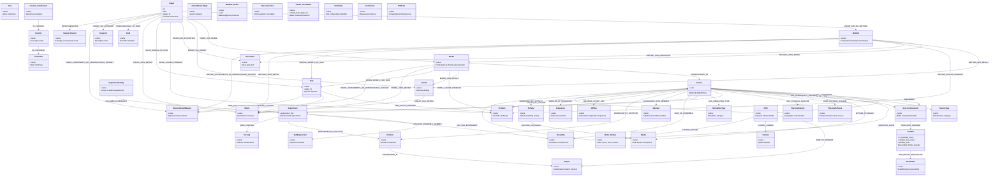

## Chat Transcript
Climate Models Knowledge Graph Exploration

👤 **User**  
@climatemodelskg

---

🧠 **Assistant**  
I'll help you explore the climatemodelskg knowledge graph. Let me start by getting information about this knowledge graph and understanding its structure.

Great! I now have access to the **Climate Models Knowledge Graph**, which is designed to support evaluation and development of climate models. Let me provide you with an overview:

### About Climate Models KG

This knowledge graph integrates structured information about climate models, experiments, and research outputs. It contains:

- **1.4 million triples** describing **55,890 entities** across **48 classes**
- Focus on climate model documentation, linking models to experiments, institutes, variables, and geographic coverage
- **394 Sources** (GCMs, RCMs) linked to **481 Experiments** conducted by **132 Institutes**
- **2,907 climate Variables** measured across extensive geographic coverage:
  - 30,062 Cities
  - 252 Countries
  - 3,893 subdivisions
- ~400,000 geographic locations for regional climate models
- Supports CMIP6-related research and regional climate modeling studies

### Key Entity Types

The knowledge graph includes 47 different classes, such as:
- **Climate Models**: Source, Model, RCM (Regional Climate Models)
- **Experiments**: Experiment, ExperimentFamily, SubExperiment
- **Geographic Entities**: City, Country, Country_Subdivision, Continent
- **Climate Variables**: Temperature, precipitation, and other measurable quantities
- **Research Outputs**: Paper, Result, Method
- **Model Components**: PhysicalScheme, SourceComponent, Realm
- **Analysis Tools**: Metric, Instrument, ObservationalDataset

### What Can I Help You With?

I can help you:
1. **Explore climate models** - Find information about specific GCMs or RCMs
2. **Query experiments** - Discover which experiments were conducted, by whom, and with what models
3. **Analyze variables** - Find climate variables, their units, and relationships
4. **Research papers** - Search for papers by topic, method, or model
5. **Geographic queries** - Find models or experiments covering specific regions
6. **Relationships** - Explore how models, experiments, institutes, and variables connect

What would you like to explore in the Climate Models Knowledge Graph?

---

👤 **User**  
Visualize schema

---

🧠 **Assistant**  
I'll create a visual representation of the Climate Models KG schema using a Mermaid class diagram.

I've created a comprehensive visualization of the Climate Models KG schema! The diagram shows:

### Key Components:

**1. Core Model Classes**
   - Source, Model, RCM (Regional Climate Models)
   - SourceComponent, SourceType

**2. Experiment Infrastructure**
   - Experiments, ExperimentFamily, SubExperiment
   - Ensemble, Member

**3. Institutions & Organization**
   - Institute, Project, MIPEra (Model Intercomparison Project eras)

**4. Variables & Data**
   - Variable (with climate measurements)
   - ObservationalDataset, Frequency, Resolution

**5. Physical Components**
   - PhysicalScheme, Realm (atmosphere, ocean, land, ice)
   - Domain, Forcing, PhysicalFeature

**6. Geographic Entities**
   - City, Country, Country_Subdivision, Continent
   - Water_Bodies

**7. Research & Analysis**
   - Paper, Method, Metric, Result
   - Task, Problem, Innovation, Field, Keyword

**8. Events & Phenomena**
   - Natural_Hazard, Weather_Event
   - Teleconnection, Ocean_Circulation

The relationships show how everything connects - from climate models being used in experiments conducted by institutes, to papers that apply methods to solve problems using specific models and producing results.

*Created by [mcp-proto-okn](https://github.com/sbl-sdsc/mcp-proto-okn) 0.5.0 on 2026-01-17*

Model: claude-sonnet-4-20250514
