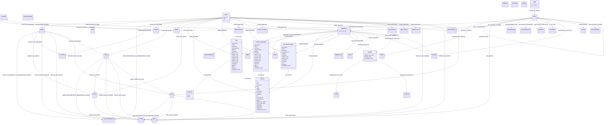

# Chat Transcript
## Exploring the Climate Models Knowledge Graph

👤 **User**  
@climatemodelskg

---

🧠 **Assistant**  
I'll help you explore the Climate Models Knowledge Graph. Let me first get some information about this knowledge graph.

Great! I now have access to the **Climate Models Knowledge Graph**, which integrates structured information about climate models, experiments, and research outputs to support climate science evaluation and development.

## Overview

The Climate Models KG contains:
- **1.4 million triples** describing 55,890 entities across 48 classes
- **394 Sources** (GCMs, RCMs) linked to **481 Experiments**
- **132 Institutes** producing **2,907 climate Variables**
- Extensive geographic coverage: **30,062 Cities**, **252 Countries**, and **3,893 subdivisions**
- Approximately **400,000 geographic locations** for regional climate models
- GeoNames integration for geospatial data
- Custom ontology structuring relationships between models, physical schemes, metrics, and results

## What I Can Help You With

I can query this knowledge graph to help you:

1. **Explore Climate Models**: Find information about specific GCMs (Global Climate Models) or RCMs (Regional Climate Models), their versions, components, and institutes
2. **Discover Experiments**: Search for climate experiments, their parameters, realms, and associated activities
3. **Analyze Variables**: Look up climate variables, their units, frequencies, and which models produce them
4. **Geographic Information**: Query cities, countries, regions with climate data
5. **Research Context**: Find papers, methods, tasks, problems, and innovations in climate science
6. **Relationships**: Understand connections between models, experiments, institutes, and geographic locations

## Example Queries

You could ask me things like:
- "What climate models were developed by a specific institute?"
- "Which experiments focus on ocean realms?"
- "Show me variables related to temperature or precipitation"
- "What are the most common physical schemes used in climate models?"
- "Which cities in a specific country have climate data?"

How would you like to explore the Climate Models Knowledge Graph?

---

👤 **User**  
Visualize the schema

---

🧠 **Assistant**  
I'll visualize the schema of the Climate Models Knowledge Graph for you.

Perfect! I've created a visual representation of the Climate Models Knowledge Graph schema. The diagram shows the 47 main classes and their relationships through 134 predicates.

## Key Schema Highlights:

**Core Climate Modeling Entities:**
- **Source** (climate models): Central hub connecting to experiments, institutes, realms, metrics, physical schemes, and more
- **Experiment**: Links to projects, institutes, variables, domains, and geographic regions
- **Variable**: Climate variables with metadata (units, standard names) produced by experiments

**Geographic Structure:**
- **City, Country, Country_Subdivision**: Rich geographic data with GeoNames integration
- All geographic entities connect to continents and countries

**Research Context:**
- **Paper**: Connects to methods, models, tasks, problems, innovations, and mentions various climate phenomena
- **Method/Model**: Link to tasks, metrics, problems, and results
- **Institute**: Produces sources and performs experiments

**Climate Science Specifics:**
- **RCM** (Regional Climate Models): Driven by other sources
- **Physical schemes, forcing, realms**: Describe model physics
- **Natural hazards, weather events, ocean circulation**: Climate phenomena

The diagram is now available for you to view and explore interactively!

---

👤 **User**  
Create transcript

---

*Created by [mcp-proto-okn](https://github.com/sbl-sdsc/mcp-proto-okn) 0.4.0 for climatemodelskg on 2025-12-24*

claude-sonnet-4-20250514
