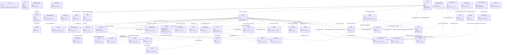

## Chat Transcript
Climate Models Knowledge Graph Exploration

👤 **User**  
@climatemodelskg

---

🧠 **Assistant**  
I'll help you explore the climatemodelskg knowledge graph. Let me start by getting information about this knowledge graph and understanding its structure.

Great! I now have access to the **Climate Models Knowledge Graph**, which is designed to support evaluation and development of climate models. Let me provide you with an overview:

### About Climate Models KG

This knowledge graph integrates structured information about climate models, experiments, research outputs, and the scientific literature that describes them. It contains:

- **~1.7 million triples** describing **~112,500 entities** across **51 classes**
- Focus on climate model documentation, linking models to experiments, institutes, variables, instruments, and geographic coverage
- **394 Sources** (GCMs, RCMs) linked to **481 Experiments** conducted by **132 Institutes**
- **3,144 climate Variables** measured by **1,490 Instruments** across extensive geographic coverage:
  - 30,062 Cities
  - 252 Countries
  - 3,893 subdivisions
- A **literature layer** of **2,000 Papers** written by **10,437 Authors** published across **373 Venues**, connected to **16,141 Results** assessed with **7,366 evaluation metrics**
- Supports CMIP6-related research and regional climate modeling studies

### Key Entity Types

The knowledge graph includes 51 different classes, such as:
- **Climate Models**: Source, Model, RCM (Regional Climate Models)
- **Experiments**: Experiment, ExperimentFamily, SubExperiment
- **Geographic Entities**: City, Country, Country_Subdivision, Continent, ClimateZone
- **Climate Variables**: Temperature, precipitation, and other measurable quantities
- **Observation**: Instrument, Platform, ObservationalDataset
- **Research Outputs**: Paper, Result, Method, EvaluationMetric
- **Literature & People**: Author, Venue, Keyword, Field
- **Model Components**: PhysicalScheme, SourceComponent, Realm

> Note: the **Model** class is defined in the ontology, but in the current data the model role is carried by **Source** — the `MODEL_*` predicates and `PAPER_USES_MODEL` link to `Source` instances.

### What Can I Help You With?

I can help you:
1. **Explore climate models** - Find information about specific GCMs or RCMs
2. **Query experiments** - Discover which experiments were conducted, by whom, and with what models
3. **Analyze variables** - Find climate variables, their units, and the instruments that measure them
4. **Research papers** - Search for papers by topic, method, model, author, or venue
5. **Geographic queries** - Find models or experiments covering specific regions
6. **Relationships** - Explore how models, experiments, institutes, variables, and publications connect

What would you like to explore in the Climate Models Knowledge Graph?

---

👤 **User**  
Visualize schema

---

🧠 **Assistant**  
I'll create a visual representation of the Climate Models KG schema using a Mermaid class diagram.

```mermaid
classDiagram
    %% Core Climate Model Classes
    class Source {
        +uuid
        Models (GCMs/RCMs)
    }
    
    class Model {
        +name
        Computational climate representation (ontology only)
    }
    
    class RCM {
        +name
        +rcm_version
        Regional Climate Model
    }
    
    class SourceComponent {
        +name
        Model component/module
    }
    
    class SourceType {
        +name
        Classification category
    }
    
    %% Experiment Classes
    class Experiment {
        +experiment_title
        Climate model experiment
    }
    
    class ExperimentFamily {
        +name
        Group of related experiments
    }
    
    class SubExperiment {
        +name
        Experiment variant
    }
    
    class Ensemble {
        +name
        Collection of model runs
    }
    
    class Member {
        +name
        Individual ensemble member
    }
    
    %% Institution and Organization
    class Institute {
        +name
        Research institution
    }
    
    class Project {
        +name
        Coordinated research initiative
    }
    
    class MIPEra {
        +name
        Model Intercomparison Project era
    }
    
    %% Variables and Data
    class Variable {
        +cf_standard_name
        +variable_long_name
        +variable_units
        Measurable climate quantity
    }
    
    class ObservationalDataset {
        +name
        Empirical measurements
    }
    
    class Frequency {
        +name
        Temporal resolution
    }
    
    class Resolution {
        +name
        Spatial/temporal granularity
    }
    
    %% Observation
    class Instrument {
        +name
        Measurement device
    }
    
    class Platform {
        +name
        Observation/computational platform
    }
    
    %% Physical and Environmental
    class PhysicalScheme {
        +name
        Parameterization of processes
    }
    
    class Realm {
        +name
        Earth system component
    }
    
    class Domain {
        +name
        Spatial domain
    }
    
    class Forcing {
        +name
        External climate driver
    }
    
    class PhysicalFeature {
        +name
        Geographic characteristic
    }
    
    %% Geographic Classes
    class City {
        +name
        +latitude
        +longitude
        Urban settlement
    }
    
    class Country {
        +name
        +iso3
        +population
        Sovereign nation
    }
    
    class Country_Subdivision {
        +name
        State/province/region
    }
    
    class Continent {
        +name
        Major landmass
    }
    
    class ClimateZone {
        +name
        Climate classification zone
    }
    
    class Water_Bodies {
        +name
        Lakes, rivers, seas, oceans
    }
    
    %% Research and Analysis
    class Paper {
        +title
        +doi
        +abstract
        +publication_year
        Scientific publication
    }
    
    class Author {
        +name
        Publication author
    }
    
    class Venue {
        +name
        +type
        Journal or conference
    }
    
    class Method {
        +name
        Computational/analytical technique
    }
    
    class EvaluationMetric {
        +name
        Model/method evaluation measure
    }
    
    class Metric {
        +name
        Quantitative measure
    }
    
    class Result {
        +name
        Outcome/finding
    }
    
    class Task {
        +name
        +paper_id
        Specific objective
    }
    
    class Problem {
        +name
        Scientific challenge
    }
    
    class Innovation {
        +name
        Novel approach
    }
    
    class Field {
        +name
        Scientific discipline
    }
    
    class Keyword {
        +name
        Descriptive term
    }
    
    %% Events and Hazards
    class Natural_Hazard {
        +name
        Naturally occurring risk event
    }
    
    class NaturalHazardType {
        +name
        Hazard category
    }
    
    class Weather_Event {
        +name
        +uuid
        Meteorological occurrence
    }
    
    class Teleconnection {
        +name
        Climate pattern correlation
    }
    
    class Ocean_Circulation {
        +name
        +added_from_paper_id
        Water movement patterns
    }
    
    %% Other Classes
    class Activity {
        +name
        Climate modeling activity
    }
    
    class SimulationType {
        +name
        Simulation category
    }
    
    class GridLabel {
        +name
        Grid configuration identifier
    }
    
    %% Core Model Relationships
    Source --|> RCM : specialization
    Source --> SourceComponent : HAS_SOURCE_COMPONENT
    Source --> SourceType : IS_OF_TYPE
    Source --> Source : INHERITED_FROM
    Source --> Source : HAS_SUBSEQUENT_VERSION
    
    %% Model Configuration
    Source --> Realm : APPLIES_TO_REALM
    Source --> PhysicalScheme : USES_PHYSICAL_SCHEME
    Source --> PhysicalFeature : HAS_PHYSICAL_FEATURE
    Source --> Metric : HAS_METRIC
    Source --> SimulationType : HAS_SIMULATION_TYPE
    
    %% Experiment Relationships
    Source --> Experiment : USED_IN_EXPERIMENT
    Experiment --> SubExperiment : HAS_SUB_EXPERIMENT
    Experiment --> Ensemble : INCLUDES_ENSEMBLE_MEMBER
    Experiment --> Institute : PERFORMED_BY_INSTITUTE
    Experiment --> Forcing : USES_FORCING
    ExperimentFamily --> Experiment : INCLUDES_EXPERIMENT
    Source --> Ensemble : PART_OF_ENSEMBLE
    
    %% Ensemble and Members
    Source --> Member : ASSOCIATED_WITH_MEMBER
    
    %% Institute and Organization
    Source --> Institute : PRODUCED_BY_INSTITUTE
    Source --> MIPEra : BELONGS_TO_MIP_ERA
    Institute --> Project : PARTICIPATED_IN
    RCM --> Project : PART_OF_PROJECT
    
    %% Regional Climate Models
    RCM --> Domain : COVERS_DOMAIN
    RCM --> Water_Bodies : COVERS_REGION
    RCM --> Source : DRIVEN_BY_SOURCE
    
    %% Variables and Observation
    Source --> Variable : PRODUCES_VARIABLE
    Variable --> Resolution : HAS_SPATIAL_RESOLUTION
    Source --> Frequency : SAMPLED_AT_FREQUENCY
    Instrument --> Variable : MEASURES_VARIABLE
    Instrument --> Platform : MOUNTED_ON
    
    %% Activities
    Source --> Activity : GENERATED_BY_ACTIVITY
    Activity --> Realm : FOCUSES_ON_REALM
    
    %% Geographic Relationships
    Country_Subdivision --> Country : IN_COUNTRY
    Country --> Continent : IN_CONTINENT
    
    %% Paper Relationships
    Paper --> Author : PAPER_AUTHORED_BY
    Paper --> Venue : PAPER_PUBLISHED_IN_VENUE
    Paper --> Source : PAPER_USES_MODEL
    Paper --> Method : PAPER_APPLIES_METHOD
    Paper --> Result : PAPER_HAS_RESULT
    Paper --> Innovation : PAPER_HAS_INNOVATION
    Paper --> Problem : PAPER_SOLVES_PROBLEM
    Paper --> Task : PAPER_WORKS_ON_TASK
    Paper --> EvaluationMetric : PAPER_USES_METRIC
    Paper --> Field : PAPER_BELONGS_TO_FIELD
    Paper --> Keyword : PAPER_HAS_KEYWORD
    Paper --> ObservationalDataset : PAPER_EXPERIMENTS_ON_OBSERVATIONAL_DATASET
    Paper --> Natural_Hazard : PAPER_MENTIONS
    
    %% Method Relationships
    Method --> Result : METHOD_HAS_RESULT
    Method --> Innovation : METHOD_HAS_INNOVATION
    Method --> Problem : METHOD_SOLVES_PROBLEM
    Method --> Task : METHOD_WORKS_ON_TASK
    Method --> EvaluationMetric : METHOD_USES_METRIC
    Method --> ObservationalDataset : METHOD_EXPERIMENTS_ON_OBSERVATIONAL_DATASET
    
    %% Model Relationships (carried by Source)
    Source --> Result : MODEL_HAS_RESULT
    Source --> EvaluationMetric : MODEL_USES_METRIC
    Source --> ObservationalDataset : MODEL_EXPERIMENTS_ON_OBSERVATIONAL_DATASET
    
    %% Task Relationships
    Task --> Problem : TASK_FACES_PROBLEM
    Task --> EvaluationMetric : TASK_USES_METRIC
    Task --> ObservationalDataset : TASK_EXPERIMENTS_ON_OBSERVATIONAL_DATASET
    
    %% Result Relationships
    Result --> EvaluationMetric : RESULT_HAS_METRIC
```

I've created a comprehensive visualization of the Climate Models KG schema! The diagram shows:

### Key Components:

**1. Core Model Classes**
   - Source, Model, RCM (Regional Climate Models)
   - SourceComponent, SourceType
   - The `Model` class is ontology-only; in the data the model role is carried by `Source`

**2. Experiment Infrastructure**
   - Experiments, ExperimentFamily, SubExperiment
   - Ensemble, Member

**3. Institutions & Organization**
   - Institute, Project, MIPEra (Model Intercomparison Project eras)

**4. Variables & Observation**
   - Variable (with climate measurements)
   - Instrument and Platform (MEASURES_VARIABLE, MOUNTED_ON)
   - ObservationalDataset, Frequency, Resolution

**5. Physical Components**
   - PhysicalScheme, Realm (atmosphere, ocean, land, ice)
   - Domain, Forcing, PhysicalFeature

**6. Geographic Entities**
   - City, Country, Country_Subdivision, Continent, ClimateZone
   - Water_Bodies (enriched with GeoNames attributes: latitude/longitude, population, ISO codes, bounding boxes)

**7. Research & Literature**
   - Paper, Author, Venue (PAPER_AUTHORED_BY, PAPER_PUBLISHED_IN_VENUE)
   - Method, EvaluationMetric, Result
   - Task, Problem, Innovation, Field, Keyword

**8. Events & Phenomena**
   - Natural_Hazard, Weather_Event
   - Teleconnection, Ocean_Circulation

The relationships show how everything connects - from climate models (Source) being used in experiments conducted by institutes, to papers that apply methods, cite models, and are written by authors published in venues, producing results assessed with evaluation metrics.

---

👤 **User**  
Create transcript

---

*Created by [mcp-proto-okn](https://github.com/sbl-sdsc/mcp-proto-okn) using claude-opus-4-8 on 2026-07-12*
