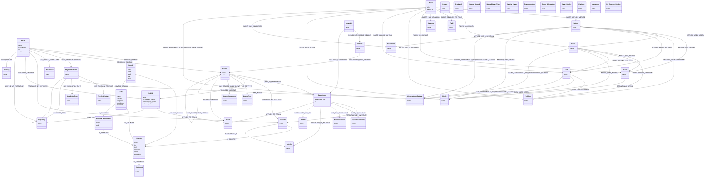

# Chat Transcript
## Climate Models Knowledge Graph Schema Visualization

---

👤 **User**  
@climatemodelskg

---

🧠 **Assistant**  
I'd be happy to help you explore the climate models knowledge graph. Let me first get information about this knowledge graph.

## Climate Models KG

Welcome! You've connected to the **Climate Models Knowledge Graph**, a resource designed to support evaluation and development of climate models. 

Here's what this knowledge graph contains:

- **1.4 million triples** describing **55,890 entities** across **48 classes**
- **394 climate model sources** (GCMs, RCMs) linked to **481 experiments**
- **132 research institutes** and **2,907 climate variables**
- Extensive geographic coverage: **30,062 cities**, **252 countries**, and **3,893 subdivisions**
- Regional climate models covering approximately **400,000 geographic locations**
- Support for **CMIP6-related research** and regional climate modeling studies

**Contact:** Aayush Acharya  
**Funding:** [NSF Award #2333789](https://www.nsf.gov/awardsearch/showAward?AWD_ID=2333789)

---

### What would you like to explore?

I can help you with queries such as:
- Finding climate models and their experiments
- Exploring variables and measurements
- Looking up geographic coverage
- Examining relationships between institutes, models, and experiments
- Visualizing the schema structure

Would you like me to show you the schema, run a specific query, or explore a particular aspect of climate modeling data?

---

👤 **User**  
Visualize the schema

---

🧠 **Assistant**  
Here's the schema visualization for the **Climate Models Knowledge Graph**:

## Schema Overview

The Climate Models KG is organized around several key conceptual areas:

**Climate Modeling Core**
- **Source** (GCMs) and **RCM** (Regional Climate Models) are central entities that produce Variables and are used in Experiments
- **Experiment** links to Institutes, Activities, and MIP Eras (like CMIP6)
- **PhysicalScheme** captures the physical parameterizations used by models

**Research & Publications**
- **Paper** connects to Methods, Models, Tasks, Problems, and Results
- Supports tracking of research innovations and metrics

**Geographic Coverage**
- Hierarchical geography: **Continent** → **Country** → **Country_Subdivision** → **City**
- **Domain** defines spatial extents (north/south/east/west bounds)
- Natural features: hazards, weather events, teleconnections, ocean circulation

**Model Configuration**
- **Forcing**, **Frequency**, **Resolution**, **GridLabel** describe model setup
- **Ensemble** and **Member** track ensemble runs

---

*Created by [mcp-proto-okn](https://github.com/sbl-sdsc/mcp-proto-okn) 0.4.0 for the Climate Models KG using claude-opus-4-5-20251101 on 2025-12-21*
