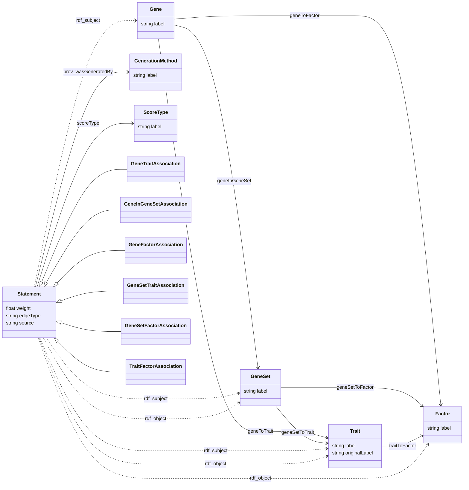

# CFDE REVEAL Knowledge Graph Chat Transcript

👤 **User**
Give a high-level overview of the @digcfdekg knowledge graph, including its main entities, relationships, and purpose.

---

🧠 **Assistant**
Here's a high-level overview of the **CFDE REVEAL Knowledge Graph** (`digcfdekg`):

**What it is.** The CFDE REVEAL Knowledge Graph is a statistically inferred genomic evidence graph that connects human genes to traits, diseases, and phenotype endpoints within the NIH Common Fund Data Ecosystem (CFDE). It is developed at the Broad Institute under NSF funding and aims to integrate and disseminate genomic knowledge across CFDE's data-generation programs.

**How it's built.** Datasets from CFDE programs are represented as gene sets, which are linked to roughly 7,000 human traits using two Bayesian methods. PIGEAN (Priors Inferred from GEne ANnotations) jointly infers which of about 20,000 genes are trait-relevant and which gene sets predict that relevance. EAGGL (Enrichment Analysis, Gene Grouping, and LLMs) learns about 4,000 latent factors that model shared disease mechanisms.

**Core entity types.** The schema has six node classes and a reification layer:

- *Biological entities* — `Gene` (NCBI Gene identifiers), `Trait` (human traits and diseases identified via Orphanet, EFO, MONDO, and HPO), and `GeneSet` (gene sets derived from CFDE datasets).
- *Inferred mechanism* — `Factor`, a latent factor learned by EAGGL that models a disease mechanism shared across genes, gene sets, and traits.
- *Provenance vocabulary* — `GenerationMethod` (PIGEAN or EAGGL) and `ScoreType` (e.g. the PIGEAN combined score).

**Relationships.** Six direct edges connect the entities: `geneToTrait`, `geneToFactor`, `geneInGeneSet`, `geneSetToTrait`, `geneSetToFactor`, and `traitToFactor`. Each edge is also reified as an `rdf:Statement` (specialized into six association classes such as `GeneTraitAssociation`) that records the asserted `rdf:subject`/`rdf:predicate`/`rdf:object` along with a probability `weight`, a `scoreType`, an `edgeType`, the `dc:source`, and the `prov:wasGeneratedBy` generating method.

**What it can answer.** Because it links genes, gene sets, latent disease mechanisms, and traits with quantified probabilities, the graph supports questions such as: which genes are associated with a given trait or disease; which latent disease-mechanism factors connect genes to a phenotype; and which CFDE gene sets predict relevance for a particular trait.

**Access.** SPARQL endpoint at `https://apps.okn.us/digcfdekg/sparql`; project homepage at `https://cfdeknowledge.org/`.

---

👤 **User**
Visualize the schema as a class diagram.

---

🧠 **Assistant**
Here's the complete schema. The six node classes are joined by the direct evidence edges; each edge is reified by an `rdf:Statement` (specialized into the six association classes) that carries the score, weight, and provenance:

**Reading the diagram.** The solid edges among `Gene`, `GeneSet`, `Trait`, and `Factor` are the six asserted evidence relationships. Every such edge is mirrored by an `rdf:Statement` — specialized into one of the six association classes — whose `rdf:subject` and `rdf:object` point back to the connected entities, whose `rdf:predicate` (not drawn) names which of the six edges is being reified, and which carries the `weight` (association probability), `edgeType`, `source` (`dc:source`), `scoreType`, and `prov:wasGeneratedBy` method that produced it.
