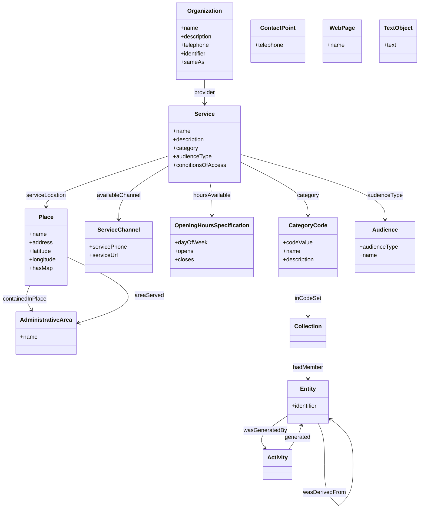

# Chat Transcript: Exploring DREAM-KG

👤 **User**  
@dreamkg

---

🧠 **Assistant**  
I'll help you explore the DREAM knowledge graph. Let me start by getting information about this knowledge graph.

**DREAM-KG Overview:**

This knowledge graph contains data about social services for people experiencing homelessness and related support organizations. It includes:

- **87 social service organizations** with locations and contact information
- **87 distinct service offerings**
- **32,460 triples** across 1,764 entities
- Integration with Aunt Bertha's social services directory (1,392 external references)

The data is structured using Schema.org vocabulary and includes:
- Service availability and opening hours
- Service categories (157 CategoryCodes)
- Target audiences (81 audience types including abuse survivors, adults, teens, African American communities)
- Geographic data (latitude/longitude coordinates)
- Provenance tracking using W3C PROV ontology

**What would you like to explore?** I can help you:
- Search for specific services or organizations
- Find services by location or target audience
- Explore service categories and availability
- Analyze the data structure and relationships
- Visualize the schema

---

👤 **User**  
Visualize the schema

---

🧠 **Assistant**  
Here's the DREAM-KG schema visualized as a class diagram:

This diagram shows how the DREAM-KG is structured:

**Core entities:**
- **Organization** - social service providers (87 in the graph)
- **Service** - specific services offered (87 distinct services)
- **Place** - physical locations with geocoded coordinates

**Service details:**
- **ServiceChannel** - ways to access services (phone, website)
- **OpeningHoursSpecification** - when services are available (609 specifications)
- **CategoryCode** - service classifications (157 codes)
- **Audience** - target populations served (81 types)

**Provenance tracking:**
- **Entity**, **Activity**, **Collection** - W3C PROV ontology classes that track data origins and transformations

The relationships show how organizations provide services at specific places, with detailed information about availability, access methods, and target audiences.

---

👤 **User**  
Create transcript

---

*Created by [mcp-proto-okn](https://github.com/sbl-sdsc/mcp-proto-okn) 0.4.0 using claude-sonnet-4-20250514 on 2025-12-22*
