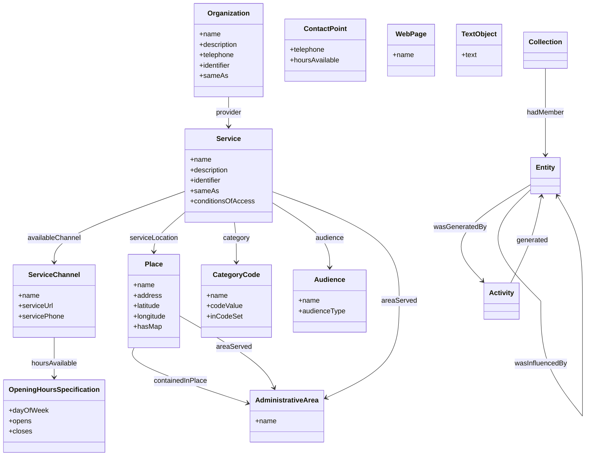

# DREAM-KG Exploration Chat Transcript

👤 **User**  
@dreamkg

---

🧠 **Assistant**  
I'll help you explore the knowledge graph! Let me first get some information about it.

Perfect! I now have access to the **DREAM-KG** (Dynamic, REsponsive, Adaptive, and Multifaceted Knowledge Graph), which addresses homelessness by integrating information about social services.

## What's in DREAM-KG?

This knowledge graph contains:
- **87 social service organizations** with locations and contact information
- **87 distinct service offerings**
- **32,460 triples** across 1,764 entities
- Information about service availability, categories, and target audiences
- Geographic data (latitude/longitude) for services
- Links to external resources like Aunt Bertha's social services directory

## What can I help you explore?

I can help you query this data to find:
- Social services by category (housing, food, healthcare, etc.)
- Services for specific populations (abuse survivors, teens, specific communities)
- Organizations and their contact information
- Service locations and hours of operation
- Services in specific geographic areas

What would you like to know about the social services and resources for addressing homelessness in this knowledge graph?

---

👤 **User**  
Visualize the schema

---

🧠 **Assistant**  
Here's the DREAM-KG schema visualization:

## Key Components:

**Core Service Model:**
- **Organization** provides **Services**
- **Services** have access channels, locations, categories, and target audiences
- **Places** provide geographic information with coordinates
- **OpeningHoursSpecification** details when services are available

**Classification & Targeting:**
- **CategoryCode** classifies services (housing, food, healthcare, etc.)
- **Audience** identifies who services are designed for
- **AdministrativeArea** defines geographic coverage

**Provenance (W3C PROV):**
- **Entity**, **Activity**, and **Collection** track data lineage and transformations

This schema enables comprehensive querying about social services for addressing homelessness!

---

*Created by [mcp-proto-okn](https://github.com/sbl-sdsc/mcp-proto-okn) 0.4.0 using claude-sonnet-4-20250514 on 2025-12-22*
