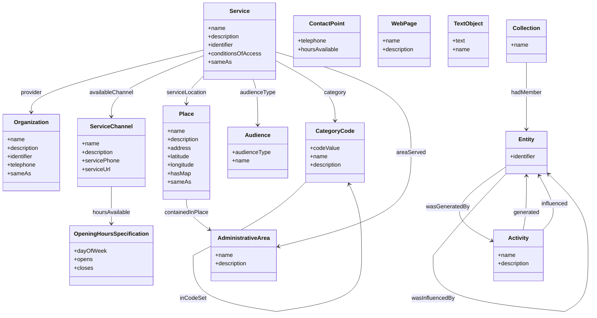

# Chat Transcript
DREAM-KG Exploration and Schema Visualization

👤 **User**  
@dreamkg

---

🧠 **Assistant**  
I'll help you explore the dreamkg knowledge graph. Let me first get information about this knowledge graph and its schema.

Great! I now have information about the **DREAM-KG** (Dynamic, REsponsive, Adaptive, and Multifaceted Knowledge Graph). This is an Open Knowledge Network designed to address homelessness by integrating social, economic, environmental, and political factors.

## Key Information about DREAM-KG:

**Purpose**: To help case workers, service providers, law enforcement, nonprofits, and people experiencing homelessness by providing comprehensive information about available services and resources.

**Scale**: 
- 32,460 triples across 1,764 entities
- 87 social service organizations
- 87 distinct service offerings
- 609 opening hours specifications
- 157 service categories
- 81 audience types

**Data Structure**: Uses Schema.org vocabulary with classes including:
- Organizations and Services
- Places and Contact Points
- Opening Hours and Service Channels
- Audience types and Category Codes
- Provenance tracking (W3C PROV ontology)

**Geographic Coverage**: Services are geocoded with latitude/longitude coordinates and linked to Aunt Bertha's social services directory.

**Target Populations**: Includes services for abuse survivors, adults, teens, African American communities, and other specific groups.

## What would you like to explore?

I can help you:
1. Find specific services or organizations
2. Search for services by category or target audience
3. Explore geographic distribution of services
4. Analyze service availability patterns
5. Visualize the knowledge graph schema

What interests you most about this knowledge graph?

---

👤 **User**  
Visualize teh schema

---

🧠 **Assistant**  
I'll visualize the DREAM-KG schema for you.

Perfect! I've created a visualization of the DREAM-KG schema. The diagram shows the main components:

**Core Service Delivery Classes:**
- **Service**: Central class representing social services with descriptions and access conditions
- **Organization**: Service providers with contact information
- **Place**: Physical locations with geocoding (latitude/longitude)
- **ServiceChannel**: Access methods (phone, website, physical location)
- **OpeningHoursSpecification**: Operating hours for services

**Classification & Targeting:**
- **CategoryCode**: Service categories from controlled vocabularies
- **Audience**: Target populations (e.g., abuse survivors, adults, teens)
- **AdministrativeArea**: Geographic regions served

**Provenance Tracking (W3C PROV):**
- **Entity**, **Activity**, **Collection**: Track data transformations and sources

The relationships show how services connect to providers, locations, audiences, and operating hours, creating a comprehensive network of homelessness resources.

---

*Created by [mcp-proto-okn](https://github.com/sbl-sdsc/mcp-proto-okn) 0.4.0 for dreamkg on 2025-12-24*

claude-sonnet-4-20250514
