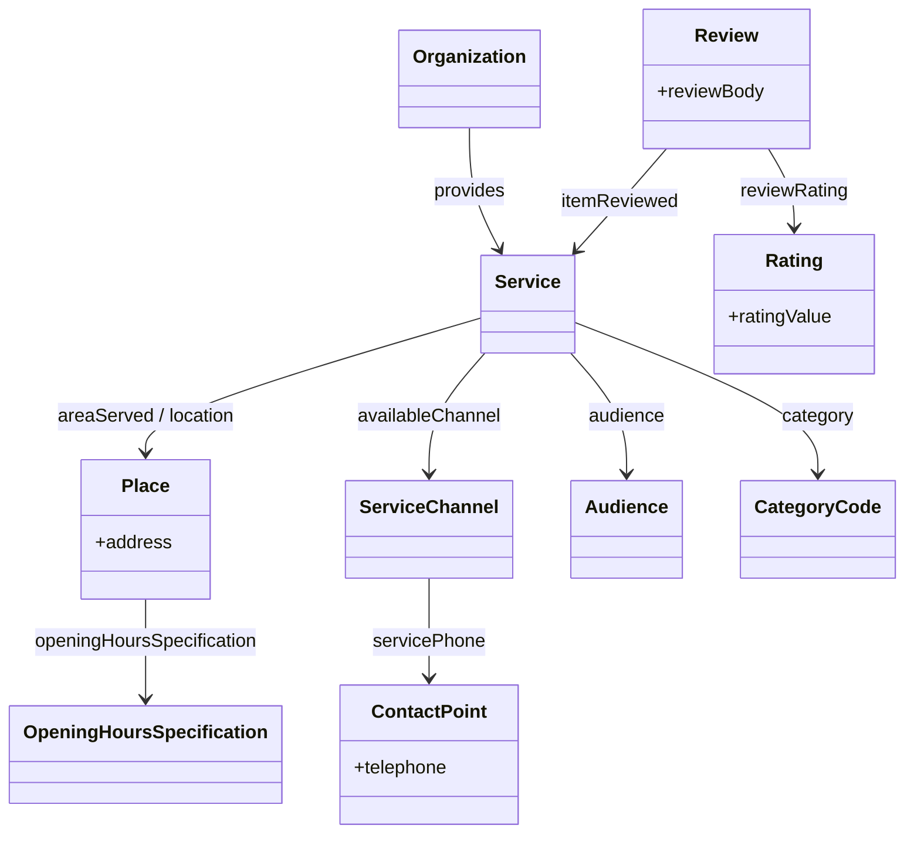

# DREAM-KG Knowledge Graph Exploration

## Chat Transcript

👤 **User**  
@dreamkg

---

🧠 **Assistant**  
I'll help you explore the dreamkg knowledge graph. Let me fetch its schema and probe the live endpoint for the classes and predicates in use.

**DREAM-KG** is a knowledge graph of **human and social services** (such as homeless and emergency services), modeled almost entirely with **schema.org** so it interoperates with civic-service data. It describes the organizations that provide services, where and when those services are available, who they serve, and community reviews of them, with PROV metadata for versioning.

Live class counts:
- **662** each of **`Organization`**, **`Service`**, **`Place`**, **`ContactPoint`**, **`TextObject`** — the core provider/service records
- **1,324 `ServiceChannel`** and **609 `OpeningHoursSpecification`** — how and when services are accessed
- **3,762 `Review`** and **3,762 `Rating`** — community feedback on services
- **444 `CategoryCode`**, **81 `Audience`**, **39 `AdministrativeArea`** — service categorization, target audiences, and geography
- **1,586 `prov:Entity`** — provenance/versioning records

**Main relationships:**
- an `Organization` provides a `Service` offered at a `Place`
- `ServiceChannel` + `ContactPoint` + `OpeningHoursSpecification` — the access channel, contact details, and hours for a service
- `Audience` and `CategoryCode` — the intended audience and service category
- `Review` → `Rating` — a review of a service and its numeric rating (`reviewBody`, `reviewRating`, `ratingValue`)

Would you like me to:
1. Visualize the schema structure?
2. Find services of a given category in an area?
3. Rank services by review rating?

---

👤 **User**  
Visualize the schema

---

🧠 **Assistant**  
Here's the live schema of DREAM-KG — organizations providing services at places, with access details, audiences, and reviews:

```mermaid
classDiagram
    class Organization
    class Service
    class Place {
        +address
    }
    class ServiceChannel
    class ContactPoint {
        +telephone
    }
    class OpeningHoursSpecification
    class Audience
    class CategoryCode
    class Review {
        +reviewBody
    }
    class Rating {
        +ratingValue
    }

    Organization --> Service : provides
    Service --> Place : areaServed / location
    Service --> ServiceChannel : availableChannel
    ServiceChannel --> ContactPoint : servicePhone
    Service --> Audience : audience
    Service --> CategoryCode : category
    Place --> OpeningHoursSpecification : openingHoursSpecification
    Review --> Service : itemReviewed
    Review --> Rating : reviewRating
```

**Key insights from the schema:**

1. **schema.org native.** Using civic/service vocabulary (`Organization`, `Service`, `Place`, `ServiceChannel`, `ContactPoint`, `OpeningHoursSpecification`) makes DREAM-KG directly interoperable with open service directories and easy to query for "what/where/when."

2. **Access-focused.** Beyond the service itself, the graph captures *how to reach it* — channels, contact points, and opening hours — supporting real-time "is this service available now" questions.

3. **Community feedback layer.** ~3,762 `Review`/`Rating` pairs (`reviewBody`, `reviewRating`, `ratingValue`) let services be ranked or filtered by user experience — a recent addition to the schema.

4. **Provenance built in.** `prov:Entity` records support versioning and change tracking, fitting DREAM-KG's "dynamic and responsive" design for frequently-updated service information.

---

👤 **User**  
Create transcript

---

*Created by [mcp-proto-okn](https://github.com/sbl-sdsc/mcp-proto-okn) 0.6.0 using claude-opus-4-8 on 2026-07-12*
