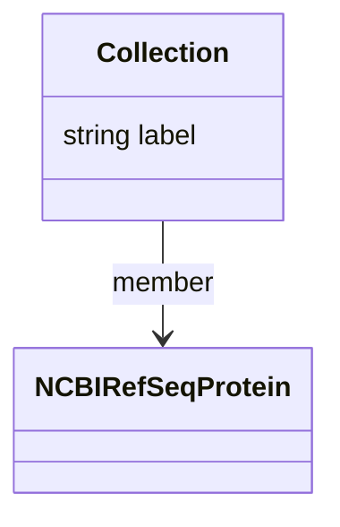

# EvoWeb Knowledge Graph — Chat Transcript

👤 **User**
Give an overview of the @evoweb KG

---

🧠 **Assistant**

Here's an overview of the **EvoWeb Knowledge Graph**:

---

## What is EvoWeb?

EvoWeb is an Open Knowledge Network (OKN) knowledge graph for exploring **co-evolving genes** and the functional relationships among their protein products. It was developed in connection with **NIAID data resources** and builds on the [EvoWeaver project](https://www.nature.com/articles/s41467-025-59175-6), funded by NSF Award #2333810.

Its core purpose is to help researchers move beyond pairwise protein analysis into **network-level interpretation** of shared evolutionary history.

---

## What Problem Does It Solve?

EvoWeb enables researchers to identify **hypothetical proteins** that may be involved in:
- **Protein complexes** — proteins that physically interact as part of a functional unit
- **Biochemical pathway steps** — proteins catalyzing linked reactions in a shared pathway
- **Broader systems of shared evolutionary history** — gene clusters that appear to have co-evolved

---

## Key Scientific Features

The graph encodes **12 coevolutionary signals** that quantify the degree to which genes have evolved together. These signals are derived from prior knowledge embedded in genomic sequences, making the inferences computationally grounded rather than purely experimental.

---

## Data Structure

EvoWeb uses a lightweight semantic structure:

- **One entity class:** `skos:Collection` — each instance represents a **protein orthology cluster**, grouping NCBI RefSeq proteins inferred to share evolutionary history (e.g., Node1, Node2, ...)
- **Two predicates:**
  - `skos:member` — links a protein group (Collection) to its constituent NCBI RefSeq protein members
  - `rdfs:label` — a human-readable functional name for each group (e.g., *"chromosomal replication initiator protein DnaA"*)

**Identifier namespaces used:** NCBI Protein, RefSeq

---

## Domain Coverage

| Domain | Tags |
|---|---|
| Comparative genomics | ✅ |
| Microbial systems biology | ✅ |
| Protein function | ✅ |
| Protein interactions | ✅ |

---

## Example Research Questions

- *What proteins are members of a co-evolving protein group?*
- *What co-evolving genes may participate in shared protein complexes or pathways?*

---

## Access

- **SPARQL endpoint:** `https://apps.okn.us/evoweb/sparql`
- **TPF endpoint:** `https://apps.okn.us/ldf/evoweb`
- **Contact:** Erik Wright (WrightLabScience @ GitHub), Baylor College of Medicine

In short, EvoWeb is a genomics-focused KG that represents the "evolutionary co-expression atlas" of microbial proteins — useful for functional annotation of unknown proteins and hypothesis generation about pathway or complex membership.

---

👤 **User**
Visualize the schema with the visualize_schema tool

---

🧠 **Assistant**

Here's the EvoWeb schema diagram:

The schema is intentionally minimal — EvoWeb has just two elements:

- **`Collection`** represents a protein orthology cluster (a group of co-evolving proteins). Each instance carries a human-readable `label` (e.g., *"chromosomal replication initiator protein DnaA"*).
- **`NCBIRefSeqProtein`** represents individual NCBI RefSeq protein entries.
- The **`member`** relationship links each Collection to all the proteins inferred to belong to that co-evolutionary group.

The simplicity is by design — the scientific richness lives in the weighted coevolutionary signals encoded in the groupings themselves, not in complex ontological structure.

---

*Created by [mcp-proto-okn](https://github.com/sbl-sdsc/mcp-proto-okn) 0.6.0 on 2026-05-01*

*Model: claude-sonnet-4-6*
