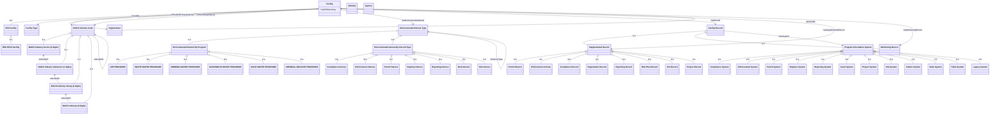

# SAWGraph FRS Knowledge Graph Exploration

👤 **User**  
@fiokg

---

🧠 **Assistant**  
I'll help you explore this knowledge graph! Let me start by getting information about it.

Great! I can see this is the **SAWGraph FRS KG** (Facility Registry Service Knowledge Graph), which is part of the SAWGraph project focused on monitoring PFAS and other contaminants in food and water systems.

Now let me get the schema to understand what data is available:

Perfect! Now I have a comprehensive view of the **SAWGraph FRS Knowledge Graph**. This is a rich environmental dataset containing information about facilities, their industries, environmental programs, and compliance records.

## What's in this Knowledge Graph?

This knowledge graph contains comprehensive data about **826,000+ regulated facilities** across the United States from the EPA's Facility Registry Service. Here are the key components:

### Core Entities

- **Facilities** - Industrial, federal, and utility facilities tracked by EPA programs
- **Organizations** - Companies and agencies that own/operate facilities  
- **Industries** - NAICS classification codes (hierarchical: Sector → Subsector → Industry Group → Industry)
- **Environmental Records** - Permits, monitoring data, enforcement actions, compliance reports
- **Environmental Programs** - Air, water, waste, hazardous materials, underground storage tanks, etc.

### Key Features

- **2.6 million entities** and **10+ million triples**
- Spatial indexing using S2 cells (Level 13) and county subdivisions
- Links to environmental interest types and compliance systems
- Temporal tracking of facility activities
- **PFAS facility identification** - facilities potentially handling PFAS chemicals

### What You Can Explore

Would you like to:
1. **Find facilities** by location, industry, or environmental program
2. **Explore PFAS-related facilities** and their industries
3. **Analyze compliance and enforcement** patterns
4. **Examine industry classifications** and facility types
5. **Investigate specific environmental programs** (air quality, water, waste, etc.)

What interests you most about this data?

---

👤 **User**  
Visualize the schema

---

🧠 **Assistant**  

This visualization shows the structure of the SAWGraph FRS Knowledge Graph with four main hierarchies:

1. **Facilities & Organizations** (left) - Shows how facilities relate to organizations and their classifications
2. **NAICS Industry Codes** (top-left) - Hierarchical industry classification from 2-digit sectors down to 6-digit industries
3. **Environmental Records** (center) - Different types of records associated with facilities
4. **Environmental Programs** (right side) - Program types and information systems that track facilities

The diagram illustrates how facilities connect to their industries, environmental programs, and various tracking records through the EPA's regulatory systems.

---

👤 **User**  
Create transcript

---

*Created by [mcp-proto-okn](https://github.com/sbl-sdsc/mcp-proto-okn) 0.4.0 using claude-sonnet-4-20250514 on 2025-12-22*
