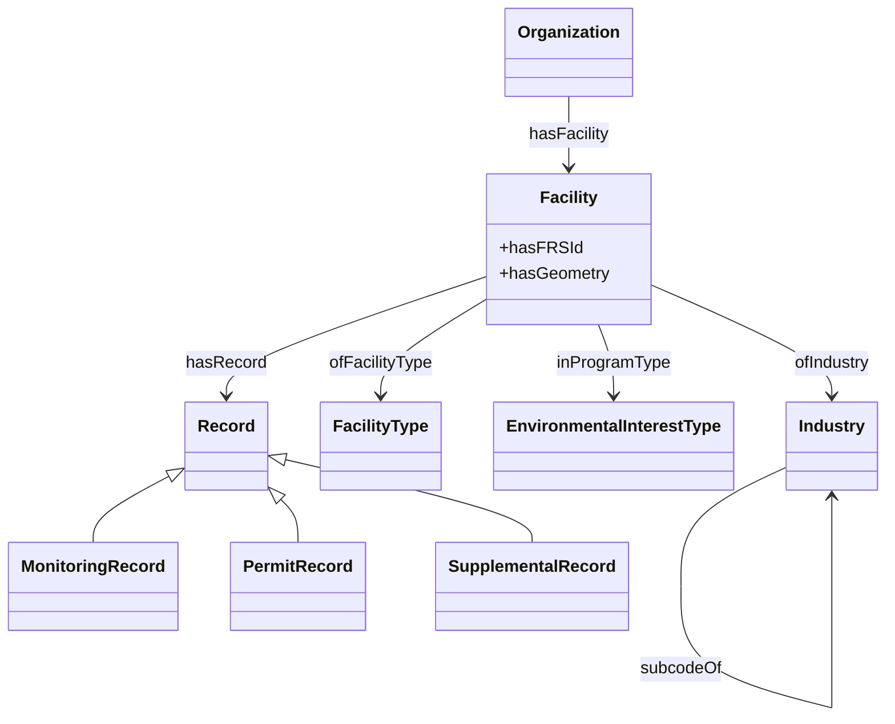

# FIO Knowledge Graph (EPA Facility Registry Service) Exploration

## Chat Transcript

👤 **User**  
@fiokg

---

🧠 **Assistant**  
I'll help you explore the fiokg knowledge graph. Let me fetch its schema and probe the live endpoint for the classes and predicates in use.

**FIOKG** applies the SAWGraph **Facilities and Industries Ontology (FIO)** to the U.S. EPA **Facility Registry Service (FRS)**. It represents regulated facilities, the environmental programs and records that track them, their industry classifications (NAICS), and the government agencies and programs involved — a large geospatial registry of environmental compliance data.

Live class counts:
- **~4.9 million `Facility`** (`fio:Facility` / `epa-frs:FRS-Facility`) — regulated facilities, each with a geometry
- **~9.1 million `Record`** including **~5.0M `MonitoringRecord`**, **~4.3M `SupplementalRecord`**, **~2.5M `ReportingRecord`**, **~1.5M `PermitRecord`**, **~1.5M `StateTrackingRecord`**
- **`EnvironmentalInterestType`** program categories (AIR PROGRAMS, CHEMICAL STORAGE PROGRAMS, DRINKING WATER PROGRAMS, …) and compliance/enforcement systems
- **`Industry`** (NAICS codes, hierarchical) and government **agency** categories; **`EPA PFAS Facility`** subset

**Main relationships:**
- `has Facility` — an `Organization` operates a `Facility`
- `has record` / `has supplemental record` — a facility's monitoring/reporting/permit/tracking records
- `of facility type` — the facility's `Facility Type`
- `in program type` / `of program category` — the `Environmental Interest Type` (regulatory program) a facility participates in
- `of industry` — the facility's `Industry` (NAICS), with `subcode of` giving the NAICS hierarchy
- `has FRS Id` — the facility's EPA FRS identifier

Would you like me to:
1. Visualize the schema structure?
2. Find facilities in a given environmental program or NAICS industry?
3. List PFAS-handling facilities by state?

---

👤 **User**  
Visualize the schema

---

🧠 **Assistant**  
Here's the live schema of FIOKG — EPA FRS facilities with their records, programs, and industry classifications:

```mermaid
classDiagram
    class Organization
    class Facility {
        +hasFRSId
        +hasGeometry
    }
    class Record
    class MonitoringRecord
    class PermitRecord
    class SupplementalRecord
    class FacilityType
    class EnvironmentalInterestType
    class Industry

    Organization --> Facility : hasFacility
    Facility --> Record : hasRecord
    Record <|-- MonitoringRecord
    Record <|-- PermitRecord
    Record <|-- SupplementalRecord
    Facility --> FacilityType : ofFacilityType
    Facility --> EnvironmentalInterestType : inProgramType
    Facility --> Industry : ofIndustry
    Industry --> Industry : subcodeOf
```

**Key insights from the schema:**

1. **Facilities at the center.** ~4.9 million `Facility` records — each geolocated — are the hub, linked to organizations that operate them and to the many EPA records that describe their regulatory activity.

2. **A record-heavy model.** ~9.1 million `Record`s (monitoring, reporting, permit, supplemental, state-tracking) capture the facility's interactions with environmental programs, so compliance history can be reconstructed per facility.

3. **Program and industry axes.** Facilities are classified by `EnvironmentalInterestType` (the regulatory program, e.g. air, drinking water, chemical storage) and by NAICS `Industry` (hierarchical via `subcode of`), the two main dimensions for slicing the registry.

4. **Federation-ready.** FRS IDs, NAICS codes, and geometries let FIOKG join to other SAWGraph water/contaminant graphs and to spatial data — e.g. connecting PFAS-handling facilities to nearby contaminant samples.

---

👤 **User**  
Create transcript

---

*Created by [mcp-proto-okn](https://github.com/sbl-sdsc/mcp-proto-okn) 0.6.0 using claude-opus-4-8 on 2026-07-12*
