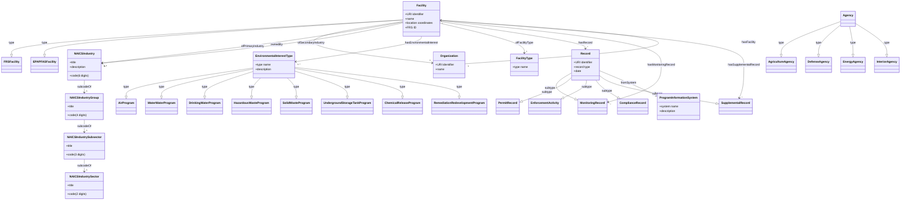

# SAWGraph FRS Knowledge Graph Exploration

👤 **User**  
@fiokg

---

🧠 **Assistant**  
I'll help you explore the fiokg knowledge graph. Let me start by getting some information about it.

Great! I now have access to the **SAWGraph FRS KG** (Facility Registry Service Knowledge Graph). This is a comprehensive environmental knowledge graph containing data about over 826,000 facilities across the United States.

## What's in this Knowledge Graph?

The SAWGraph FRS KG contains:
- **2.6 million entities** and **10+ million triples**
- Facility data from EPA's Facility Registry Service
- Industry classifications using NAICS codes
- Environmental compliance records (permits, monitoring, enforcement)
- Spatial indexing to counties and S2 cells
- Links to environmental programs (air, water, waste, hazardous materials, etc.)

## Key Information You Can Query:

1. **Facilities** - Industrial, federal, and utility facilities with locations and industry codes
2. **Environmental Programs** - Air quality, water quality, hazardous waste, drinking water, underground storage tanks, etc.
3. **Records** - Permits, monitoring data, enforcement actions, compliance records
4. **Industries** - NAICS industry classifications at multiple hierarchical levels
5. **Organizations** - Entities that own/operate facilities
6. **PFAS Facilities** - Facilities potentially handling PFAS chemicals

## What would you like to explore?

I can help you:
- Find facilities by location, industry, or program type
- Analyze environmental compliance patterns
- Explore PFAS-related facilities
- Search for specific types of environmental records
- Examine industry distributions
- Or anything else you're curious about!

What interests you?

---

👤 **User**  
Visualize the schema

---

🧠 **Assistant**  
Here's the schema visualization for the SAWGraph FRS Knowledge Graph! 

The diagram shows the key structure:

**Core Entities:**
- **Facility** - Central entity representing industrial/federal/utility facilities with FRS IDs and locations
- **Organization** - Entities that own/operate facilities
- **Record** - Environmental records in various information systems

**Industry Classification:**
- 4-level NAICS hierarchy from Sector (2-digit) → Subsector (3-digit) → Industry Group (4-digit) → Industry (6-digit)

**Environmental Programs:**
- Air Quality, Water/Wastewater, Drinking Water
- Hazardous Waste, Solid Waste
- Underground Storage Tanks
- Chemical Releases, Remediation programs

**Record Types:**
- Monitoring, Permits, Enforcement, Compliance, Supplemental

**Key Relationships:**
- Facilities are owned by Organizations
- Facilities have primary/secondary NAICS industry codes
- Facilities participate in multiple environmental programs
- Facilities have various types of environmental records tracked in different information systems

---

👤 **User**  
Create transcript

---

*Created by [mcp-proto-okn](https://github.com/sbl-sdsc/mcp-proto-okn) 0.4.0 for fiokg using claude-sonnet-4-20250514 on 2025-12-24*
