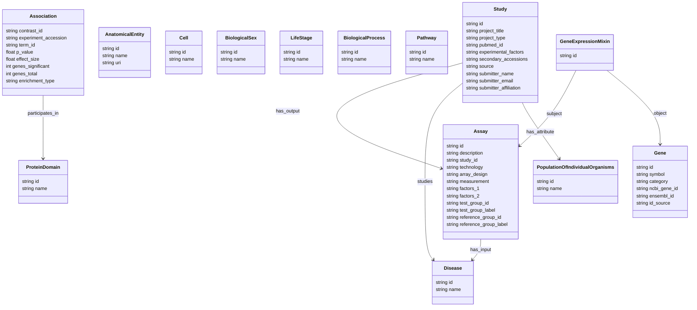

# Gene Expression Atlas Knowledge Graph Exploration

👤 **User**  
@gene-expression-atlas-okn

---

🧠 **Assistant**  
I'll help you explore the gene expression atlas knowledge graph. Let me first get some information about what's available in this resource.

Great! I can help you explore the **Gene Expression Atlas** knowledge graph, which contains selected studies from the EMBL-EBI Gene Expression Atlas. This resource includes:

- **243 studies** with 797 assays
- Expression data for **152,879 genes**
- Differential expression measurements with statistical metrics
- Links to anatomical entities, cell types, diseases, developmental stages, and biological sex categories

Let me get the schema to show you what kinds of data and relationships are available:

Perfect! Here's what you can explore in this knowledge graph:

## Main Entity Types:
- **Study** - 243 gene expression studies from the Atlas
- **Assay** - 797 individual assays/experiments  
- **Gene** - 152,879 genes with expression data
- **AnatomicalEntity** - Tissue/organ locations
- **Cell** - Cell types
- **Disease** - Disease conditions
- **BiologicalSex** - Sex-specific data
- **LifeStage** - Developmental stages
- **BiologicalProcess**, **Pathway**, **ProteinDomain** - Functional annotations

## Key Relationships:
- Studies contain assays (has_output)
- Assays measure gene expression with statistical metrics
- Studies can be linked to diseases, populations, and organisms

## Important Properties:
- **Statistical metrics**: p_value, effect_size, genes_significant
- **Study metadata**: project_title, pubmed_id, experimental_factors
- **Assay details**: technology, array_design, test/reference groups
- **Gene identifiers**: ncbi_gene_id, ensembl_id, symbol

## What would you like to explore?

I can help you:
1. Search for genes and their expression patterns
2. Find studies related to specific diseases or tissues
3. Analyze differential expression data
4. Explore experimental factors and contrasts
5. Visualize the knowledge graph structure

What interests you?

---

👤 **User**  
Visualize schema

---

🧠 **Assistant**  
I'll create a visual schema diagram for you. Let me generate the Mermaid class diagram showing all the entity types and their relationships.

Here's the schema visualization for the Gene Expression Atlas knowledge graph! The diagram shows:

**Core Structure:**
- **Study** entities contain multiple **Assay** experiments
- **GeneExpressionMixin** connects assays to genes, representing the actual expression measurements
- **Association** entities capture enrichment and statistical relationships

**Biological Context:**
- Studies can be linked to **Disease** conditions and **PopulationOfIndividualOrganisms**
- The schema includes entities for anatomical locations, cell types, life stages, biological sex, pathways, and protein domains

**Key Properties:**
- Studies have metadata like titles, PubMed IDs, and experimental factors
- Assays track technology platforms, test/reference groups, and measurement types
- Genes have multiple identifiers (NCBI, Ensembl) and symbols
- Associations include statistical measures (p-values, effect sizes)

The downloadable .mermaid file is ready for you to use in documentation or presentations!

---

*Created by [mcp-proto-okn](https://github.com/sbl-sdsc/mcp-proto-okn) 0.5.0 on 2026-01-15*
*Model: Claude Sonnet 4.5 (claude-sonnet-4-5-20250929)*
