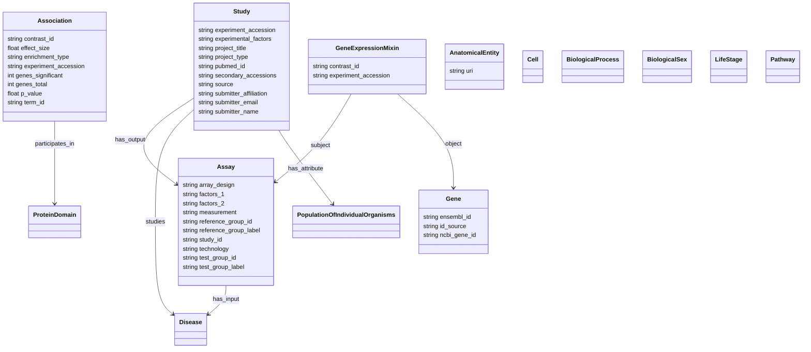

# Gene Expression Atlas OKN Exploration

👤 **User**  
@gene-expression-atlas-okn

---

🧠 **Assistant**  
I'll help you explore the gene-expression-atlas-okn knowledge graph. Let me first get information about this knowledge graph to understand what data it contains.

Great! Now let me get the schema to understand the structure of this knowledge graph.

Perfect! I now have a comprehensive understanding of the **Gene Expression Atlas Open Knowledge Network**. This is a rich semantic knowledge graph containing selected studies from the EMBL-EBI Gene Expression Atlas.

## Overview

The knowledge graph contains:
- **243 studies** with **797 assays**
- Expression data for **152,879 genes**
- Differential gene expression measurements with statistical metrics

## Key Entities (Classes)

The knowledge graph includes these main entity types:

1. **Gene** - Genes with NCBI Gene IDs or Ensembl IDs
2. **Study** - Research studies from Gene Expression Atlas
3. **Assay** - Individual differential expression measurements
4. **AnatomicalEntity** - Anatomical structures (from UBERON ontology)
5. **Cell** - Cell types (from Cell Ontology)
6. **Disease** - Diseases studied
7. **BiologicalProcess** - GO biological processes
8. **Pathway** - Biological pathways
9. **BiologicalSex** - Sex categories
10. **LifeStage** - Developmental stages
11. **GeneExpressionMixin** - Expression associations with quantitative data
12. **Association** - General associations between entities

## What You Can Explore

You can query this knowledge graph to:
- Find genes differentially expressed in specific tissues, cell types, or diseases
- Explore expression patterns across developmental stages
- Investigate disease-associated expression changes
- Analyze expression data by biological sex
- Find enriched pathways and biological processes
- Get study metadata including PubMed references and experimental conditions

## Example Questions

Would you like me to help you with any of these types of queries?
- "Which genes are upregulated in heart tissue?"
- "Find studies related to a specific disease"
- "Show expression patterns for a specific gene"
- "What assays involve specific cell types?"

What would you like to explore in this gene expression data?

---

👤 **User**  
Visualize schema

---

🧠 **Assistant**  
I'll create a visual representation of the Gene Expression Atlas schema using a Mermaid class diagram. Let me follow the workflow step by step.

First, I'll generate the draft diagram based on the schema I already retrieved:

Perfect! Now I'll present the cleaned diagram and save it to a file:

I've created a visual schema diagram for the Gene Expression Atlas knowledge graph! The diagram shows:

**Core Data Flow:**
- **Study** → **Assay** → **Gene** (via GeneExpressionMixin)
- Studies contain multiple assays that measure gene expression

**Key Entity Types:**
- **Study** - Research projects with metadata (title, PubMed ID, submitter info, experimental factors)
- **Assay** - Individual expression measurements with test/reference groups and technology details
- **Gene** - Genes identified by NCBI or Ensembl IDs
- **GeneExpressionMixin** - The connection between assays and genes with contrast information
- **Association** - General associations with statistical measures (p-values, effect sizes, enrichment data)

**Contextual Entities:**
- AnatomicalEntity, Cell, Disease, BiologicalProcess, BiologicalSex, LifeStage, Pathway, ProteinDomain, PopulationOfIndividualOrganisms

The diagram renders interactively above and is also available as a downloadable .mermaid file.

---

*Created by [mcp-proto-okn](https://github.com/sbl-sdsc/mcp-proto-okn) 0.5.0 on 2026-01-15*

Model: Claude Sonnet 4.5 (claude-sonnet-4-5-20250929)
