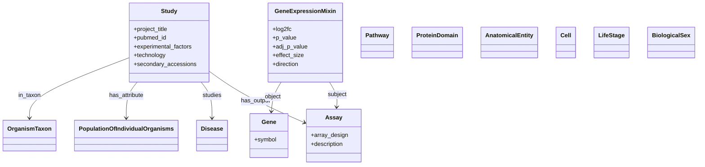

# Gene Expression Atlas OKN Knowledge Graph Exploration

## Chat Transcript

👤 **User**  
@gene-expression-atlas-okn

---

🧠 **Assistant**  
I'll help you explore the gene-expression-atlas-okn knowledge graph. Let me fetch its schema and probe the live endpoint for the classes and predicates in use.

The **Gene Expression Atlas OKN** is a semantic knowledge graph of differential gene-expression results derived from the EMBL-EBI Gene Expression Atlas. It represents which genes change expression in which assays, together with the statistical measures of that change and the biological context of each study. Its entities follow the **Biolink Model**, while the quantitative expression measures are carried on the expression associations through the graph's own measurement vocabulary.

Live class counts show the graph is dominated by expression associations over genes:
- **~8.8 million `GeneExpressionMixin`** — individual differential-expression associations (assay ↔ gene)
- **~833 K `Gene`** and **~288 K `Association`** records
- **~14,850 `Assay`** and **~4,668 `Study`** — the experiments and their component assays
- Context classes: **`Pathway`** (4,862), **`ProteinDomain`** (3,367), **`AnatomicalEntity`** (1,088), **`Cell`** (932), **`Disease`** (869), **`LifeStage`** (690), **`BiologicalSex`**, **`PopulationOfIndividualOrganisms`**, **`OrganismTaxon`**

**Main relationships:**
- `has_output` — links a `Study` to its `Assay`s
- `studies` — links a `Study` to the `Disease` studied
- `has_attribute` / `in_taxon` — link a study to its population and organism
- `subject` / `object` / `predicate` — a `GeneExpressionMixin` association links its subject `Assay` to its object `Gene` (predicate typically *affects_expression_of*)

**Expression measures** (carried on the association, in the `wobd` vocabulary):
- `log2fc` — log2 fold change (positive = up-regulated, negative = down-regulated)
- `p_value`, `adj_p_value` — raw and FDR-adjusted significance
- `effect_size`, `direction` — magnitude and direction of change

Would you like me to:
1. Visualize the schema structure?
2. Find genes differentially expressed in a specific disease?
3. Compare fold changes across studies for a gene?

---

👤 **User**  
Visualize the schema

---

🧠 **Assistant**  
Here's the live schema of the Gene Expression Atlas OKN — studies and assays producing gene-expression associations, with the differential-expression statistics carried on each association:

```mermaid
classDiagram
    class Study {
        +project_title
        +pubmed_id
        +experimental_factors
        +technology
        +secondary_accessions
    }
    class Assay {
        +array_design
        +description
    }
    class GeneExpressionMixin {
        +log2fc
        +p_value
        +adj_p_value
        +effect_size
        +direction
    }
    class Gene {
        +symbol
    }
    class Disease
    class Pathway
    class ProteinDomain
    class AnatomicalEntity
    class Cell
    class LifeStage
    class BiologicalSex
    class PopulationOfIndividualOrganisms

    Study --> Assay : has_output
    Study --> Disease : studies
    Study --> PopulationOfIndividualOrganisms : has_attribute
    Study --> OrganismTaxon : in_taxon
    GeneExpressionMixin --> Assay : subject
    GeneExpressionMixin --> Gene : object
```

**Key insights from the schema:**

1. **Associations are the core.** ~8.8 million `GeneExpressionMixin` records are the workhorse — each connects an assay (its `subject`) to a gene (its `object`) and carries the differential-expression statistics as properties, so a single query pattern retrieves fold changes and p-values.

2. **Study → Assay → Association hierarchy.** A `Study` groups `Assay`s via `has_output`; each assay contributes many gene-level associations. Study metadata (`project_title`, `pubmed_id`, `experimental_factors`, `technology`) supports provenance and meta-analysis.

3. **Biolink classes, `wobd` measures.** Entities (Gene, Assay, Study, Disease, anatomical/cell/life-stage/sex contexts) use Biolink classes; the quantitative measures (`log2fc`, `p_value`, `adj_p_value`, `effect_size`, `direction`) come from the graph's `wobd` vocabulary rather than Biolink edge properties.

4. **Rich biological context.** Studies link to disease, organism, and population; genes connect to pathways and protein domains — enabling questions like "which genes are up-regulated in a disease across studies" and cross-study meta-analyses.

---

👤 **User**  
Create transcript

---

*Created by [mcp-proto-okn](https://github.com/sbl-sdsc/mcp-proto-okn) 0.6.0 using claude-opus-4-8 on 2026-07-12*
