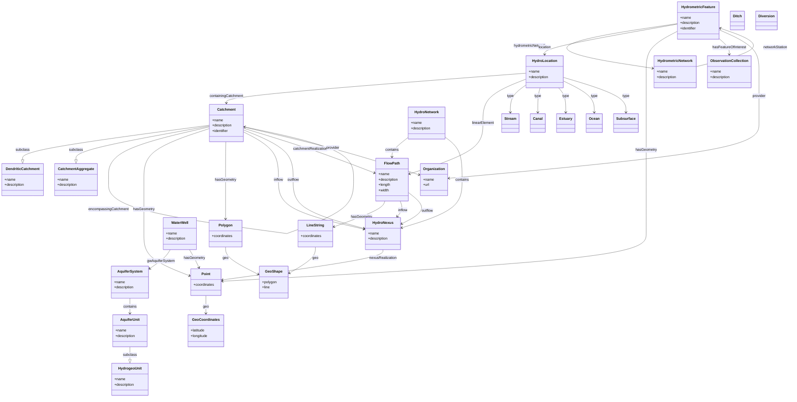

## Chat Transcript
GEOCONNEX Knowledge Graph Exploration

👤 **User**  
@geoconnex

---

🧠 **Assistant**  
I'll help you explore the geoconnex knowledge graph! Let me start by getting some basic information about it.

Perfect! Now I have a good understanding of the **GEOCONNEX** knowledge graph. Let me summarize what's available:

## GEOCONNEX Knowledge Graph

**GEOCONNEX** is an open, community-driven knowledge graph linking U.S. hydrologic features to enable seamless water data discovery, access, and collaborative monitoring.

### Key Statistics
- **19.2 million triples** describing hydrologic data
- **1.6 million hydrologic locations** including:
  - Monitoring sites
  - Dams
  - Watersheds
  - Stream networks
  - Water bodies
- **763,000 point geometries**
- **320,000 polygon features**

### Main Feature Types

The knowledge graph includes:

1. **Hydrologic Features**:
   - Catchments (watersheds)
   - Flow paths and stream networks
   - Hydrologic nexuses (junction points)
   - Hydrometric features (monitoring stations)

2. **Water Body Types**:
   - Streams, canals, ditches
   - Estuaries and ocean features
   - Lakes and water bodies
   - Sinkholes

3. **Groundwater Features**:
   - Wells
   - Aquifer systems and units
   - Hydrogeologic units

4. **Monitoring & Observations**:
   - Sensor observations
   - Hydrometric networks
   - Measurement data

### What Can You Explore?

I can help you query this knowledge graph to:
- Find hydrologic features by location or name
- Explore watershed relationships (upstream/downstream connections)
- Discover monitoring stations and their observations
- Analyze catchment networks and drainage patterns
- Find geographic features and their geometries
- Explore groundwater systems

**What would you like to explore?** For example, I can help you find monitoring stations in a specific area, trace upstream/downstream relationships, or search for specific hydrologic features.

---

👤 **User**  
Visualize the schema

---

🧠 **Assistant**  
Perfect! Here's the GEOCONNEX knowledge graph schema visualization:

The diagram shows the core structure of the GEOCONNEX knowledge graph, including:

**Key Entity Groups:**
- **Catchments & Watersheds** - hierarchical relationships showing upstream/downstream connections
- **Flow Paths & Networks** - the stream and river networks
- **Hydrometric Features** - monitoring stations and observation points
- **Groundwater** - wells, aquifers, and hydrogeologic units
- **Location Types** - streams, canals, estuaries, subsurface features
- **Geometries** - points, polygons, and lines for spatial representation

The relationships show how water flows through the system, how catchments connect to each other, and how monitoring features relate to the hydrologic network.

---

👤 **User**  
Create transcript

---

*Created by [mcp-proto-okn](https://github.com/sbl-sdsc/mcp-proto-okn) 0.4.0 for geoconnex on 2024-12-24*

claude-sonnet-4-20250514