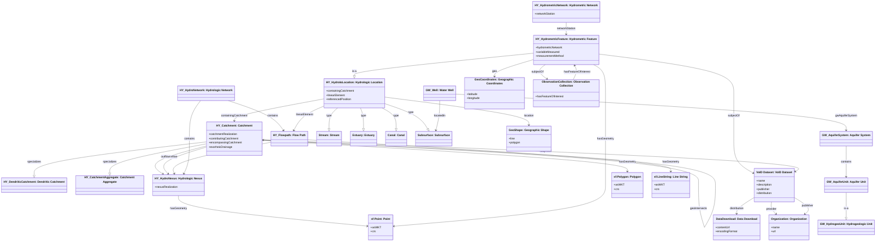

# Chat Transcript: Exploring the GEOCONNEX Knowledge Graph

👤 **User**  
@geoconnex

---

🧠 **Assistant**  
I'll help you explore the Geoconnex knowledge graph! Let me start by getting information about this knowledge graph.

Perfect! I now have access to the **GEOCONNEX** knowledge graph. This is a fascinating resource containing over 19.2 million triples about U.S. hydrologic features!

## What is GEOCONNEX?

GEOCONNEX is an open, community-driven knowledge graph that links hydrologic features across the United States. It makes water data easily discoverable, accessible, and usable for researchers, agencies, and water managers.

### Key Statistics:
- **19.2 million triples** describing hydrologic data
- **1.6 million hydrologic locations** including:
  - Monitoring sites
  - Dams
  - Watersheds
  - Stream networks
  - Water bodies
- **763,000 point geometries** and **320,000 polygon features** for geospatial coverage

### What kinds of data can you explore?

The knowledge graph includes:

**Hydrologic Features:**
- Catchments and watersheds
- Flow paths and stream networks
- Hydrologic nexuses (connection points)
- Hydrometric features (gauging stations)

**Water Infrastructure:**
- Wells and aquifer systems
- Dams and diversions
- Canals and ditches

**Geographic Types:**
- Streams, estuaries, sinkholes
- Subsurface features (groundwater)
- Atmospheric monitoring locations

**Data & Observations:**
- Sensor observations
- Measurement methods and techniques
- Temporal coverage of datasets

Would you like me to:
1. Show you example queries you can run?
2. Visualize the schema structure?
3. Find specific hydrologic features in a region?
4. Explore relationships between water features?

What would you like to explore?

---

👤 **User**  
Visualize the schema

---

🧠 **Assistant**  
Here's a comprehensive visualization of the GEOCONNEX schema:

## Key Components of the Schema:

### 🌊 **Core Hydrologic Features**
- **Catchments**: Watersheds that collect water, with hierarchical relationships (upper/lower, contributing/receiving)
- **Flow Paths**: Linear water flow routes through the landscape
- **Hydrologic Nexuses**: Connection points where water flows converge or diverge
- **Hydrologic Networks**: Connected systems of flow paths and nexuses

### 📊 **Monitoring & Observations**
- **Hydrometric Features**: Gauging stations where measurements are taken
- **Observation Collections**: Groups of measurements from monitoring sites
- **Hydrometric Networks**: Organized systems of monitoring stations

### 💧 **Groundwater Features**
- **Wells**: Access points to groundwater
- **Aquifer Systems & Units**: Underground water-bearing formations
- **Hydrogeologic Units**: Rock/sediment layers characterized by water flow properties

### 📍 **Geographic Representation**
- **Points, Lines, Polygons**: Geometric representations with WKT format
- **Geo Coordinates**: Latitude/longitude positions
- **Spatial Relationships**: Features can be within or intersect with each other

### 📚 **Data & Metadata**
- **Datasets**: Collections of water data with providers and publishers
- **Organizations**: Agencies and institutions managing the data

The schema elegantly captures how water flows through landscapes, how it's monitored, and how different hydrologic features relate to each other!

---

👤 **User**  
Create transcript

---

*Created by [mcp-proto-okn](https://github.com/sbl-sdsc/mcp-proto-okn) 0.4.0 using claude-sonnet-4-20250514 on 2025-12-22*
