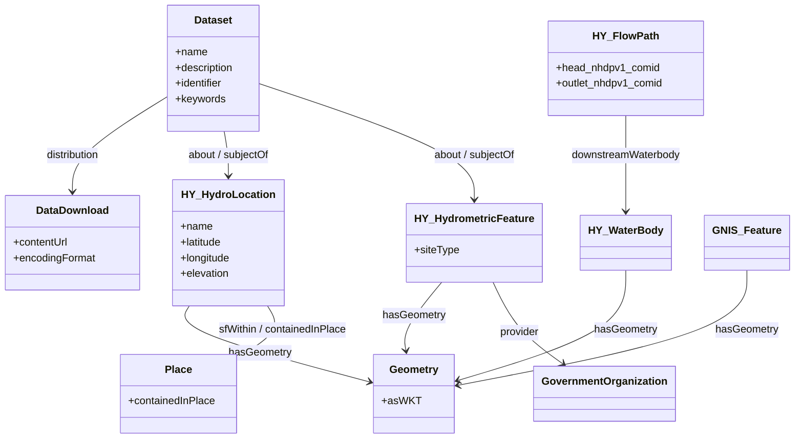

# Geoconnex Knowledge Graph Exploration

## Chat Transcript

👤 **User**  
@geoconnex

---

🧠 **Assistant**  
I'll help you explore the geoconnex knowledge graph. Let me fetch its schema and probe the live endpoint for the classes and predicates actually in use.

**Geoconnex** is a geospatial reference and cataloging system for U.S. water data. It mints persistent, linked-data identifiers for hydrologic features — monitoring locations, water bodies, and flow paths — and catalogs the datasets published about them, with geometries and connectivity to the National Hydrography Dataset (NHD) river network. It is built primarily on **schema.org**, the **OGC HY_Features (hyf)** hydrologic feature model, **GeoSPARQL / Simple Features** geometries, and **GNIS** place identifiers.

The graph is dominated by a dataset catalog layered over hydrologic features:
- **~25 million `schema:Dataset`** records and **~23 million `schema:DataDownload`** distributions — the catalog of water data available about each feature
- **~2.4 million `hyf:HY_HydroLocation`** and **~2.4 million `hyf:HY_HydrometricFeature`** — hydrologic locations and monitoring features
- **`hyf:HY_WaterBody`** and **`hyf:HY_FlowPath`** — lakes/rivers and the flow paths connecting them
- **~2.7 million `sf:Point`** geometries plus `sf:MultiPolygon`, `sf:LineString`, `sf:Polygon`, and `geosparql:Geometry`
- **`gnis:Feature`**, `gnis:County`, `gnis:State` — GNIS-identified named places
- **`schema:Place`**, `schema:AdministrativeArea`, `schema:State`, `schema:GovernmentOrganization`, `schema:Organization`

Monitoring features are further categorized by **USGS site-type** classes (e.g. `…/site-types/items/GW` groundwater, `ST` stream, `SP` spring, `LK` lake, and many `FA-*`, `LA-*`, `SB-*` facility/land/subsurface categories).

**Main relationships:**
- `geo:hasGeometry` / `geo:asWKT` — attach geometry (WKT) to a feature
- `geo:sfWithin`, `schema:containedInPlace`, `schema:geoWithin` — spatial containment (feature → place / administrative area)
- `schema:distribution` → `schema:DataDownload`, with `schema:contentUrl`, `schema:encodingFormat` — the downloadable data for a dataset
- `schema:about` / `schema:subjectOf` — link a dataset to the hydrologic feature it describes
- `head_nhdpv1_comid` / `outlet_nhdpv1_comid` (and `head_rf1id` / `outlet_rf1id`) — connectivity of flow paths to NHDPlus v1 / RF1 river-network reaches
- `schema:name`, `schema:identifier`, `schema:description`, `schema:latitude`, `schema:longitude`, `schema:elevation` — feature descriptors

Would you like me to:
1. Visualize the schema structure?
2. Find monitoring locations of a given USGS site-type in a state?
3. Trace flow paths and connected water bodies along the river network?

---

👤 **User**  
Visualize the schema

---

🧠 **Assistant**  
Here's the live schema of the geoconnex knowledge graph — a dataset catalog over HY_Features hydrologic features with geometries, places, and NHD connectivity:

```mermaid
classDiagram
    class Dataset {
        +name
        +description
        +identifier
        +keywords
    }
    class DataDownload {
        +contentUrl
        +encodingFormat
    }
    class HY_HydroLocation {
        +name
        +latitude
        +longitude
        +elevation
    }
    class HY_HydrometricFeature {
        +siteType
    }
    class HY_WaterBody
    class HY_FlowPath {
        +head_nhdpv1_comid
        +outlet_nhdpv1_comid
    }
    class Geometry {
        +asWKT
    }
    class Place {
        +containedInPlace
    }
    class GNIS_Feature
    class GovernmentOrganization

    Dataset --> DataDownload : distribution
    Dataset --> HY_HydroLocation : about / subjectOf
    Dataset --> HY_HydrometricFeature : about / subjectOf
    HY_HydroLocation --> Geometry : hasGeometry
    HY_HydrometricFeature --> Geometry : hasGeometry
    HY_WaterBody --> Geometry : hasGeometry
    HY_FlowPath --> HY_WaterBody : downstreamWaterbody
    HY_HydroLocation --> Place : sfWithin / containedInPlace
    GNIS_Feature --> Geometry : hasGeometry
    HY_HydrometricFeature --> GovernmentOrganization : provider
```

**Key insights from the schema:**

1. **A catalog, not just features.** The bulk of the graph is `schema:Dataset` + `schema:DataDownload` — geoconnex indexes *what data exists* about each hydrologic feature and where to download it, making it an entry point to distributed water-data services.

2. **HY_Features backbone.** Real-world hydrology is modeled with OGC HY_Features: `HY_HydroLocation` and `HY_HydrometricFeature` (monitoring points), `HY_WaterBody` (lakes/rivers), and `HY_FlowPath` (river reaches). Flow paths carry NHDPlus/RF1 `comid`/`rf1id` head and outlet references, so features can be traced along the national river network.

3. **Geometry and place everywhere.** Features attach WKT geometry via `geo:hasGeometry`/`geo:asWKT` (Points, LineStrings, Polygons) and are located within places (`schema:Place`, `AdministrativeArea`, `State`, and GNIS counties/states) through `geo:sfWithin` / `schema:containedInPlace`.

4. **USGS site-type categorization.** Monitoring features are typed by USGS site-type codes (groundwater `GW`, stream `ST`, spring `SP`, lake `LK`, and many facility/land-subsurface categories), supporting filtering of monitoring locations by kind.

5. **Federation key.** Persistent geoconnex identifiers, NHD `comid`s, and GNIS ids make this graph a spatial join hub — linking water-quality, hydrology, and administrative datasets to a common set of hydrologic feature and place identifiers.

---

👤 **User**  
Create transcript

---

*Created by [mcp-proto-okn](https://github.com/sbl-sdsc/mcp-proto-okn) 0.6.0 using claude-opus-4-8 on 2026-07-12*
