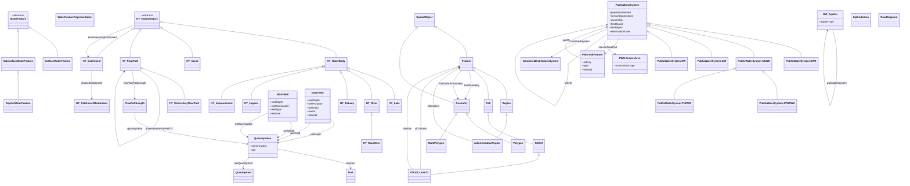

# Chat Transcript
Exploring the SAWGraph Hydrology Knowledge Graph

👤 **User**  
@hydrologykg

---

🧠 **Assistant**  
I'll help you explore the hydrologykg knowledge graph. Let me first get information about what this knowledge graph contains.

The **SAWGraph Hydrology KG** is now accessible. This knowledge graph integrates surface and groundwater data to help trace pollutant pathways and understand water connectivity. Here's what you can explore:

## Key Features:

**Surface Water:**
- Rivers, streams, lakes, and catchments from NHDPlus
- Flow paths and hydrological connectivity (upstream/downstream relationships)
- Water bodies like canals, estuaries, lagoons, and impoundments

**Groundwater:**
- Wells from Maine and Illinois geological surveys
- Aquifers and aquifer systems
- Well depths, purposes, yields, and types

**Public Water Systems:**
- Community and non-community water systems
- Water sources (groundwater vs. surface water)
- Service connections and population served

**Spatial Integration:**
- S2 cells (Level 13) for precise location
- Administrative regions (counties, states)
- ZIP code areas
- Topological relationships (contains, touches, crosses, overlaps)

## What would you like to explore?

Some example queries you could ask:
- Find wells in a specific county or state
- Trace upstream or downstream flow paths from a location
- Find public water systems and their sources
- Identify aquifers and connected wells
- Explore water features in specific catchments

What interests you?

---

👤 **User**  
Visualize the schema

---

🧠 **Assistant**  
I'll create a visual diagram of the SAWGraph Hydrology KG schema using Mermaid.

Here's the SAWGraph Hydrology KG schema visualization:

The diagram shows the main components of the SAWGraph Hydrology KG organized into five major categories:

1. **Water Features** - Abstract hierarchy for surface and subsurface water
2. **Surface Water** - Rivers, lakes, flow paths, and catchments with upstream/downstream connectivity
3. **Groundwater** - Aquifers and wells from Maine (MGS) and Illinois (ISGS) surveys
4. **Public Water Systems** - Community and non-community systems with their sources and service areas
5. **Spatial Integration** - S2 cells and administrative regions for geospatial queries

Key relationships enable tracing water flow and contamination pathways throughout the hydrological network.

---

*Created by [mcp-proto-okn](https://github.com/sbl-sdsc/mcp-proto-okn) 0.4.0 for hydrologykg on 2025-12-24*

claude-sonnet-4-20250514
