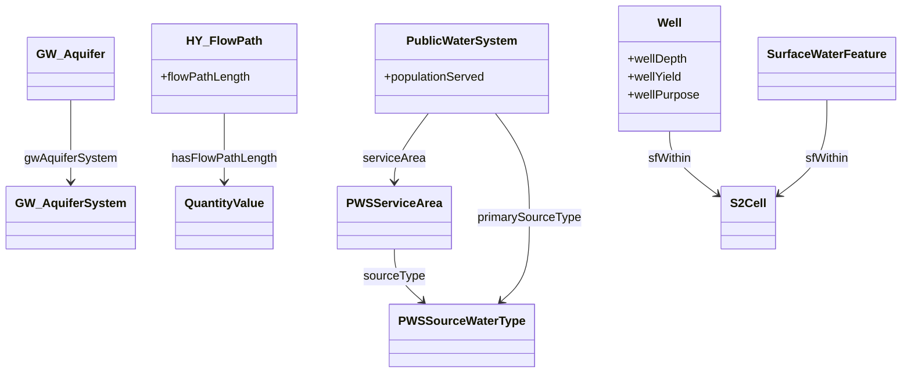

# SAWGraph Hydrology Knowledge Graph Exploration

## Chat Transcript

👤 **User**  
@hydrologykg

---

🧠 **Assistant**  
I'll help you explore the hydrologykg knowledge graph. Let me fetch its schema and probe the live endpoint for the classes and predicates in use.

**HydrologyKG** is the SAWGraph representation of surface- and subsurface-water features and drinking-water infrastructure. It combines **public water systems** (from SDWIS), **wells** and **aquifers** (e.g. Maine Geological Survey), OGC **HY_Features** hydrography, and a dense **S2-cell** spatial index, with measurements expressed in **QUDT** quantities. It reuses GroundWaterML2 (`gwml2`), a hydro-feature ontology (`hyfo`), NHDPlus v2, STKO spatial classes, and GeoSPARQL.

Live class counts (largest first):
- **~7.4 million `S2Cell` / `Region`** (STKO Level-13 discrete global grid) — the spatial index features attach to
- **~8.5 million `geo:Feature`** / **~9.1M `geo:SpatialObject`** — geospatial features and geometries
- **~434 K `HY_FlowPath` / `HY_CatchmentRealization`** with **`nhdplusv2:FlowPathLength`** and **`qudt:QuantityValue`** measures
- **Public Water Systems**: `Community Water System`, `Non-Community` / `Non-Transient Non-Community Water System`, `PWS Groundwater` / `PWS Surface Water`, with `PWS Service Area` and `PWS Source Water Type`
- **Wells & aquifers**: `Maine Geological Survey Well` (depth/yield/purpose/type/use), `gwml2:GW_Aquifer`, `gwml2:GW_AquiferSystem`, `hyfo` surface/subsurface/aquifer water features

**Main relationships:**
- `serviceArea` / `serviceAreaType` — a Public Water System's service area and its type
- `primarySourceType` — the PWS's source water (ground vs surface); `populationServed`
- `gwAquiferSystem` — links a `GW_Aquifer` to its `GW_AquiferSystem`
- `hasFlowPathLength` / `hasQuantityKind` / `quantityValue` — QUDT-typed measurements on flow paths and features
- `geo:hasGeometry` / `geo:defaultGeometry` — geometry, with features indexed to S2 cells

Would you like me to:
1. Visualize the schema structure?
2. Find public water systems by source type in a region?
3. Trace flow paths and connected catchments?

---

👤 **User**  
Visualize the schema

---

🧠 **Assistant**  
Here's the live schema of HydrologyKG — public water systems, wells, aquifers, and hydrography over an S2 spatial grid:

```mermaid
classDiagram
    class PublicWaterSystem {
        +populationServed
    }
    class PWSServiceArea
    class PWSSourceWaterType
    class Well {
        +wellDepth
        +wellYield
        +wellPurpose
    }
    class GW_Aquifer
    class GW_AquiferSystem
    class SurfaceWaterFeature
    class HY_FlowPath {
        +flowPathLength
    }
    class QuantityValue
    class S2Cell

    PublicWaterSystem --> PWSServiceArea : serviceArea
    PWSServiceArea --> PWSSourceWaterType : sourceType
    PublicWaterSystem --> PWSSourceWaterType : primarySourceType
    GW_Aquifer --> GW_AquiferSystem : gwAquiferSystem
    HY_FlowPath --> QuantityValue : hasFlowPathLength
    Well --> S2Cell : sfWithin
    SurfaceWaterFeature --> S2Cell : sfWithin
```

**Key insights from the schema:**

1. **Drinking-water infrastructure.** Public Water Systems (community, non-community, non-transient) are described with their service areas, source-water type (ground vs surface), and population served — supporting source-to-tap and exposure analyses.

2. **Wells and aquifers.** Well records (depth, yield, purpose, type, use) and GroundWaterML2 aquifers/aquifer systems capture subsurface water, linked through `gwAquiferSystem`.

3. **Hydrography + measurements.** HY_Features flow paths and catchment realizations carry NHDPlus lengths and other QUDT-typed quantities, so hydrologic networks can be traversed and measured.

4. **S2 spatial backbone.** A ~7.4-million-cell STKO S2 grid (Level 13) indexes every feature, making this graph a spatial join hub with the other SAWGraph water/contaminant/facility graphs.

---

👤 **User**  
Create transcript

---

*Created by [mcp-proto-okn](https://github.com/sbl-sdsc/mcp-proto-okn) 0.6.0 using claude-opus-4-8 on 2026-07-12*
