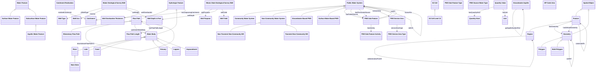

# Chat Transcript: Exploring the SAWGraph Hydrology Knowledge Graph

👤 **User**  
hydrologykg

---

🧠 **Assistant**  
I'll help you explore the hydrology knowledge graph. Let me first get some information about it.

*[Retrieved knowledge graph description and schema]*

# SAWGraph Hydrology Knowledge Graph

I've connected to the **SAWGraph Hydrology KG**, which is part of the Safe Agricultural Products and Water Graph project. This knowledge graph helps environmental regulators, water safety officials, and PFAS researchers trace pollutant pathways and analyze water quality.

## What's in the Knowledge Graph?

The graph contains **58 classes** and **85 predicates** covering:

### Water Features
- **Surface water**: streams, rivers, lakes, waterbodies, estuaries, impoundments
- **Groundwater**: aquifers, wells (from Maine and Illinois geological surveys)
- **Public water systems**: community water systems, service areas, water sources

### Hydrological Connectivity
- Upstream/downstream flow paths
- Catchments and watersheds
- Transitive closure relationships for tracing water flow

### Spatial Integration
- S2 cells (Level 13) for precise geolocation
- Administrative regions (counties, states)
- ZIP code areas
- Topological relations (contains, crosses, overlaps, touches)

### Data Sources
- USGS National Hydrography Dataset (NHDPlus)
- Maine Geological Survey wells
- Illinois State Geological Survey wells
- EPA Safe Drinking Water Information System (SDWIS)

## What Can You Do?

You can query this graph to:
- Trace pollutant pathways upstream or downstream
- Find wells connected to contaminated sites
- Identify water systems serving specific areas
- Analyze hydrological connectivity
- Explore water quality monitoring locations

**What would you like to explore?** For example, I could help you find wells in a specific area, trace downstream connections from a location, or analyze public water system data.

---

👤 **User**  
Visualize the schema

---

🧠 **Assistant**  
I'll create a visual representation of the SAWGraph Hydrology KG schema using a Mermaid diagram.

*[Generated and cleaned Mermaid class diagram]*

This diagram shows the SAWGraph Hydrology KG schema organized into five main sections:

1. **Water Feature Hierarchy** - The core classification of water features (surface vs. subsurface)

2. **HY Features Ontology** - Hydrological features including flow paths, water bodies (rivers, lakes, canals, etc.), and catchments with their connectivity relationships (upstream/downstream)

3. **Groundwater Features** - Aquifers and wells from Maine and Illinois surveys with their properties (depth, type, use, yield)

4. **Public Water Systems** - Community and non-community water systems with their components, sources, and service areas, including water trading relationships (buys/sells)

5. **Spatial Features** - Geographic representations using S2 cells, administrative regions, and GeoSPARQL geometries with spatial relationship predicates

The diagram emphasizes the hydrological connectivity (upstream/downstream relationships) and spatial integration that make this knowledge graph useful for tracing contaminant pathways and analyzing water quality.

---

👤 **User**  
Create transcript

---

🧠 **Assistant**  
*[Created this transcript document]*

---

## Knowledge Graph Information

**Name:** SAWGraph Hydrology KG  
**SPARQL Endpoint:** https://frink.apps.renci.org/hydrologykg/sparql  
**Project Homepage:** https://sawgraph.github.io/  
**Funding:** NSF Award #2333782  
**Statistics:** https://frink.renci.org/kg-stats/hydrology-kg

**Principal Investigators:**
- David Kedrowski (david.kedrowski@maine.edu)
- Torsten Hahmann (torsten.hahmann@maine.edu)

**Description:** The SAWGraph Hydrology KG is part of the Safe Agricultural Products and Water Graph (SAWGraph) that facilities environmental regulators, water safety officials, and PFAS researchers to trace pollutant pathways, identify upstream contamination sources, assess downstream impacts from point sources, and determine which water wells are hydrologically connected to contaminated sites.

**Data Integration:**
- Surface water features from USGS National Hydrography Dataset (NHDPlus)
- Groundwater features from state geological surveys (Maine, Illinois)
- Public water system data from EPA SDWIS
- Spatial integration via S2 cells (Level 13) and administrative regions
- Reuse of geoconnex URIs for linking to additional details

---

*Created by [mcp-proto-okn](https://github.com/sbl-sdsc/mcp-proto-okn) 0.4.0 using claude-sonnet-4-20250514 on 2025-12-22*
