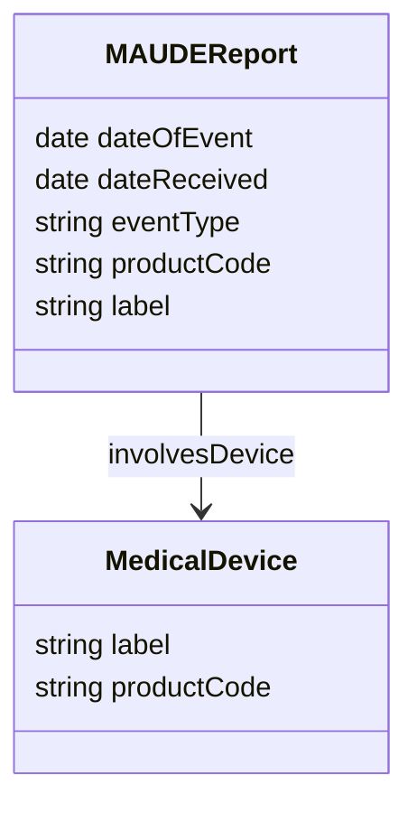

# FDA MAUDE Adverse Event Knowledge Graph — Chat Transcript

👤 **User**
Give a high-level overview of this knowledge graph

---

🧠 **Assistant**
Here's a high-level overview of **medical-device-kg** — the FDA MAUDE Adverse Event Knowledge Graph:

---

**What it is:** A structured RDF knowledge graph built from the U.S. FDA's Manufacturer and User Facility Device Experience (MAUDE) database — the postmarket surveillance system that collects adverse event reports for medical devices.

**Data source & scale:** Data is pulled from the openFDA API using standardized FDA product codes, then converted to RDF/Turtle. The graph is relatively compact: ~95,938 triples and ~5 MB — focused and specific rather than sprawling.

**Core entities:** The schema centers on two domain classes — **MAUDE Report** (the adverse event report itself) and **Medical Device** (the device involved). Key properties capture: date of event, date received by FDA, event type (injury, malfunction, or death), the involved device, device label, and FDA product code.

**What it enables:** Structured SPARQL querying of device safety signals over time — e.g., which event types (injury vs. malfunction vs. death) cluster around specific product codes. It's designed to support downstream statistical analysis of medical device safety patterns.

**Important caveat baked into the design:** MAUDE is a *passive surveillance* system — reports are submitted by manufacturers, importers, user facilities, clinicians, patients, and consumers. The graph preserves the data as-is, so query results reflect reporting patterns, not ground-truth incidence rates.

**Domains:** `adverse_events`, `medical_devices`  
**Contact/source:** Prabhjot Singh (Hofstra University) — [GitHub](https://github.com/Prabhadeus/Proto-OKN)

---

👤 **User**
Visualize the schema using the visualize_schema tool

---

🧠 **Assistant**
Here's the rendered schema:

The schema is intentionally minimal — just two classes connected by a single relationship:

- **MAUDEReport** — the core entity, capturing when the event occurred (`dateOfEvent`), when FDA received the report (`dateReceived`), the nature of the event (`eventType`: injury/malfunction/death), a product code, and a label.
- **MedicalDevice** — the device implicated in the report, identified by its label and FDA product code.
- **involvesDevice** — the single edge linking a report to its associated device.

No edge properties are present, keeping the graph lean and focused purely on the report→device relationship.

---

*Created by [mcp-proto-okn](https://github.com/sbl-sdsc/mcp-proto-okn) 0.6.0 on 2026-05-22*

*Model: claude-sonnet-4-6*
