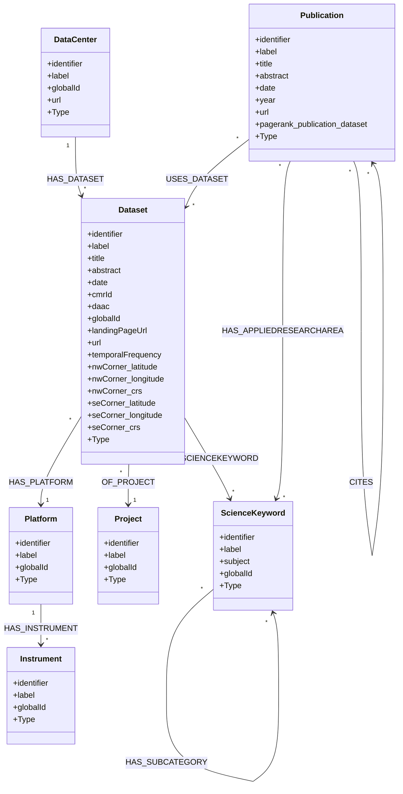

# NASA GES DISC Knowledge Graph Exploration

👤 **User**  
@nasa-gesdisc-kg

---

🧠 **Assistant**  
I'll help you explore the NASA GES DISC Knowledge Graph. Let me start by getting information about this knowledge graph and its schema.

Great! I've accessed the **NASA GES DISC Knowledge Graph**. This is a comprehensive graph-based dataset that connects information about NASA's Earth observation data ecosystem.

## Overview

The NASA GES DISC Knowledge Graph integrates information about:
- **Satellite datasets** managed by NASA's Distributed Active Archive Centers (DAACs) and 184 data providers worldwide
- **Scientific publications** that cite or use these datasets
- **Instruments and platforms** (satellites/spacecraft) used for data collection
- **Projects and missions** associated with data collection
- **Science keywords** categorizing datasets by research domain

## Key Components

The knowledge graph contains **7 main classes**:

1. **Dataset** - Satellite datasets and data collections
2. **Publication** - Scientific papers citing/using datasets
3. **DataCenter** - NASA DAACs and other data providers
4. **Instrument** - Scientific sensors on satellites
5. **Platform** - Satellites and spacecraft
6. **Project** - Scientific missions and research projects
7. **ScienceKeyword** - Terms categorizing datasets by research domain

## What You Can Explore

Would you like me to help you:
- Find specific datasets by topic or science keyword?
- Explore which publications use certain datasets?
- Discover instruments and platforms for specific missions?
- Analyze relationships between data centers, projects, and datasets?
- Search for datasets by geographic coverage or temporal frequency?

Let me know what interests you, and I can query the knowledge graph for you!

---

👤 **User**  
Visualize the schema

---

🧠 **Assistant**  

This diagram shows the complete structure of the NASA GES DISC Knowledge Graph:

**Key Relationships:**
- **DataCenter → Dataset**: Data centers manage and distribute datasets
- **Dataset → Platform → Instrument**: Datasets are collected by platforms (satellites) carrying instruments
- **Dataset → Project**: Datasets belong to scientific missions/projects
- **Dataset ↔ ScienceKeyword**: Datasets are categorized by science keywords
- **Publication → Dataset**: Publications reference and use datasets
- **Publication ↔ ScienceKeyword**: Publications are tagged with research areas
- **Publication → Publication**: Publications cite other publications
- **ScienceKeyword → ScienceKeyword**: Keywords have hierarchical subcategories

The schema enables powerful queries to trace connections between scientific research, the data it uses, and the instruments/missions that collect that data!

---

👤 **User**  
Create transcript

---

*Created by [mcp-proto-okn](https://github.com/sbl-sdsc/mcp-proto-okn) 0.4.0 using claude-sonnet-4-20250514 on 2025-12-22*
