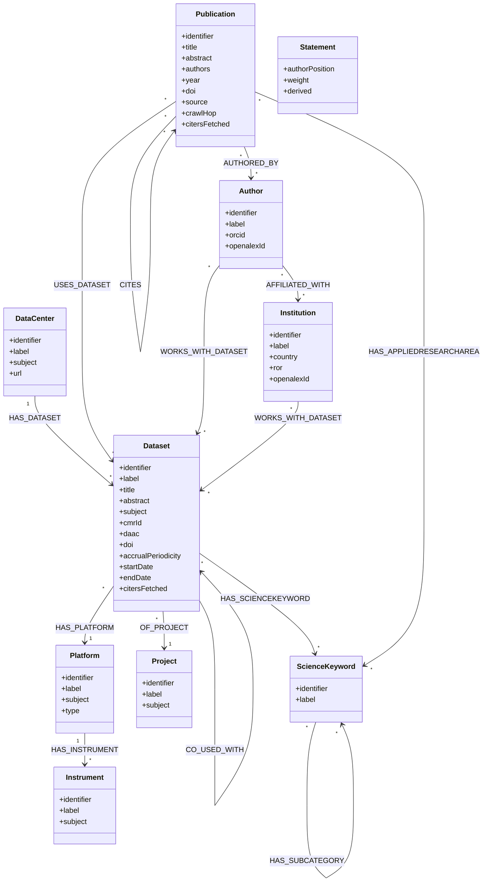

# NASA GES DISC Knowledge Graph Exploration

👤 **User**  
@nasa-gesdisc-kg

---

🧠 **Assistant**  
I'll help you explore the NASA GES DISC Knowledge Graph. Let me start by getting information about this knowledge graph and its schema.

Great! I've accessed the **NASA GES DISC Knowledge Graph**. This is a graph-based dataset that connects information about NASA's Earth observation data ecosystem together with the scientific literature and researchers that use it.

## Overview

The NASA GES DISC Knowledge Graph integrates information about:
- **Satellite datasets** managed by NASA's Distributed Active Archive Centers (DAACs) and other data providers worldwide
- **Instruments and platforms** (satellites/spacecraft) used for data collection
- **Projects and missions** associated with data collection
- **Science keywords** (GCMD-style) categorizing datasets by research domain
- **Scientific publications** that cite or use these datasets
- **Authors and institutions** behind those publications, cross-referenced to ORCID, ROR, and OpenAlex

## Key Components

The knowledge graph contains **10 classes**:

1. **Dataset** - Satellite datasets and data collections
2. **Publication** - Scientific papers citing/using datasets
3. **DataCenter** - NASA DAACs and other data providers
4. **Instrument** - Scientific sensors carried on platforms
5. **Platform** - Satellites and spacecraft
6. **Project** - Scientific missions and research projects
7. **ScienceKeyword** - Terms categorizing datasets by research domain
8. **Author** - Publication authors, identified by ORCID/OpenAlex
9. **Institution** - Research organizations, identified by ROR/OpenAlex
10. **Statement** - Reified RDF statements that attach edge attributes (author position, co-usage weight, derived flag) to relationships

## What You Can Explore

Would you like me to help you:
- Find specific datasets by topic or science keyword?
- Explore which publications use certain datasets, and who authored them?
- Discover instruments and platforms for specific missions?
- Analyze relationships between data centers, projects, and datasets?
- Trace citation networks or find datasets that are frequently used together?
- Follow authors and their institutional affiliations?

Let me know what interests you, and I can query the knowledge graph for you!

---

👤 **User**  
Visualize the schema

---

🧠 **Assistant**  

```mermaid
classDiagram
    class Dataset {
        +identifier
        +label
        +title
        +abstract
        +subject
        +cmrId
        +daac
        +doi
        +accrualPeriodicity
        +startDate
        +endDate
        +citersFetched
    }

    class Publication {
        +identifier
        +title
        +abstract
        +authors
        +year
        +doi
        +source
        +crawlHop
        +citersFetched
    }

    class DataCenter {
        +identifier
        +label
        +subject
        +url
    }

    class Instrument {
        +identifier
        +label
        +subject
    }

    class Platform {
        +identifier
        +label
        +subject
        +type
    }

    class Project {
        +identifier
        +label
        +subject
    }

    class ScienceKeyword {
        +identifier
        +label
    }

    class Author {
        +identifier
        +label
        +orcid
        +openalexId
    }

    class Institution {
        +identifier
        +label
        +country
        +ror
        +openalexId
    }

    class Statement {
        +authorPosition
        +weight
        +derived
    }

    DataCenter "1" --> "*" Dataset : HAS_DATASET
    Dataset "*" --> "1" Platform : HAS_PLATFORM
    Platform "1" --> "*" Instrument : HAS_INSTRUMENT
    Dataset "*" --> "1" Project : OF_PROJECT
    Dataset "*" --> "*" ScienceKeyword : HAS_SCIENCEKEYWORD
    Dataset "*" --> "*" Dataset : CO_USED_WITH
    Publication "*" --> "*" Dataset : USES_DATASET
    Publication "*" --> "*" ScienceKeyword : HAS_APPLIEDRESEARCHAREA
    Publication "*" --> "*" Publication : CITES
    Publication "*" --> "*" Author : AUTHORED_BY
    Author "*" --> "*" Institution : AFFILIATED_WITH
    Author "*" --> "*" Dataset : WORKS_WITH_DATASET
    Institution "*" --> "*" Dataset : WORKS_WITH_DATASET
    ScienceKeyword "*" --> "*" ScienceKeyword : HAS_SUBCATEGORY
```

This diagram shows the structure of the NASA GES DISC Knowledge Graph:

**Data and observation layer:**
- **DataCenter → Dataset**: Data centers (NASA DAACs) manage and distribute datasets
- **Dataset → Platform → Instrument**: Datasets are collected by platforms (satellites) carrying instruments
- **Dataset → Project**: Datasets belong to scientific missions/projects
- **Dataset ↔ ScienceKeyword**: Datasets are categorized by science keywords
- **ScienceKeyword → ScienceKeyword**: Keywords have hierarchical subcategories

**Literature and researcher layer:**
- **Publication → Dataset**: Publications reference and use datasets
- **Publication ↔ ScienceKeyword**: Publications are tagged with applied research areas
- **Publication → Publication**: Publications cite other publications
- **Publication → Author → Institution**: Publications are written by authors affiliated with institutions
- **Author/Institution → Dataset**: Researchers and organizations work with datasets
- **Dataset ↔ Dataset**: Datasets that are co-used in the same research

**Edge attributes (reification):** `AUTHORED_BY`, `CO_USED_WITH`, and `WORKS_WITH_DATASET` relationships are reified as `Statement` nodes so they can carry attributes — author position, co-usage weight, and a derived flag.

The schema enables powerful queries that trace connections between scientific research, the researchers who produce it, the data they use, and the instruments and missions that collect that data!

---

👤 **User**  
Create transcript

---

*Created by [mcp-proto-okn](https://github.com/sbl-sdsc/mcp-proto-okn) using claude-opus-4-8 on 2026-07-12*
