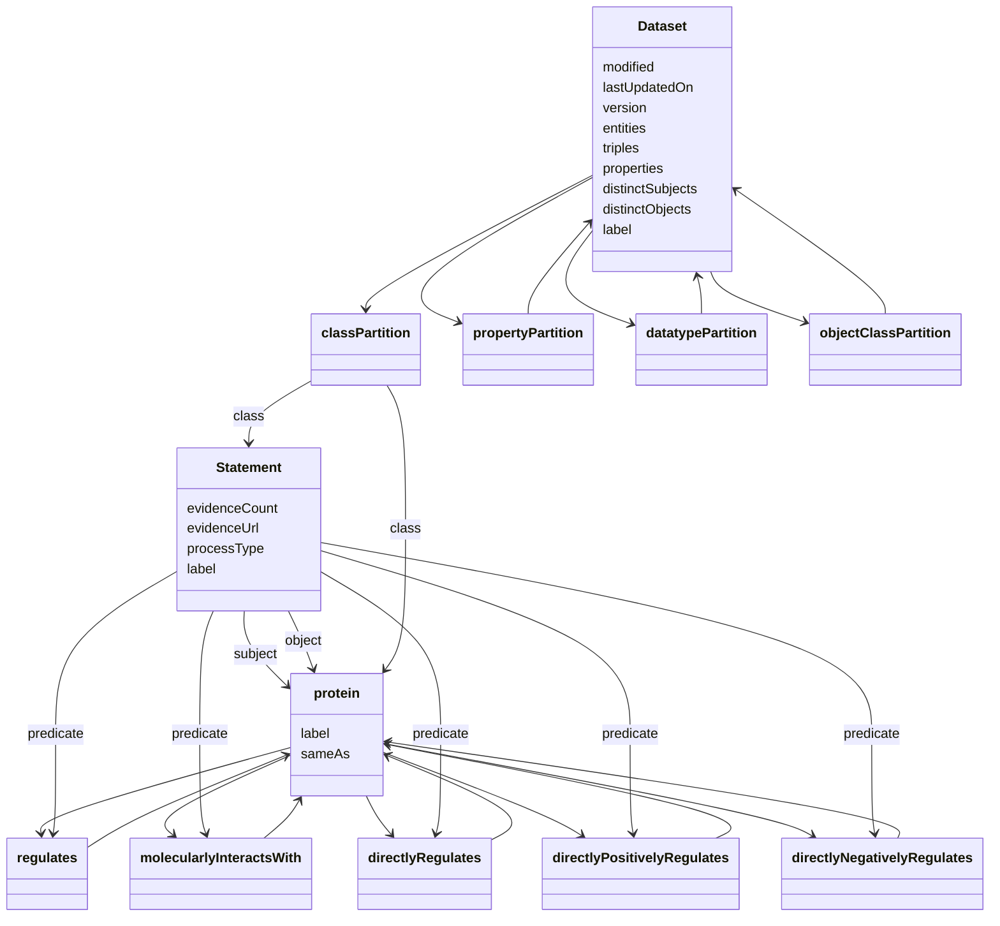

# Chat Transcript
## Exploring the NCI-PID 2.0 Knowledge Graph (ncipidkg)

👤 **User**

Give an overview of the @ncipidkg

---

🧠 **Assistant**

# NCI-PID 2.0 Knowledge Graph (ncipidkg) — Overview

**ncipidkg** is an RDF semantic knowledge graph derived from the **National Cancer Institute's Pathway Interaction Database (NCI-PID), version 2.0**. It converts 196 curated pathway networks — originally distributed in Cytoscape CX2 format on NDEx — into queryable linked data, enriched with evidence metadata from the **INDRA** (Integrated Network and Dynamical Reasoning Assembler) system.

It's primarily focused on **human molecular signaling and regulation**, with strong relevance to **cancer biology**.

## What it captures

- **Protein interactions** — binding, activation, inhibition, and post-translational modifications between proteins (identified by UniProt accessions).
- **Regulatory relationships** — `regulates`, `directly regulates`, `directly positively regulates`, `directly negatively regulates`, `molecularly interacts with`.
- **Evidence provenance** — every relationship is reified as an RDF `Statement` carrying evidence counts, evidence URLs, source attribution (INDRA and/or NCI-PID), and PTM/process type annotations.

## Standard ontologies used

| Prefix | Ontology | Role |
|---|---|---|
| RO | Relations Ontology | Relationship predicates |
| GO | Gene Ontology | PTM/biological process types (phosphorylation, ubiquitination, sumoylation, etc.) |
| SIO | Semanticscience Integrated Ontology | Entity typing (protein, complex, gene product) |
| UniProt | UniProt | Protein identifiers |
| CHEBI | Chemical Entities of Biological Interest | Small molecules |

## Core entity model

- **Classes:** `Dataset`, `protein`, `Statement` (reified edges)
- **Edge metadata** is attached to `Statement` nodes via predicates like `evidence count`, `evidence URL`, and `process type` — meaning you can query at either the simple subject–predicate–object level or drill into provenance.

## Typical questions it answers

- What proteins directly regulate EGFR in NCI-PID pathways?
- Which molecular interactions have evidence counts and supporting URLs?
- What pathway relationships are annotated with GO process or PTM types?

## Access

- **SPARQL endpoint:** `https://apps.okn.us/ncipidkg/sparql`
- **TPF endpoint:** `https://apps.okn.us/ldf/ncipidkg`
- **Source networks:** [NDEx pathway set](https://www.ndexbio.org/index.html#/networkset/7bc65b82-2a2f-11ed-ac45-0ac135e8bacf)
- **Maintainer:** Cytoscape and NDEx Team (support@ndexbio.org)
- **Funding:** NSF Proto-OKN, NIH NCI (5U24CA269436), NIH NHGRI Cytoscape (5U24HG012107)

---

👤 **User**

Visualize the schema using the visualize_schema tool

---

🧠 **Assistant**

- **`Statement` ↔ `protein`** — Statements reify protein–protein edges, so `subject` and `object` point at proteins, and `predicate` points at one of the regulation predicates (which are themselves connected to protein).
- **`Dataset` → `protein` / `Statement`** — VoID `classPartition` describes which classes the dataset contains, linked via the `class` predicate.

That makes the predicate intermediaries the bridge: `protein` reaches them via direct edges, `Statement` reaches them via `predicate`, and `Dataset` reaches both `protein` and `Statement` via class partitions.

**How everything connects:**

- **`protein` ↔ predicate nodes ↔ `protein`** — direct biological interactions
- **`Statement` → `protein`** (`subject`, `object`) and **`Statement` → predicate nodes** (`predicate`) — the reification mirrors each direct edge with provenance metadata
- **`Dataset` → `classPartition` → `protein` / `Statement`** — VoID class partitions describe which classes live in the graph, anchoring the metadata layer to the biological one

---

*Created by [mcp-proto-okn](https://github.com/sbl-sdsc/mcp-proto-okn) 0.6.0 on 2026-05-04*

*Model: claude-opus-4-7*
