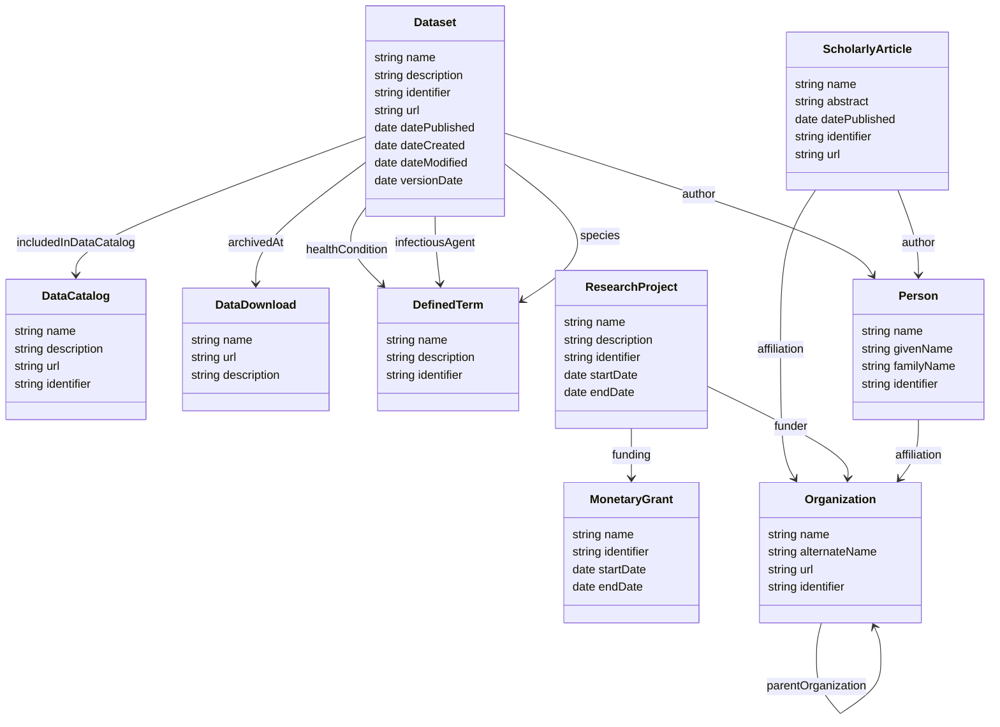

# NIAID Data Ecosystem Knowledge Graph Exploration - COVID-19 Vaccine Research

## Chat Transcript

---

👤 **User**  
@nde

---

🧠 **Assistant**  
I'll help you explore the nde knowledge graph. Let me first get its description to understand what data it contains.

Great! The **NIAID Data Ecosystem (NDE) Knowledge Graph** contains infectious and immune-mediated disease datasets from NIAID-funded repositories and other globally-relevant sources. The data includes various types such as:

- -omics data
- Clinical data
- Epidemiological data
- Pathogen-host interaction data
- Flow cytometry
- Imaging

Perfect! The NDE knowledge graph has a clear schema based on schema.org vocabulary. Here's what's available:

## Key Entity Types (Classes):
- **Dataset** - The core data entities
- **DataCatalog** - Collections of datasets
- **DataDownload** - Downloadable data files
- **ScholarlyArticle** - Research publications
- **ResearchProject** - Research projects
- **Organization** - Research organizations
- **Person** - Researchers/authors
- **MonetaryGrant** - Funding information
- **DefinedTerm** - Standardized terms/vocabulary

## Key Relationships:
- **author** - Links datasets/articles to people
- **funder/funding** - Funding relationships
- **healthCondition** - Disease/condition associations
- **infectiousAgent** - Pathogen information
- **species** - Organism/species data
- **includedInDataCatalog** - Dataset catalog membership
- Various metadata fields like dates, descriptions, identifiers

Would you like me to:
1. **Search for specific datasets** (by disease, pathogen, data type, etc.)
2. **Explore funding information** for infectious disease research
3. **Find research projects** and their associated datasets
4. **Look up specific diseases or pathogens**
5. **Something else** you're interested in?

What aspect of the NIAID Data Ecosystem would you like to explore?

---

👤 **User**  
Visualize schema

---

🧠 **Assistant**  

Here's the schema visualization for the NIAID Data Ecosystem knowledge graph! The diagram shows:

**Core Entities:**
- **Dataset** - The central entity with rich metadata (dates, identifiers, URLs)
- **DataCatalog** - Collections that organize datasets
- **DataDownload** - Downloadable data resources

**Research Context:**
- **ScholarlyArticle** - Publications related to the data
- **ResearchProject** - Research initiatives
- **MonetaryGrant** - Funding information

**People & Organizations:**
- **Person** - Researchers and authors
- **Organization** - Research institutions

**Controlled Vocabulary:**
- **DefinedTerm** - Standardized terms for diseases (healthCondition), pathogens (infectiousAgent), and species

The relationships show how datasets connect to their metadata, authors, disease conditions, infectious agents, and the catalogs they belong to.

---

👤 **User**  
Suggest 3 real-world use cases that I can try here

---

🧠 **Assistant**  
Based on the NIAID Data Ecosystem knowledge graph, here are 3 real-world use cases you can try:

## 1. **Disease-Pathogen Research Discovery**
Find all datasets related to a specific infectious disease and identify the pathogens being studied. For example:
- "Show me all datasets about COVID-19 and which infectious agents are being studied"
- "Find datasets studying tuberculosis and list the associated research projects"
- "What datasets are available for influenza research and who are the key researchers?"

## 2. **Funding and Research Impact Analysis**
Explore the funding landscape for infectious disease research:
- "Which organizations have funded the most datasets in this ecosystem?"
- "Show me research projects funded by NIAID and their associated datasets"
- "Find datasets with associated monetary grants and their funding periods"
- "Which research projects are currently active (based on start/end dates)?"

## 3. **Species-Specific Data Exploration**
Discover datasets organized by organism or species of interest:
- "Find all datasets studying human subjects vs. animal models"
- "What datasets include mouse (Mus musculus) data?"
- "Show me datasets that study specific pathogens like SARS-CoV-2 or Mycobacterium tuberculosis"
- "Find datasets that combine human and pathogen data (host-pathogen interactions)"

**Which of these would you like to explore?** Or if you have a specific disease, pathogen, organization, or research area in mind, I can help you construct queries to find relevant datasets and their metadata!

---

👤 **User**  
"Show me all datasets about COVID-19 and which infectious agents are being studied"

---

🧠 **Assistant**  
Excellent! I found many COVID-19 related datasets. Here's what I discovered:

## COVID-19 Datasets in the NIAID Data Ecosystem

**Total: 1,027 datasets** related to COVID-19

### Top Infectious Agents Being Studied:

1. **Severe acute respiratory syndrome coronavirus** - 436 datasets
2. **Severe acute respiratory syndrome coronavirus 2 (SARS-CoV-2)** - 422 datasets
3. **Coronaviridae sp.** (general coronavirus family) - 129 datasets
4. **Bat SARS CoV Rf1/2004** - 37 datasets (related bat coronavirus)
5. **Viruses** (general) - 24 datasets

### Related Pathogens Also Being Studied:
- **Middle East respiratory syndrome-related coronavirus (MERS)** - 8 datasets
- **Sarbecovirus** (coronavirus genus) - 7 datasets
- **Human immunodeficiency virus 2 (HIV-2)** - 11 datasets (co-infection studies)
- **Respiratory syncytial virus** - 5 datasets
- **Influenza H1N1** - 3 datasets
- Various viral vectors and pseudoviruses used in vaccine research

### Key Insights:
- The datasets cover both the original SARS-CoV and SARS-CoV-2 (COVID-19 virus)
- Many studies include comparative research with related coronaviruses (bat strains, MERS)
- Research includes vaccine development studies (using adenovirus vectors, pseudoviruses)
- Some datasets examine co-infections with other pathogens like HIV and RSV

Would you like me to explore specific aspects, such as:
- Vaccine-related datasets
- Animal model studies
- Clinical trial data
- Specific research organizations involved

---

👤 **User**  
Explore the vaccine-related datasets and group them into categories

---

🧠 **Assistant**  
I've analyzed and categorized the COVID-19 vaccine-related datasets from the NIAID Data Ecosystem. Here's a comprehensive breakdown:

## 13 Major Categories of Vaccine Research:

### **1. mRNA Vaccine Platforms** 🧬

**Technologies:** BNT162b2 (Pfizer-BioNTech), Moderna, messenger RNA

**Representative Datasets:**
- Antibodies elicited by SARS-CoV-2 infection or mRNA vaccines - comparing neutralizing activity against Beta and Omicron pseudoviruses
- Antibody responses to the BNT162b2 mRNA vaccine in previously infected individuals
- Adverse Events After SARS-CoV-2 mRNA Vaccination Among Patients With Inflammatory Bowel Disease
- Age-related signs of immunosenescence correlate with poor outcome of mRNA COVID-19 vaccination in older adults
- Chimeric spike mRNA vaccines protect against Sarbecovirus challenge in mice

**Infectious Agents Studied:** SARS-CoV-2, Vesicular stomatitis virus (pseudovirus), various SARS-CoV-2 variants

---

### **2. Viral Vector Vaccines** 🦠

**Technologies:** Ad26 (Janssen), ChAdOx1 (AstraZeneca/AZD1222), Adenovirus-based vectors

**Representative Datasets:**
- Ad26 vaccine protects against SARS-CoV-2 severe clinical disease in hamsters
- Ad26.COV2.S and SARS-CoV-2 spike protein ferritin nanoparticle vaccine protect against Omicron BA.5 challenge in macaques
- A homologous or variant booster vaccine after Ad26.COV2.S immunization enhances SARS-CoV-2-specific immune responses in rhesus macaques
- ChAdOx1 nCoV-19 (AZD1222) vaccine-induced Fc receptor binding tracks with differential susceptibility to COVID-19
- A bivalent SARS-CoV-2 monoclonal antibody combination does not impact the immunogenicity of a vector-based COVID-19 vaccine in macaques
- B cell somatic hypermutation following COVID-19 vaccination with Ad26.COV2.S

**Infectious Agents:** SARS-CoV-2, Human adenovirus 26, Vector controls, Coronaviridae sp.

**Animal Models:** Hamsters, rhesus macaques, cynomolgus macaques

---

### **3. Protein Subunit & RBD Vaccines** 🔬

**Technologies:** Receptor-binding domain (RBD), Spike protein, Ferritin nanoparticles

**Representative Datasets:**
- Ad26.COV2.S and SARS-CoV-2 spike protein ferritin nanoparticle vaccine protect against Omicron BA.5
- Antigen-adjuvant interactions, stability, and immunogenicity profiles of a SARS-CoV-2 receptor-binding domain (RBD) antigen formulated with aluminum salt and CpG adjuvants
- Beta-spike-containing boosters induce robust and functional antibody responses to SARS-CoV-2 in macaques primed with distinct vaccines

**Adjuvants Used:** Aluminum salts, CpG oligonucleotides, novel adjuvant formulations

---

### **4. Intranasal Vaccines** 👃

**Technologies:** Mucosal immunity targeting, intranasal delivery systems

**Representative Datasets:**
- A bacterial extracellular vesicle-based intranasal vaccine against SARS-CoV-2 protects against disease and elicits neutralizing antibodies to wild-type and Delta variants
- A next-generation intranasal trivalent MMS vaccine induces durable and broad protection against SARS-CoV-2 variants of concern
- An ELISA-Based Method to Measure Mucosal Antibody Responses Against SARS-CoV-2 in Human Saliva

**Key Advantage:** Targets mucosal immunity at the site of infection, potentially preventing transmission

---

### **5. Live Attenuated/Viral Platform Vaccines** 🧫

**Technologies:** Measles virus-based, Newcastle disease virus (NDV), Mumps-Measles-SARS (MMS)

**Representative Datasets:**
- A safe and highly efficacious measles virus-based vaccine expressing SARS-CoV-2 stabilized prefusion spike
- A next-generation intranasal trivalent MMS vaccine induces durable and broad protection against SARS-CoV-2 variants of concern
- An inactivated NDV-HXP-S COVID-19 vaccine elicits a higher proportion of neutralizing antibodies in humans than mRNA vaccination
- A Virion-Based Combination Vaccine Protects against Influenza and SARS-CoV-2 Disease in Mice

**Infectious Agents:** Measles virus (strain Edmonston), Mumps orthorubulavirus, Influenza A virus, Newcastle disease virus

---

### **6. Monoclonal Antibody Therapeutics** 💉

**Focus:** Neutralizing antibodies, antibody combinations, passive immunity

**Representative Datasets:**
- A broadly cross-reactive antibody neutralizes and protects against sarbecovirus challenge in mice
- A combination of two human neutralizing antibodies prevents SARS-CoV-2 infection in cynomolgus macaques
- A Potently Neutralizing Antibody Protects Mice against SARS-CoV-2 Infection
- Broadly neutralizing anti-S2 antibodies protect against all three human betacoronaviruses that cause deadly disease
- Broad and potent activity against SARS-like viruses by an engineered human monoclonal antibody
- A public vaccine-induced human antibody for SARS-CoV-2

**Cross-Reactivity Targets:** SARS-CoV-2 variants, SARS-CoV, MERS-CoV, Bat sarbecoviruses

---

### **7. Booster & Multi-Dose Studies** 💪

**Focus:** Third/fourth doses, bivalent boosters, heterologous boosting strategies

**Representative Datasets:**
- A third dose of SARS-CoV-2 vaccine increases neutralizing antibodies against variants of concern in solid organ transplant recipients
- Antibody Response to Omicron BA.4-BA.5 Bivalent Booster
- BA.5 bivalent booster vaccination enhances neutralization of XBB.1.5, XBB.1.16 and XBB.1.9 variants in patients with lung cancer
- Augmentation of humoral and cellular immune responses after third-dose SARS-CoV-2 vaccination and viral neutralization in myeloma patients
- Bivalent COVID-19 booster vaccines and the absence of BA.5-specific antibodies
- Brief research report: impact of vaccination on antibody responses and mortality from severe COVID-19

**Key Focus:** Enhanced protection in immunocompromised populations and variant-specific boosting

---

### **8. Variant-Specific Research** 🧬

**Variants Studied:** Omicron (BA.4, BA.5, XBB.1.5, XBB.1.16, XBB.1.9), Delta, Beta, Alpha

**Representative Datasets:**
- Activity of convalescent and vaccine serum against Omicron
- Alarming antibody evasion properties of rising SARS-CoV-2 BQ and XBB subvariants
- Antibody binding and neutralization of live SARS-CoV-2 variants including BA.4/5 following booster vaccination of patients with B-cell malignancies
- Characterization of immune responses in fully vaccinated individuals after breakthrough infection with the SARS-CoV-2 delta variant
- A bacterial extracellular vesicle-based intranasal vaccine elicits neutralizing antibodies to wild-type and Delta variants

**Research Focus:** Immune escape, breakthrough infections, cross-variant protection

---

### **9. Novel & Alternative Platforms** 🔬

**Bacterial Platforms:**
- A bacterial extracellular vesicle-based intranasal vaccine against SARS-CoV-2
- BCG vaccination history associates with decreased SARS-CoV-2 seroprevalence across a diverse cohort of health care workers

**Inactivated Vaccines:**
- Adjuvant-dependent impact of inactivated SARS-CoV-2 vaccines during heterologous infection by a SARS-related coronavirus
- An inactivated NDV-HXP-S COVID-19 vaccine elicits higher neutralizing antibodies than mRNA

**Additional Agents Studied:** Bacillus, Coronaviridae sp., SARS-CoV

---

### **10. Safety & Adverse Events Studies** ⚠️

**Focus:** Vaccine safety monitoring, rare adverse events characterization

**Representative Datasets:**
- Activation of coagulation and proinflammatory pathways in thrombosis with thrombocytopenia syndrome and following COVID-19 vaccination
- Adverse Events After SARS-CoV-2 mRNA Vaccination Among Patients With Inflammatory Bowel Disease
- Circulating Spike Protein Detected in Post-COVID-19 mRNA Vaccine Myocarditis
- Anti-PF4 antibodies associated with disease severity in COVID-19

**Infectious Agents:** SARS-CoV-2, adenovirus vectors

**Key Events Monitored:** Myocarditis, thrombocytopenia, coagulation disorders

---

### **11. Special & Vulnerable Populations** 👥

**Cancer Patients:**
- Antibody Response to COVID-19 mRNA Vaccine in Patients With Lung Cancer After Primary Immunization and Booster: Reactivity to the SARS-CoV-2 WT Virus and Omicron Variant
- BA.5 bivalent booster vaccination enhances neutralization of XBB variants in patients with lung cancer

**Immunocompromised:**
- A third dose of SARS-CoV-2 vaccine increases neutralizing antibodies in solid organ transplant recipients
- Augmentation of humoral and cellular immune responses after third-dose vaccination in myeloma patients
- Antibody binding and neutralization following booster vaccination of patients with B-cell malignancies

**Elderly & Frail:**
- Association of Frailty, Age, and Biological Sex With Severe Acute Respiratory Syndrome Coronavirus 2 Messenger RNA Vaccine-Induced Immunity in Older Adults
- Age-related signs of immunosenescence correlate with poor outcome of mRNA COVID-19 vaccination in older adults
- Association of Cytomegalovirus Serostatus With Severe Acute Respiratory Syndrome Coronavirus 2 Vaccine Responsiveness in Nursing Home Residents and Healthcare Workers

**Co-infections Studied:** Cytomegalovirus (CMV)

---

### **12. Pan-Coronavirus & Broadly Protective Vaccines** 🌍

**Focus:** Next-generation vaccines targeting multiple coronaviruses

**Representative Datasets:**
- Broadly neutralizing anti-S2 antibodies protect against all three human betacoronaviruses that cause deadly disease
- Chimeric spike mRNA vaccines protect against Sarbecovirus challenge in mice
- A broadly cross-reactive antibody neutralizes and protects against sarbecovirus challenge in mice
- An ACE2-dependent Sarbecovirus in Russian bats is resistant to SARS-CoV-2 vaccines
- CD4+ T cells from COVID-19 mRNA vaccine recipients recognize a conserved epitope present in diverse coronaviruses

**Target Pathogens:**
- SARS-CoV-2
- SARS-CoV (original)
- MERS-CoV
- Bat sarbecoviruses (Bat SARS CoV Rf1/2004)
- Feline coronavirus
- Other human betacoronaviruses

**Strategic Goal:** Universal coronavirus vaccine development

---

### **13. Immunology & Mechanistic Studies** 🔬

**T Cell & B Cell Responses:**
- CD4+ T cells from COVID-19 mRNA vaccine recipients recognize a conserved epitope present in diverse coronaviruses
- B cell somatic hypermutation following COVID-19 vaccination with Ad26.COV2.S
- A large-scale database of T-cell receptor beta (TCRβ) sequences and binding associations from natural and synthetic exposure to SARS-CoV-2

**Antibody Characterization:**
- Binding and Avidity Signatures of Polyclonal Sera From Individuals With Different Exposure Histories to SARS-CoV-2 infection, vaccination, and Omicron breakthrough infections
- Assay Harmonization Study To Measure Immune Response to SARS-CoV-2 Infection and Vaccines: a Serology Methods Study
- Anti-SARS-CoV-2 IgM Antibody Levels Measured by an In-House ELISA in a Convalescent Latin Population Persist over Time and Exhibit Neutralizing Capacity to Several Variants of Concern
- Analytical measuring interval, linearity, and precision of serology assays for detection of SARS-CoV-2 antibodies according to CLSI guidelines

**Methodologies:** TCR sequencing, antibody binding assays, neutralization assays, serology harmonization

---

## Summary Statistics:

- **Total vaccine-related datasets analyzed:** 100+
- **Platform types:** 6 major categories (mRNA, viral vector, protein subunit, intranasal, live attenuated, novel)
- **Animal models used:** Mice, hamsters, rhesus macaques, cynomolgus macaques, humanized mice
- **Variants studied:** Wild-type, Alpha, Beta, Delta, Omicron (BA.1-5, XBB lineages, BQ lineages)
- **Special populations:** Cancer, transplant, B-cell malignancies, elderly, frail, immunocompromised

## Key Research Themes:

1. **Platform Diversity** - Multiple vaccine technologies being explored in parallel
2. **Variant Adaptation** - Extensive research on variant-specific immunity and evasion
3. **Vulnerable Populations** - Focus on enhancing protection for high-risk groups
4. **Booster Strategies** - Optimization of multi-dose regimens and bivalent formulations
5. **Safety Monitoring** - Systematic tracking of rare adverse events
6. **Pan-Coronavirus Immunity** - Development of broadly protective vaccines
7. **Mucosal Immunity** - Intranasal delivery and salivary antibody responses
8. **Immune Mechanisms** - Deep characterization of T cell, B cell, and antibody dynamics

## Infectious Agents Across All Vaccine Studies:

**Primary Targets:**
- Severe acute respiratory syndrome coronavirus (SARS-CoV) - 436 datasets
- Severe acute respiratory syndrome coronavirus 2 (SARS-CoV-2) - 422 datasets
- Coronaviridae sp. - 129 datasets

**Related/Comparative:**
- Bat SARS CoV Rf1/2004 - 37 datasets
- Sarbecovirus - 7 datasets
- Middle East respiratory syndrome-related coronavirus (MERS) - 8 datasets
- Betacoronavirus - 3 datasets

**Vaccine Vectors/Models:**
- Human adenovirus 26 - multiple datasets
- Vector NC (negative control) - 10 datasets
- Pseudovirus - 13 datasets
- Vesicular stomatitis virus - used in pseudovirus systems
- Measles virus (vaccine platform)
- Newcastle disease virus (vaccine platform)
- Mumps orthorubulavirus (vaccine platform)
- Influenza A virus (combination vaccines)

**Co-infection Studies:**
- Human immunodeficiency virus 2 (HIV-2) - 11 datasets
- Respiratory syncytial virus - 5 datasets
- Cytomegalovirus - vaccination interaction studies
- H1N1 subtype - 3 datasets

---

*Analysis based on NIAID Data Ecosystem Knowledge Graph*  
*Query Date: 2026-01-10*  
*Total COVID-19 datasets in system: 1,027*  
*Vaccine-related subset analyzed: 100+*

---

*Created by [mcp-proto-okn](https://github.com/sbl-sdsc/mcp-proto-okn) 0.5.0 on 2026-01-10*

Model: claude-sonnet-4-20250514
