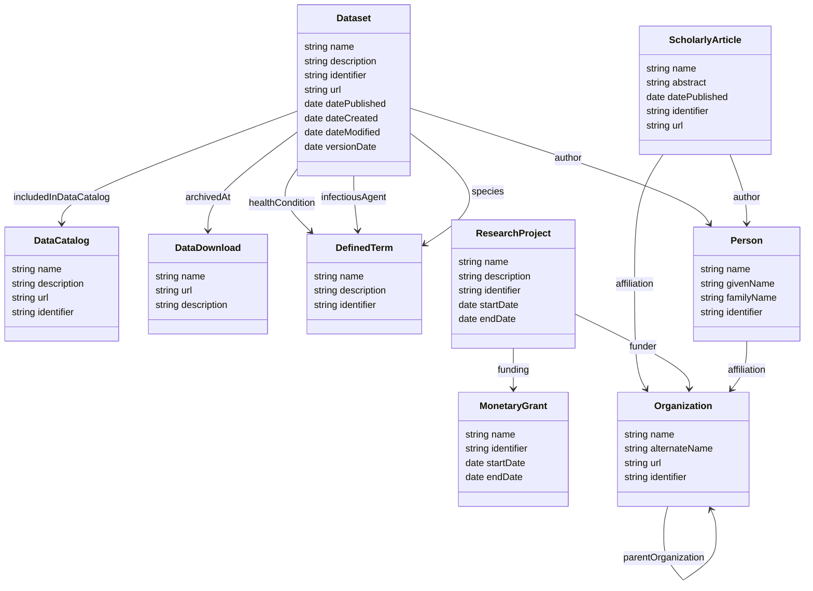

# NIAID Data Ecosystem Knowledge Graph Exploration

👤 **User**  
@nde

---

🧠 **Assistant**  
I'll help you explore the nde knowledge graph. Let me first get its description to understand what data it contains.

Great! The **NIAID Data Ecosystem (NDE) Knowledge Graph** contains infectious and immune-mediated disease datasets from NIAID-funded repositories and other globally-relevant sources. The data includes various types such as:

- -omics data
- Clinical data
- Epidemiological data
- Pathogen-host interaction data
- Flow cytometry
- Imaging

Perfect! The NDE knowledge graph has a clear schema based on schema.org vocabulary. Here's what's available:

## Key Entity Types (Classes):
- **Dataset** - The core data entities
- **DataCatalog** - Collections of datasets
- **DataDownload** - Downloadable data files
- **ScholarlyArticle** - Research publications
- **ResearchProject** - Research projects
- **Organization** - Research organizations
- **Person** - Researchers/authors
- **MonetaryGrant** - Funding information
- **DefinedTerm** - Standardized terms/vocabulary

## Key Relationships:
- **author** - Links datasets/articles to people
- **funder/funding** - Funding relationships
- **healthCondition** - Disease/condition associations
- **infectiousAgent** - Pathogen information
- **species** - Organism/species data
- **includedInDataCatalog** - Dataset catalog membership
- Various metadata fields like dates, descriptions, identifiers

Would you like me to:
1. **Search for specific datasets** (by disease, pathogen, data type, etc.)
2. **Explore funding information** for infectious disease research
3. **Find research projects** and their associated datasets
4. **Look up specific diseases or pathogens**
5. **Something else** you're interested in?

What aspect of the NIAID Data Ecosystem would you like to explore?

---

👤 **User**  
Visualize schema

---

🧠 **Assistant**  

Here's the schema visualization for the NIAID Data Ecosystem knowledge graph! The diagram shows:

**Core Entities:**
- **Dataset** - The central entity with rich metadata (dates, identifiers, URLs)
- **DataCatalog** - Collections that organize datasets
- **DataDownload** - Downloadable data resources

**Research Context:**
- **ScholarlyArticle** - Publications related to the data
- **ResearchProject** - Research initiatives
- **MonetaryGrant** - Funding information

**People & Organizations:**
- **Person** - Researchers and authors
- **Organization** - Research institutions

**Controlled Vocabulary:**
- **DefinedTerm** - Standardized terms for diseases (healthCondition), pathogens (infectiousAgent), and species

The relationships show how datasets connect to their metadata, authors, disease conditions, infectious agents, and the catalogs they belong to.

---

*Created by [mcp-proto-okn](https://github.com/sbl-sdsc/mcp-proto-okn) 0.5.0 on 2026-01-10*

Model: claude-sonnet-4-20250514
