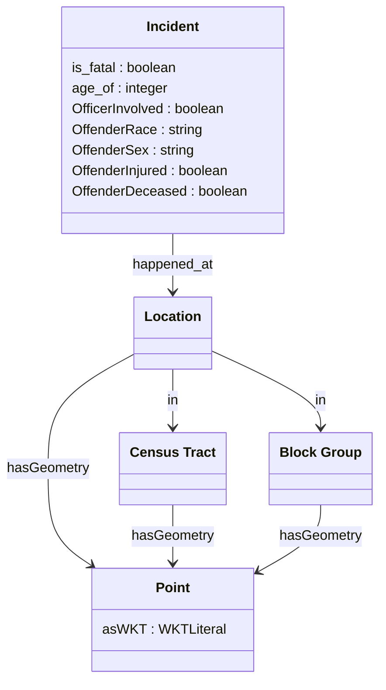

# Chat Transcript
## Exploring the Neighborhood Information Knowledge Graph (NIKG)

---

👤 **User**  
@nikg

---

🧠 **Assistant**  
Hello! I can help you explore the **Neighborhood Information Knowledge Graph (NIKG)** — a knowledge graph warehouse designed for analyzing neighborhood-level data.

NIKG integrates:
- **Incident records** (particularly crime and safety events) with attributes like officer involvement, fatality status, and offender demographics
- **Census tract boundaries**
- **Geospatial location data** from Philadelphia and potentially other urban areas

It's designed for researchers, urban planners, and public health officials analyzing neighborhood-level information.

Would you like me to:
1. **Show you the schema** — see what classes, relationships, and properties are available
2. **Run some queries** — explore specific data like incidents by location, demographics, or time
3. **Visualize the schema** — create a diagram of how the data is organized

What would you like to explore?

---

👤 **User**  
Show the schema

---

🧠 **Assistant**  
Here's the schema for the **Neighborhood Information Knowledge Graph (NIKG)**:

## Classes (6)

| Class | Description |
|-------|-------------|
| **Incident** | An event or occurrence, typically related to public safety or emergency services |
| **Location** | A geographic location or place within the Philadelphia region |
| **Census Tract** | A small geographic subdivision used for presenting statistical data |
| **Block Group** | A census block group, a geographic subdivision used for statistical purposes |
| **Point** | A geometric object representing a single location with x,y coordinates (GeoSPARQL) |
| **Class** | RDF Schema class definition |

## Properties (10)

| Property | Description |
|----------|-------------|
| **happened_at** | Links an incident to the location where it occurred |
| **is_fatal** | Boolean indicating whether an incident resulted in a fatality |
| **age_of** | Age of a person involved in an incident |
| **OfficerInvolved** | Whether a law enforcement officer was involved |
| **OffenderRace** | Race of an offender involved in an incident |
| **OffenderSex** | Sex/gender of an offender involved in an incident |
| **OffenderInjured** | Whether an offender was injured |
| **OffenderDeceased** | Whether an offender was deceased |
| **hasGeometry** | Links a spatial feature to its geometric representation |
| **asWKT** | Serializes geometry as Well-Known Text (WKT) format |

---

The data is centered around **Incidents** that link to **Locations**, which in turn connect to **Census Tracts** and **Block Groups** with precise **Point** geometries.

Would you like me to visualize this as a diagram, or run some queries to explore the data?

---

👤 **User**  
Visualize the schema

---

🧠 **Assistant**  
Here's a visual representation of the NIKG schema:

The diagram shows how:
- **Incidents** are the central entity with detailed attributes about fatality, officer involvement, and offender demographics
- Each incident **happened_at** a **Location**
- Locations are associated with **Census Tracts** and **Block Groups** for statistical analysis
- All geographic entities have **Point** geometries stored in Well-Known Text (WKT) format for GeoSPARQL queries

Would you like me to run some queries to explore the actual data?

---

*Created by [mcp-proto-okn](https://github.com/sbl-sdsc/mcp-proto-okn) 0.4.0 using claude-opus-4-5-20251101 on 2025-12-20*
