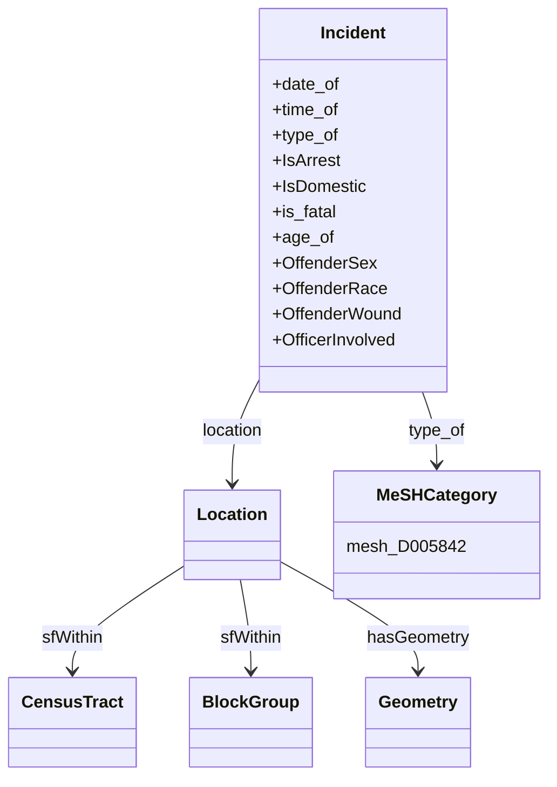

# Neighborhood Information Knowledge Graph (NIKG) Exploration

## Chat Transcript

👤 **User**  
@nikg

---

🧠 **Assistant**  
I'll help you explore the nikg (Neighborhood Information Knowledge Graph) graph. Let me fetch its schema and probe the live endpoint for the classes and predicates in use.

**NIKG** integrates neighborhood-level public-safety data for Philadelphia (sourced from `metadata.phila.gov`). It centers on **incidents** — individual events such as shootings — described by rich attributes and linked to the **locations** where they occurred, which are in turn nested within census geographies. Incident types are categorized with **MeSH** descriptor codes.

Live class counts:
- **~103,669 `Incident`** — individual public-safety events
- **~60,178 `Location`** — geolocated points where incidents occurred
- **~30,089 `mesh_D005842`** and **~1,142 `mesh_D000091368`** — incidents classified by MeSH descriptor (e.g. firearm-related categories)
- **~2,284 `CensusTract`** and **~480 `BlockGroup`** — U.S. Census geographies

**Incident attributes:**
- `date_of`, `time_of` — when the incident occurred (replacing the earlier single `happened_at` timestamp)
- `type_of` — the incident/MeSH category
- `IsArrest`, `IsDomestic`, `is_fatal` — event flags
- `age_of`, `OffenderSex`, `OffenderRace`, `OffenderWound`, `OffenderInjured`, `OffenderDeceased`, `OfficerInvolved` — participant details

**Main relationships:**
- `location` — links an `Incident` to the `Location` where it happened
- `sfWithin` — a `Location` lies within a `CensusTract` / `BlockGroup`
- `hasGeometry` — attaches a geometry to a spatial feature

Would you like me to:
1. Visualize the schema structure?
2. Aggregate incidents by census tract?
3. Break down incidents by type, arrest status, or fatality?

---

👤 **User**  
Visualize the schema

---

🧠 **Assistant**  
Here's the live schema of NIKG — incidents linked to locations nested within census geographies, categorized by MeSH descriptors:

```mermaid
classDiagram
    class Incident {
        +date_of
        +time_of
        +type_of
        +IsArrest
        +IsDomestic
        +is_fatal
        +age_of
        +OffenderSex
        +OffenderRace
        +OffenderWound
        +OfficerInvolved
    }
    class Location
    class CensusTract
    class BlockGroup
    class MeSHCategory {
    mesh_D005842
    }
    class Geometry

    Incident --> Location : location
    Incident --> MeSHCategory : type_of
    Location --> CensusTract : sfWithin
    Location --> BlockGroup : sfWithin
    Location --> Geometry : hasGeometry
```

**Key insights from the schema:**

1. **Incident-centric.** The graph is organized around ~104 K `Incident` records, each carrying event attributes (timing, type, arrest/domestic/fatality flags) and offender/officer details — a compact model for querying public-safety events.

2. **Spatial nesting via simple-features.** Incidents attach to `Location` points, which are related to census `CensusTract` and `BlockGroup` polygons through `sfWithin`, and to geometries through `hasGeometry`. (The previous model's `asWKT` literal and `sf:Point` class are no longer used; geometry is reached via `hasGeometry`.)

3. **MeSH categorization.** Incidents are typed against MeSH descriptor codes (e.g. `mesh_D005842`), enabling semantic grouping of incident/injury categories and joins to biomedical vocabularies.

4. **Split timestamps.** Timing is now expressed as separate `date_of` and `time_of` attributes rather than a single `happened_at` value, giving finer control for temporal filtering.

---

👤 **User**  
Create transcript

---

*Created by [mcp-proto-okn](https://github.com/sbl-sdsc/mcp-proto-okn) 0.6.0 using claude-opus-4-8 on 2026-07-12*
