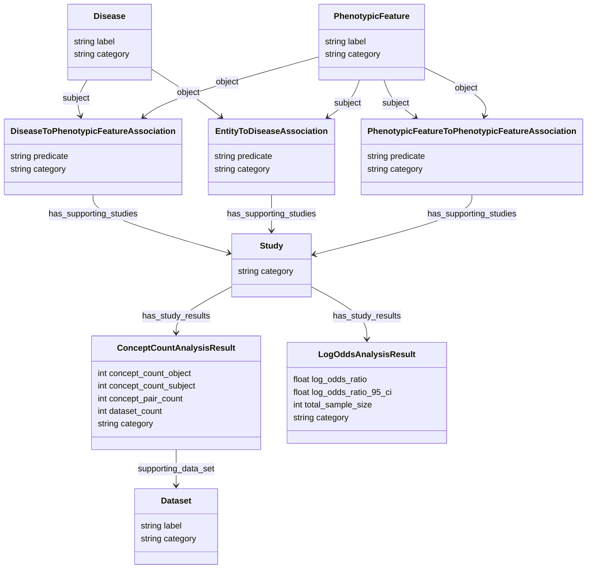

# OARD-KG Chat Transcript

👤 **User**
Give an overview of the @oard-kg

---

🧠 **Assistant**
Here's a comprehensive overview of the **OARD-KG** (Open Annotations for Rare Diseases Knowledge Graph):

**What it is.** The OARD-KG (Open Annotations for Rare Diseases Knowledge Graph) is an RDF triplestore maintained by the WengLab Informatics Research group at Columbia University. It surfaces clinically derived associations between rare diseases and phenotypes, extracted from real-world electronic health records using ontology mapping and natural language processing applied to billing codes, lab tests, and clinical narratives.

**Domain.** Rare disease · clinical phenotyping · health informatics. Identifiers come from three standard biomedical namespaces: MONDO (diseases), HPO (phenotypic features), and UMLS.

**Core entity types.** The graph has ten classes organized into three conceptual tiers:

- *Biomedical entities* — `Disease` and `PhenotypicFeature`, the subjects and objects of all clinical associations.
- *Associations* — `DiseaseToPhenotypicFeatureAssociation`, `PhenotypicFeatureToPhenotypicFeatureAssociation`, and `EntityToDiseaseAssociation`, linking entities with standardized Biolink predicates.
- *Evidence layer* — each association links to `Study` nodes, which in turn produce `ConceptCountAnalysisResult` (co-occurrence counts, concept pair counts, dataset counts) and `LogOddsAnalysisResult` (log odds ratio, 95% CI, sample size).

**What makes it useful.** Unlike curated ontology databases, OARD-KG is grounded in real patient records, so it captures rare disease–phenotype co-occurrences that appear in clinical practice rather than only those documented in the literature. The statistical evidence layer (log odds ratios with confidence intervals) lets researchers filter associations by strength and reproducibility, making it well-suited for phenotype-driven diagnosis, knowledgebase enrichment, and evidence synthesis.

**Access.** SPARQL endpoint at `https://frink.apps.renci.org/oard-kg/sparql`, with a Linked Data Fragments interface at `https://frink.apps.renci.org/ldf/oard-kg`.

---

👤 **User**
Visualize the schema with the visualize_schema tool

---

🧠 **Assistant**
Here's the cleaned schema diagram for OARD-KG:

The schema flows top-to-bottom through three tiers: biomedical entities (`Disease`, `PhenotypicFeature`, `Dataset`) at the top feed into three association classes, which each link to `Study` nodes, which produce two types of analysis results — `ConceptCountAnalysisResult` (co-occurrence stats) and `LogOddsAnalysisResult` (odds ratios with confidence intervals). No edges carry properties in this graph, so all relationships are simple labeled arrows.

---

*Created by [mcp-proto-okn](https://github.com/sbl-sdsc/mcp-proto-okn) 0.6.0 on 2026-05-01*

*Model: claude-sonnet-4-6*
