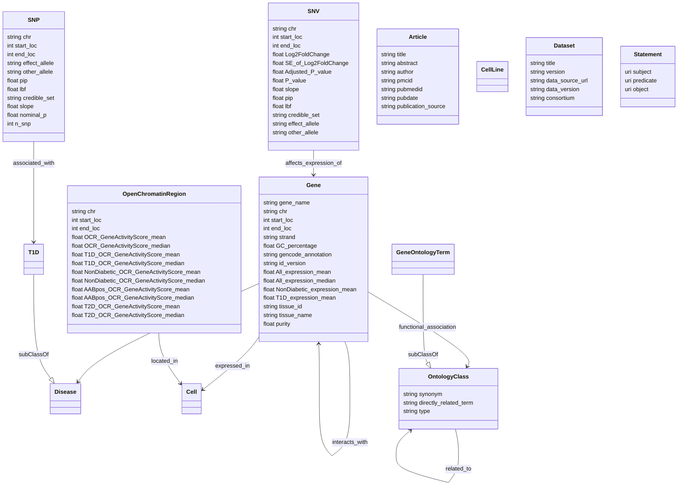

# PanKgraph Knowledge Graph Exploration

👤 **User**
Give an overview of the @pankgraph KG

---

🧠 **Assistant**

Here's an overview of the **PanKgraph** knowledge graph:

**What it is:** PanKgraph is the knowledge graph component of [PanKbase](https://pankbase.org/), a centralized, open-source research hub for the human pancreas and type 1 diabetes (T1D), funded by the NSF and developed at the University of Michigan. It was built to connect previously fragmented biomedical data using large language models and diverse data types.

**Core focus:** The graph centers on mechanisms of diabetes pathogenesis — specifically how genes, genetic variants (SNPs/SNVs), regulatory regions, and expression data interact in pancreatic tissue.

**Scale:** The graph contains roughly 1.6M+ triples, with the most populous entity types being:
- ~1.4M RDF statements (reified edges carrying rich metadata)
- ~79K genes (Biolink-aligned)
- ~19K SNPs and SNVs
- ~18K open chromatin regions (OCRs)
- ~17K Gene Ontology terms
- ~957 scientific articles
- A small set of cell types, cell lines, and diseases (including T1D itself)

*(Interactive entity-relationship diagram rendered in chat)*

**Entity model (14 classes, 117 predicates):** The graph is aligned to the [Biolink Model](https://biolink.github.io/biolink-model/) and key ontologies, covering:

- **Genomic variation:** SNPs and SNVs (dbSNP, Sequence Ontology)
- **Regulatory genomics:** Open chromatin regions (OCRs) with Gene Activity Scores computed for T1D, non-diabetic, and AAB-positive donors
- **Gene expression:** eQTL evidence, slope, p-values, fine-mapping (PIP, LBF, credible sets)
- **Gene function:** GO term annotations, gene-gene interactions (BioGRID)
- **Literature:** PubMed-linked articles with provenance on associations
- **Omics metadata:** Datasets with tissue, donor, and version metadata

**Identifier namespaces:** Ensembl, NCBI Gene, HGNC, dbSNP, GO, PubMed, GEO, BioSample, and a PanKbase-native namespace.

**Key use cases:**
- Connecting T1D GWAS variants → eQTLs → pancreatic gene expression
- Exploring open chromatin accessibility differences between T1D and non-diabetic donors
- Tracing gene-condition associations with publication provenance
- Multi-omics integration across genomics, epigenomics, and transcriptomics

The SPARQL endpoint is at `https://apps.okn.us/pankgraph/sparql`.

---

👤 **User**
Visualize the schema using the visualize_schema tool

---

🧠 **Assistant**

Here's the cleaned PanKgraph schema diagram:

A few things worth noting about the schema:

- **No edge properties** — all 117 predicates are node-level annotations rather than reified edge attributes, meaning metadata like `pip`, `slope`, and expression quantiles live directly on nodes, not on relationship edges.
- **`OpenChromatinRegion`** is the most property-rich class, carrying per-donor-group gene activity scores across four conditions (all donors, non-diabetic, T1D, T2D, and AAB-positive).
- **`SNP` vs `SNV`** are distinct classes: SNPs carry fine-mapping statistics (PIP, LBF, credible sets) and link to T1D; SNVs carry differential expression stats (log2FC, adjusted p-values) and link to genes via `affects_expression_of`.
- **`Statement`** (RDF reification) acts as the provenance backbone — capturing the subject/predicate/object of any asserted triple to enable evidence tracking across 1.4M annotated relationships.

---

*Created by [mcp-proto-okn](https://github.com/sbl-sdsc/mcp-proto-okn) 0.6.0 on 2026-05-01*

*Model: claude-sonnet-4-6 (claude-sonnet-4-20250514)*
