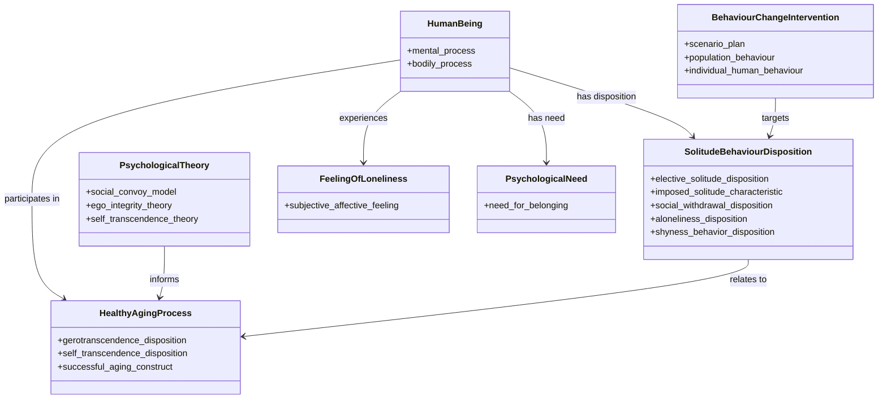

# PHASES KG — Knowledge Graph Overview

👤 **User**
@phaseskg: Give a high-level overview of this knowledge graph

---

🧠 **Assistant**

**PHASES KG** (Promoting Healthy Aging through Semantic Enrichment) is a compact, ontology-oriented knowledge graph built for the **HealthyPhases** research project, which investigates how *solitude* relates to healthy aging and gerotranscendence.

### Purpose

It provides a semantically precise, FAIR-compliant framework to integrate concepts from gerontology, psychology, and behavior-change science — reducing terminological ambiguity across solitude and aging datasets.

### Scale

200 entities total: 93 classes and 107 predicates. This is a focused ontology-level graph, not a large-scale data graph.

### Core Domains

**Aging & wellbeing**
- Gerotranscendence disposition
- Healthy aging process
- Self-transcendence disposition
- Successful aging construct

**Solitude & social**
- Elective vs. imposed solitude
- Social isolation and social alienation
- Aloneliness
- Feeling of loneliness
- Social withdrawal disposition

**Psychology**
- Behaviour change interventions
- Mental dispositions and mental quality
- Cognitive appraisal representational pattern quality
- Self-efficacy representational pattern quality
- Anxious solitude construct

**Theoretical foundations**
- Erikson's ego integrity theory
- Social convoy model
- Self-transcendence theory
- Reminiscence therapy process
- Need for a sense of belonging to a community

**Formal structure (BFO-grounded)**
- Independent continuant, disposition, quality
- Process, occurrent, planned process
- Realizable entity, function, process profile

### Ontology Stack

Built on a rich set of established vocabularies:

| Namespace | Description |
|-----------|-------------|
| BFO | Basic Formal Ontology |
| BCIO | Behaviour Change Intervention Ontology |
| IAO | Information Artifact Ontology |
| RO | Relation Ontology |
| MFOEM | Mental Functioning Ontology |
| OWL / RDFS / SKOS | Web ontology and vocabulary standards |
| PAV | Provenance, Authoring and Versioning |
| VOID / VOID-EXT | Dataset descriptions |

### Key Predicates

- `has behavioural outcome` / `has behavioural attribute`
- `serves behavioural function`
- `is enacted by` / `uses`
- `realises` / `occurs in`
- `causally related to`
- `characteristic of`
- `synonym` / `defined by construct`
- `imported from` / `derived from`

### Schema Diagram

### Example Query

> "Which factors or behaviors are associated with healthy aging?"

This graph supports research questions such as:
- How does elective solitude differ from imposed solitude in the context of aging?
- What behaviour change interventions are relevant to gerotranscendence?
- How are psychological theories linked to aging dispositions?

### Identifier Namespaces

BCIO · BCIOR · BFO · DC · DCTERMS · GO · IAO · MF · MFOEM · OBI · oboInOwl · OGMS · OMO · OWL · PAV · PHASES · RDF · RDFS · RO · Schema.org · SDGIO · SKOS · VOID · VOID-EXT · Wikidata

---

👤 **User**
Create a chat transcript

---

*Created by [mcp-proto-okn](https://github.com/sbl-sdsc/mcp-proto-okn) 0.6.0 on 2026-05-22*

*Model: claude-sonnet-4-6*
