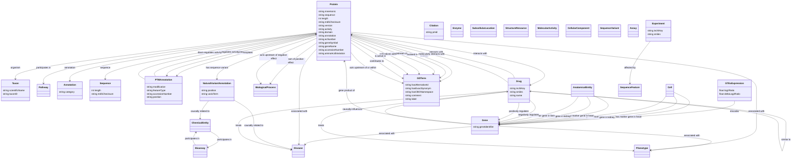

# ProKN Knowledge Graph — Chat Transcript

👤 **User**
Give an overview of the @prokn KG

---

🧠 **Assistant**

Here's a comprehensive overview of the **ProKN (Protein Knowledge Network)** knowledge graph:

### ProKN — Protein Knowledge Network

**What it is:** ProKN is a protein-centric integrative knowledge graph developed by the University of Delaware as part of the NIH Common Fund Data Ecosystem (CFDE). It harmonizes heterogeneous biological data around proteins, connecting them to genes, diseases, pathways, post-translational modifications (PTMs), genetic variants, and drug interactions.

**Core focus areas:**

*Protein biology (UniProt backbone):* The graph is anchored to UniProt reviewed (Swiss-Prot) entries, carrying rich annotations including amino acid sequences, EC numbers, subcellular locations, organism/taxon links, PTM annotations, and natural variant annotations.

*Post-translational modifications:* A key specialty — ProKN tracks which kinases phosphorylate which proteins and how those modifications up- or down-regulate activity. The `KSMoFinder` tool (linked from the portal) predicts kinase-substrate interactions.

*Genetic variants:* Natural variant annotations are linked to associated diseases and phenotypes (via EFO), enabling variant-to-disease queries.

*Functional genomics:* Gene Ontology (GO) terms covering biological process, molecular function, and cellular component are fully integrated. GTEx expression data annotates genes with marker expression in heart, kidney, and liver tissue.

*Drug/disease connections:* Drugs and chemicals (from NCIT, BioAssay Ontology, schema.org) are linked to proteins via molecular interaction, inhibition, and treatment relations. Diseases connect through both UniProt annotations and the Biolink model.

**Ontologies and vocabularies used:** UniProt core, Biolink model, Gene Ontology (OBO), UBERON, Sequence Ontology, NCIT, BioAssay Ontology (BAO), MeSH, EFO, AOP ontology, CHEMINF, and schema.org — making ProKN one of the most ontologically diverse graphs in the Proto-OKN ecosystem.

**Identifier namespaces:** UniProt accessions, PubMed IDs, NCIT codes, SMILES, InChIKey, NCBI Taxon IDs, and EC numbers.

**Access:** SPARQL endpoint at `https://frink.apps.renci.org/prokn/sparql`, plus a portal at [research.bioinformatics.udel.edu/ProKN](https://research.bioinformatics.udel.edu/ProKN/) with REST APIs, ID mapping, variant mapping, and protein embedding tools.

**Example queries you can run:**
- Find all properties and relationships for a specific gene like APOE
- Find all protein kinases
- Retrieve proteins associated with a specific disease

ProKN is well-suited for precision medicine and drug discovery research, particularly for bridging disparate CFDE datasets through its protein-centric integration layer.

---

👤 **User**
Visualize schema

---

🧠 **Assistant**

The ProKN schema is shown below as a Mermaid class diagram. Key things to note:

- `Protein` is the most connected node — it links to sequences, annotations, PTMs, GO terms, pathways, drugs, diseases, and variants.
- `PTMAnnotation` acts as a bidirectional hub — proteins phosphorylate it, and it in turn up/down-regulates protein activity.
- `GOTerm` aggregates many functional relationships from `Protein` (enables, involved in, colocalizes with, etc.).
- `GTExExpression` carries quantitative properties (`log2Ratio`, `deltaLog2Ratio`) and connects back to `Gene`.
- `Drug` has a self-referential `similar to` edge for chemical similarity queries.

---

*Created by [mcp-proto-okn](https://github.com/sbl-sdsc/mcp-proto-okn) 0.6.0 on 2026-03-16*

*Model: claude-sonnet-4-6*
